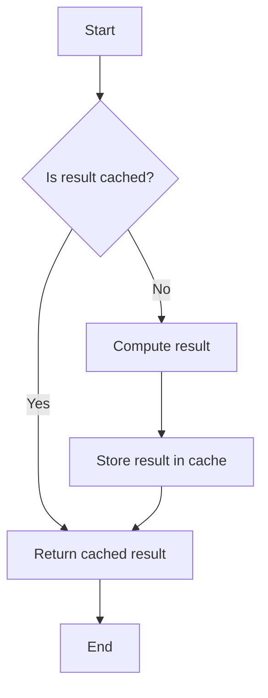

## 3.6. Memoization

Memoization is a powerful optimization technique used in functional programming to enhance the performance of applications by caching the results of expensive function calls and returning the cached result when the same inputs occur again. This section will delve into the concept of memoization, its benefits, and how to implement it using pseudocode. We'll also explore practical examples, such as memoizing recursive functions like Fibonacci, to illustrate its application.

### Caching Function Results

Memoization involves storing the results of function calls and reusing those results when the same inputs are encountered. This is particularly useful for functions with expensive computations or recursive functions that may call themselves multiple times with the same arguments.

#### Intent

The primary intent of memoization is to improve the efficiency of function calls by avoiding redundant calculations. By caching results, we can significantly reduce the time complexity of algorithms, especially those involving recursive calls.

#### Key Participants

- **Function**: The function whose results are to be cached.
- **Cache**: A data structure (often a dictionary or map) used to store the results of function calls.
- **Memoization Wrapper**: A higher-order function that wraps the original function and manages the cache.

### Improving Performance

Memoization can lead to substantial performance improvements, particularly in scenarios where the same computations are repeated multiple times. By storing the results of these computations, we can avoid unnecessary recalculations, thus saving time and computational resources.

#### Applicability

Memoization is applicable in various scenarios, including:

- **Recursive Functions**: Functions that call themselves with the same arguments multiple times.
- **Dynamic Programming**: Problems that can be broken down into overlapping subproblems.
- **Expensive Calculations**: Functions that perform costly operations, such as complex mathematical computations or database queries.

### Pseudocode Implementation

Let's explore how to implement memoization using pseudocode. We'll create a memoization wrapper that can be applied to any function to cache its results.

```pseudocode
function memoize(fn):
    cache = {}  // Initialize an empty cache

    function memoizedFunction(...args):
        key = args.toString()  // Convert arguments to a string key
        if key in cache:
            return cache[key]  // Return cached result if available
        else:
            result = fn(...args)  // Call the original function
            cache[key] = result  // Store the result in the cache
            return result

    return memoizedFunction
```

#### Explanation

- **Cache Initialization**: We start by initializing an empty cache, typically a dictionary or map.
- **Key Generation**: The arguments of the function are converted into a string key to uniquely identify each function call.
- **Cache Lookup**: Before executing the function, we check if the result is already cached. If so, we return the cached result.
- **Function Execution**: If the result is not cached, we execute the function, store the result in the cache, and return it.

### Examples

Let's apply memoization to a classic example: the Fibonacci sequence. The Fibonacci sequence is a perfect candidate for memoization due to its recursive nature and overlapping subproblems.

#### Memoizing Fibonacci

The Fibonacci sequence is defined as follows:

- `F(0) = 0`
- `F(1) = 1`
- `F(n) = F(n-1) + F(n-2)` for `n > 1`

Without memoization, calculating Fibonacci numbers using recursion can be highly inefficient due to repeated calculations. Let's see how memoization can optimize this process.

```pseudocode
function fibonacci(n):
    if n <= 1:
        return n
    else:
        return fibonacci(n - 1) + fibonacci(n - 2)

memoizedFibonacci = memoize(fibonacci)
```

#### Explanation

- **Recursive Definition**: The Fibonacci function is defined recursively, with base cases for `n = 0` and `n = 1`.
- **Memoization Application**: We apply the `memoize` function to the `fibonacci` function, creating a `memoizedFibonacci` function that caches results.

#### Performance Comparison

To illustrate the performance benefits of memoization, consider the following comparison:

- **Without Memoization**: Calculating `F(40)` involves over 2 billion recursive calls.
- **With Memoization**: Calculating `F(40)` involves only 40 calls, as each result is cached and reused.

### Visualizing Memoization

To better understand how memoization works, let's visualize the process using a flowchart.



#### Diagram Explanation

- **Start**: The process begins with a function call.
- **Cache Check**: We check if the result is already cached.
- **Return Cached Result**: If the result is cached, we return it immediately.
- **Compute Result**: If not cached, we compute the result.
- **Store in Cache**: The computed result is stored in the cache for future use.
- **End**: The process ends with the result being returned.

### Design Considerations

When implementing memoization, consider the following:

- **Cache Size**: Unlimited caching can lead to memory issues. Consider implementing a cache eviction policy, such as Least Recently Used (LRU), to manage cache size.
- **Argument Types**: Ensure that the arguments can be converted into a unique key. For complex objects, consider using a hash function.
- **Thread Safety**: In concurrent environments, ensure that cache access is thread-safe to avoid race conditions.

### Try It Yourself

Experiment with memoization by modifying the Fibonacci example. Try memoizing other recursive functions, such as factorial or the Ackermann function, and observe the performance improvements.

### Knowledge Check

Before we conclude, let's reinforce our understanding of memoization with a few questions:

- What is the primary benefit of memoization?
- How does memoization improve the performance of recursive functions?
- What are some potential pitfalls of using memoization?

### Embrace the Journey

Remember, memoization is just one of many powerful techniques in functional programming. As you continue your journey, explore other patterns and apply them to real-world problems. Keep experimenting, stay curious, and enjoy the process of learning and discovery!

## Quiz Time!



### What is the primary purpose of memoization?

- [x] To cache function results for future use
- [ ] To increase the complexity of algorithms
- [ ] To reduce the readability of code
- [ ] To eliminate the need for recursion

> **Explanation:** Memoization is used to cache function results, improving performance by avoiding redundant calculations.

### How does memoization improve performance?

- [x] By reducing redundant calculations
- [ ] By increasing the number of function calls
- [ ] By making code more complex
- [ ] By eliminating the need for functions

> **Explanation:** Memoization improves performance by storing results of expensive function calls and reusing them, thus reducing redundant calculations.

### In the context of memoization, what is a cache?

- [x] A data structure used to store function results
- [ ] A function that computes results
- [ ] A variable that holds temporary data
- [ ] A loop that iterates over data

> **Explanation:** A cache is a data structure used to store the results of function calls for future use.

### Which of the following is a common use case for memoization?

- [x] Recursive functions
- [ ] Simple arithmetic operations
- [ ] String concatenation
- [ ] File I/O operations

> **Explanation:** Memoization is commonly used for recursive functions to avoid redundant calculations.

### What is a potential drawback of memoization?

- [x] Increased memory usage
- [ ] Decreased function execution speed
- [ ] Reduced code readability
- [ ] Elimination of recursion

> **Explanation:** Memoization can lead to increased memory usage due to storing results in a cache.

### What is the role of a memoization wrapper?

- [x] To manage the cache and wrap the original function
- [ ] To execute the original function without changes
- [ ] To increase the complexity of the function
- [ ] To eliminate the need for a cache

> **Explanation:** A memoization wrapper manages the cache and wraps the original function to provide caching functionality.

### How can you ensure thread safety when using memoization in concurrent environments?

- [x] By using thread-safe data structures for the cache
- [ ] By avoiding the use of a cache
- [ ] By increasing the number of function calls
- [ ] By eliminating recursion

> **Explanation:** Ensuring thread safety involves using thread-safe data structures for the cache to avoid race conditions.

### What is a common strategy for managing cache size in memoization?

- [x] Implementing a cache eviction policy like LRU
- [ ] Increasing the cache size indefinitely
- [ ] Reducing the number of function calls
- [ ] Eliminating the cache entirely

> **Explanation:** Implementing a cache eviction policy, such as Least Recently Used (LRU), helps manage cache size effectively.

### Which of the following is a key consideration when implementing memoization?

- [x] Ensuring arguments can be converted into a unique key
- [ ] Increasing the number of recursive calls
- [ ] Reducing the number of function arguments
- [ ] Eliminating the use of functions

> **Explanation:** Ensuring that arguments can be converted into a unique key is crucial for effective caching in memoization.

### True or False: Memoization can be used to optimize any function, regardless of its complexity.

- [ ] True
- [x] False

> **Explanation:** Memoization is most effective for functions with expensive or redundant calculations, such as recursive functions, and may not be suitable for all functions.


