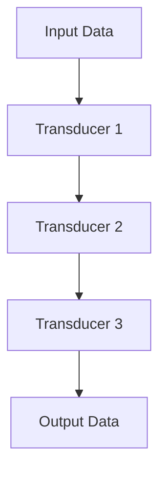
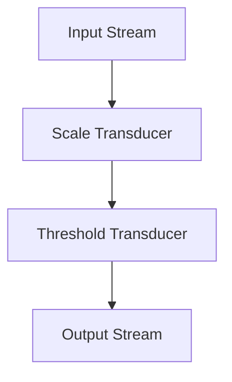

## 3.7. Transducer Pattern

In the realm of functional programming, the transducer pattern emerges as a powerful tool for efficient data transformation. This pattern allows us to compose multiple operations into a single pass over the data, thereby avoiding the creation of intermediate collections that can lead to inefficiencies. In this section, we will delve into the concepts, advantages, and practical implementations of transducers, providing you with a comprehensive understanding of how to leverage this pattern in your functional programming endeavors.

### Composing Efficient Data Transformations

Transducers are a concept that originated in the functional programming community, particularly in languages like Clojure, and have since gained traction in other languages that support functional paradigms. At their core, transducers are composable transformations that can be applied to data structures or streams of data. They allow us to define a series of transformations that can be applied in a single pass, thus optimizing performance and reducing memory overhead.

#### Key Concepts of Transducers

1. **Composable Transformations**: Transducers are functions that take a reducing function and return a new reducing function. This allows them to be composed together to form complex transformations.

2. **Decoupling Transformation from Input/Output**: Transducers separate the logic of transformation from the data structures they operate on. This means the same transducer can be applied to different types of collections or streams.

3. **Single Pass Execution**: By composing transformations into a single pass, transducers eliminate the need for intermediate collections, reducing memory usage and improving performance.

4. **Reusability and Modularity**: Transducers promote code reuse and modularity by allowing transformations to be defined independently and then composed as needed.

Let's visualize the concept of transducers and how they operate on data:



**Diagram Explanation**: The diagram illustrates a series of transducers applied to input data, resulting in transformed output data. Each transducer represents a transformation step that is composed into a single pass.

### Advantages Over Chaining

Traditional functional programming often involves chaining operations like `map`, `filter`, and `reduce` directly on collections. While this approach is expressive and easy to understand, it can lead to inefficiencies due to the creation of intermediate collections at each step. Transducers offer several advantages over this chaining approach:

1. **Reduced Memory Usage**: By eliminating intermediate collections, transducers reduce the memory footprint of data transformations.

2. **Improved Performance**: Transducers perform transformations in a single pass, which can lead to significant performance improvements, especially for large datasets.

3. **Increased Flexibility**: Transducers can be applied to various data sources, including lists, streams, and channels, without modification.

4. **Enhanced Composability**: Transducers can be composed together to create complex transformations, promoting code reuse and modularity.

### Pseudocode Implementation

To understand how transducers work, let's explore a pseudocode implementation. We'll define a simple transducer that performs a `map` operation, followed by a `filter` operation, and then apply it to a collection.

#### Defining a Transducer

A transducer is essentially a higher-order function that takes a reducing function and returns a new reducing function. Here's how we can define a basic transducer:

```pseudocode
function mapTransducer(mappingFunction):
    return function(reducingFunction):
        return function(accumulator, value):
            return reducingFunction(accumulator, mappingFunction(value))

function filterTransducer(predicateFunction):
    return function(reducingFunction):
        return function(accumulator, value):
            if predicateFunction(value):
                return reducingFunction(accumulator, value)
            else:
                return accumulator
```

**Explanation**: The `mapTransducer` function takes a `mappingFunction` and returns a new function that takes a `reducingFunction`. This returned function applies the `mappingFunction` to each value before passing it to the `reducingFunction`. Similarly, the `filterTransducer` function takes a `predicateFunction` and returns a function that only applies the `reducingFunction` if the predicate is true.

#### Applying Transducers

To apply transducers to a collection, we need a function that can reduce the collection using the composed transducer. Here's how we can implement this:

```pseudocode
function transduce(transducer, reducingFunction, initialAccumulator, collection):
    composedReducer = transducer(reducingFunction)
    accumulator = initialAccumulator
    for value in collection:
        accumulator = composedReducer(accumulator, value)
    return accumulator
```

**Explanation**: The `transduce` function takes a `transducer`, a `reducingFunction`, an `initialAccumulator`, and a `collection`. It composes the transducer with the reducing function and iterates over the collection, applying the composed reducer to each value.

#### Example: Mapping and Filtering

Let's see how we can use the transducer pattern to map and filter a collection in a single pass:

```pseudocode
function addOne(x):
    return x + 1

function isEven(x):
    return x % 2 == 0

collection = [1, 2, 3, 4, 5]

mapTrans = mapTransducer(addOne)
filterTrans = filterTransducer(isEven)

composedTransducer = function(reducingFunction):
    return mapTrans(filterTrans(reducingFunction))

result = transduce(composedTransducer, function(acc, val): acc + [val], [], collection)

print(result)  // Output: [2, 4, 6]
```

**Explanation**: In this example, we define a `mapTransducer` that adds one to each element and a `filterTransducer` that filters out odd numbers. We then compose these transducers and apply them to a collection using the `transduce` function. The result is a transformed collection `[2, 4, 6]`.

### Examples: Processing Streams of Data Efficiently

Transducers are particularly useful when working with streams of data, where efficiency is crucial. Let's explore a scenario where we process a stream of data using transducers.

#### Scenario: Real-Time Data Processing

Imagine we have a stream of sensor data that we need to process in real-time. We want to apply a series of transformations to this data, including filtering out noise and scaling the values.

```pseudocode
function scaleValue(x):
    return x * 2

function isAboveThreshold(x):
    return x > 10

sensorDataStream = [5, 12, 7, 15, 3, 20]

scaleTrans = mapTransducer(scaleValue)
thresholdTrans = filterTransducer(isAboveThreshold)

composedTransducer = function(reducingFunction):
    return scaleTrans(thresholdTrans(reducingFunction))

processedData = transduce(composedTransducer, function(acc, val): acc + [val], [], sensorDataStream)

print(processedData)  // Output: [24, 30, 40]
```

**Explanation**: In this scenario, we define a `scaleTransducer` that scales each value by 2 and a `thresholdTransducer` that filters out values below a threshold of 10. We compose these transducers and apply them to the sensor data stream, resulting in a processed stream `[24, 30, 40]`.

### Visualizing Transducer Workflow

To better understand the workflow of transducers, let's visualize the process using a flowchart:



**Diagram Explanation**: The flowchart illustrates the application of two transducers to an input stream, resulting in a transformed output stream. Each transducer represents a transformation step in the workflow.

### Design Considerations

When using transducers, there are several design considerations to keep in mind:

1. **When to Use Transducers**: Transducers are most beneficial when dealing with large datasets or streams where performance and memory efficiency are critical.

2. **Avoiding Complexity**: While transducers offer powerful composability, they can introduce complexity if overused. It's important to balance the use of transducers with readability and maintainability.

3. **Understanding Limitations**: Transducers are not a one-size-fits-all solution. They may not be suitable for all types of data transformations, especially those that require stateful operations.

4. **Language Support**: Not all programming languages have built-in support for transducers. It's important to understand the capabilities and limitations of the language you're working with.

### Programming Language Specifics

While the concept of transducers is language-agnostic, the implementation details can vary depending on the language. Here are some considerations for specific languages:

- **Clojure**: Transducers are a first-class concept in Clojure, with built-in support for composing and applying them to collections and streams.

- **JavaScript**: Libraries like `transducers-js` provide support for transducers in JavaScript, allowing you to apply them to arrays and streams.

- **Python**: While Python does not have native support for transducers, you can implement them using higher-order functions and iterators.

### Differences and Similarities

Transducers are often compared to other functional programming patterns, such as:

- **Pipelines**: While both transducers and pipelines allow for composing transformations, transducers focus on eliminating intermediate collections, whereas pipelines may still create them.

- **Monads**: Transducers and monads both provide a way to compose operations, but transducers are specifically designed for data transformation, while monads can represent a wider range of computations.

### Try It Yourself

To deepen your understanding of transducers, try modifying the code examples provided. Experiment with different mapping and filtering functions, and observe how the output changes. Consider implementing a transducer that performs a more complex transformation, such as grouping or partitioning data.

### References and Links

For further reading on transducers and functional programming, consider exploring the following resources:

- [Clojure Transducers](https://clojure.org/reference/transducers)
- [Transducers in JavaScript](https://github.com/cognitect-labs/transducers-js)
- [Functional Programming in Python](https://realpython.com/python-functional-programming/)

### Knowledge Check

To reinforce your understanding of transducers, consider the following questions:

- What are the key advantages of using transducers over traditional chaining methods?
- How do transducers improve performance and memory efficiency?
- In what scenarios are transducers most beneficial?

### Embrace the Journey

Remember, mastering transducers is just one step in your functional programming journey. As you continue to explore and apply these concepts, you'll discover new ways to write efficient, expressive, and maintainable code. Keep experimenting, stay curious, and enjoy the journey!

## Quiz Time!



### What is a key advantage of using transducers?

- [x] They eliminate intermediate collections.
- [ ] They increase the number of transformations.
- [ ] They require more memory.
- [ ] They are only applicable to lists.

> **Explanation:** Transducers eliminate intermediate collections, reducing memory usage and improving performance.

### How do transducers improve performance?

- [x] By performing transformations in a single pass.
- [ ] By increasing the number of operations.
- [ ] By creating more intermediate collections.
- [ ] By requiring more computational power.

> **Explanation:** Transducers perform transformations in a single pass, which reduces the overhead of creating intermediate collections.

### In which language are transducers a first-class concept?

- [x] Clojure
- [ ] JavaScript
- [ ] Python
- [ ] Java

> **Explanation:** Transducers are a first-class concept in Clojure, with built-in support for composing and applying them.

### What is a transducer?

- [x] A composable transformation function.
- [ ] A data structure.
- [ ] A type of loop.
- [ ] A sorting algorithm.

> **Explanation:** A transducer is a composable transformation function that can be applied to data structures or streams.

### What is the main purpose of a transducer?

- [x] To compose multiple operations into a single pass.
- [ ] To increase the complexity of code.
- [ ] To create more intermediate collections.
- [ ] To reduce the number of transformations.

> **Explanation:** The main purpose of a transducer is to compose multiple operations into a single pass, improving efficiency.

### Which of the following is NOT a benefit of transducers?

- [ ] Reduced memory usage
- [ ] Improved performance
- [x] Increased complexity
- [ ] Enhanced composability

> **Explanation:** Transducers reduce memory usage, improve performance, and enhance composability, but they do not inherently increase complexity.

### What is a common use case for transducers?

- [x] Processing streams of data efficiently.
- [ ] Sorting small arrays.
- [ ] Creating complex data structures.
- [ ] Managing database connections.

> **Explanation:** Transducers are commonly used for processing streams of data efficiently, especially when performance and memory usage are concerns.

### What is the role of a reducing function in a transducer?

- [x] To accumulate results during transformation.
- [ ] To sort data.
- [ ] To filter data.
- [ ] To create intermediate collections.

> **Explanation:** A reducing function accumulates results during transformation, allowing transducers to apply transformations in a single pass.

### How can transducers be applied to different data sources?

- [x] By decoupling transformation logic from input/output.
- [ ] By creating specific transducers for each data source.
- [ ] By using only lists.
- [ ] By requiring additional libraries.

> **Explanation:** Transducers decouple transformation logic from input/output, allowing them to be applied to various data sources.

### True or False: Transducers are only applicable to functional programming languages.

- [ ] True
- [x] False

> **Explanation:** While transducers are rooted in functional programming, they can be implemented in any language that supports higher-order functions.


