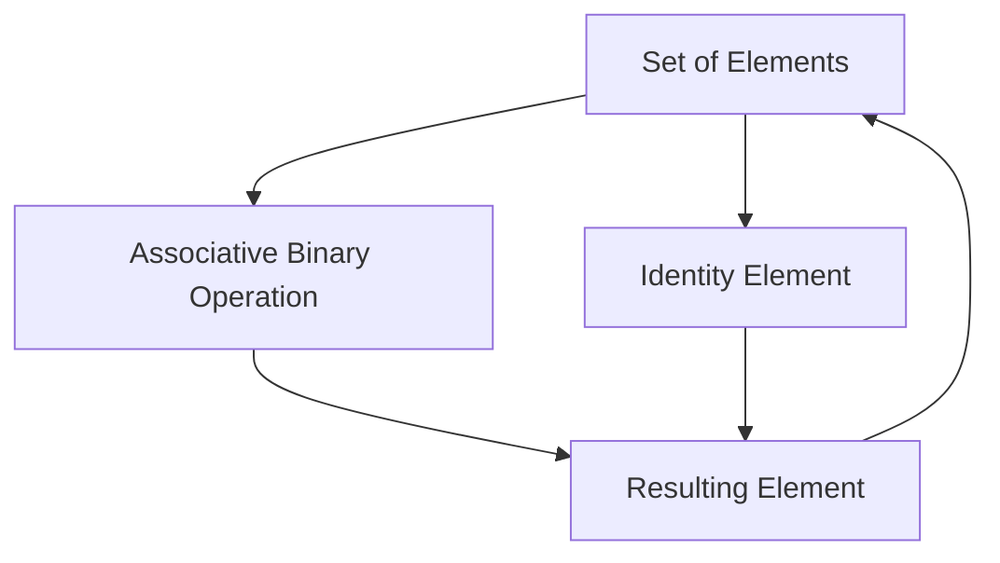

## 4.1. Monoid Pattern

In the realm of functional programming, the Monoid Pattern stands out as a fundamental concept that encapsulates an algebraic structure with an associative binary operation and an identity element. This pattern is not only pivotal in theoretical computer science but also finds practical applications in software development, particularly in scenarios involving data aggregation and transformation. Let's delve into the intricacies of the Monoid Pattern, exploring its structure, laws, and implementations through pseudocode examples.

### Understanding Monoids

A **Monoid** is an algebraic structure that consists of:

1. **A Set**: A collection of elements.
2. **An Associative Binary Operation**: A function that combines two elements of the set to produce another element of the same set.
3. **An Identity Element**: An element in the set that, when used in the binary operation with any other element of the set, returns the other element unchanged.

#### Key Components of a Monoid

- **Set**: The domain of elements that the monoid operates over.
- **Binary Operation**: Often denoted as `*`, this operation must be associative.
- **Identity Element**: Often denoted as `e`, this element must satisfy the identity law.

### Monoid Laws

To qualify as a monoid, the structure must satisfy two fundamental laws:

1. **Associativity**: For any elements `a`, `b`, and `c` in the set, the equation `(a * b) * c = a * (b * c)` must hold. This means that the grouping of operations does not affect the result.
   
2. **Identity**: For any element `a` in the set, the equations `e * a = a` and `a * e = a` must hold. This means that the identity element does not change the other element when used in the operation.

### Pseudocode Implementation

To illustrate the Monoid Pattern, let's define a monoid for a simple data type, such as integers with addition as the binary operation and zero as the identity element.

```pseudocode
// Define a Monoid for integers with addition
class IntegerAdditionMonoid {
    // Define the binary operation
    function concat(a, b) {
        return a + b
    }
    
    // Define the identity element
    function empty() {
        return 0
    }
}

// Usage example
let monoid = new IntegerAdditionMonoid()
let result = monoid.concat(monoid.concat(1, 2), 3) // (1 + 2) + 3
let identityCheck = monoid.concat(5, monoid.empty()) // 5 + 0
```

### Examples

#### Working with Strings

Strings can also form a monoid with concatenation as the binary operation and the empty string as the identity element.

```pseudocode
// Define a Monoid for strings with concatenation
class StringConcatenationMonoid {
    // Define the binary operation
    function concat(a, b) {
        return a + b
    }
    
    // Define the identity element
    function empty() {
        return ""
    }
}

// Usage example
let stringMonoid = new StringConcatenationMonoid()
let combinedString = stringMonoid.concat("Hello, ", "World!")
let identityCheckString = stringMonoid.concat("Functional", stringMonoid.empty())
```

#### Working with Complex Data Structures

Consider a scenario where we have a list of objects, and we want to combine them based on a specific property.

```pseudocode
// Define a Monoid for combining objects by summing a specific property
class ObjectSumMonoid {
    // Define the binary operation
    function concat(obj1, obj2) {
        return { value: obj1.value + obj2.value }
    }
    
    // Define the identity element
    function empty() {
        return { value: 0 }
    }
}

// Usage example
let objectMonoid = new ObjectSumMonoid()
let obj1 = { value: 10 }
let obj2 = { value: 20 }
let combinedObject = objectMonoid.concat(obj1, obj2) // { value: 30 }
let identityCheckObject = objectMonoid.concat(obj1, objectMonoid.empty()) // { value: 10 }
```

### Visualizing the Monoid Pattern

To better understand the Monoid Pattern, let's visualize the structure and operations using a diagram.



**Diagram Description**: This diagram represents the flow of operations in a monoid. The set of elements undergoes an associative binary operation, which, along with the identity element, produces a resulting element that remains within the set.

### Design Considerations

When implementing the Monoid Pattern, consider the following:

- **Associativity**: Ensure that the binary operation is truly associative. This is crucial for the correctness of the monoid.
- **Identity Element**: Verify that the identity element behaves as expected, leaving other elements unchanged when used in the operation.
- **Performance**: In some cases, the binary operation might be computationally expensive. Consider optimizing the operation or using lazy evaluation techniques.

### Programming Language Specifics

While the concept of a monoid is universal, the implementation details can vary across programming languages. For instance, languages with strong type systems like Haskell provide built-in support for monoids, whereas in languages like JavaScript, you might need to implement the pattern manually.

### Differences and Similarities

The Monoid Pattern is often compared to other algebraic structures like **Semigroups** and **Groups**. A semigroup is similar to a monoid but lacks an identity element. A group extends a monoid by requiring an inverse for each element. Understanding these distinctions is crucial for applying the correct pattern to a given problem.

### Try It Yourself

To deepen your understanding of the Monoid Pattern, try modifying the pseudocode examples:

- Implement a monoid for a different data type, such as a list with concatenation.
- Experiment with different binary operations and identity elements.
- Create a monoid for a custom data structure, ensuring it satisfies the monoid laws.

### Knowledge Check

Before moving on, let's reinforce what we've learned:

- What are the key components of a monoid?
- How do the associativity and identity laws apply to monoids?
- Can you identify a real-world scenario where the Monoid Pattern could be beneficial?

### Embrace the Journey

Remember, mastering the Monoid Pattern is just one step in your functional programming journey. As you continue to explore and apply these concepts, you'll find new ways to enhance your code's modularity and robustness. Keep experimenting, stay curious, and enjoy the journey!

## Quiz Time!



### What is a Monoid?

- [x] An algebraic structure with an associative binary operation and an identity element.
- [ ] A data structure with a fixed size.
- [ ] A function that returns a monad.
- [ ] A pattern for managing state in functional programming.

> **Explanation:** A monoid is defined by its associative binary operation and identity element, making it an algebraic structure.

### Which of the following is a Monoid law?

- [x] Associativity
- [x] Identity
- [ ] Commutativity
- [ ] Distributivity

> **Explanation:** Monoids must satisfy the laws of associativity and identity, but not commutativity or distributivity.

### What is the identity element for integer addition in a Monoid?

- [x] 0
- [ ] 1
- [ ] -1
- [ ] 10

> **Explanation:** The identity element for addition is 0, as adding 0 to any number returns the number itself.

### In a String Monoid, what is the identity element?

- [x] ""
- [ ] " "
- [ ] "null"
- [ ] "undefined"

> **Explanation:** The identity element for string concatenation is the empty string "", as concatenating it with any string returns the original string.

### What operation is used in a Monoid for strings?

- [x] Concatenation
- [ ] Subtraction
- [ ] Multiplication
- [ ] Division

> **Explanation:** String monoids use concatenation as the binary operation.

### Which of the following is NOT a requirement for a Monoid?

- [ ] Associative binary operation
- [ ] Identity element
- [x] Inverse element
- [ ] Set of elements

> **Explanation:** Monoids do not require an inverse element; this is a requirement for groups.

### How does a Monoid differ from a Semigroup?

- [x] A Monoid has an identity element, while a Semigroup does not.
- [ ] A Semigroup has an identity element, while a Monoid does not.
- [ ] Both have identity elements.
- [ ] Neither has an identity element.

> **Explanation:** A Monoid includes an identity element, whereas a Semigroup does not.

### What is the result of concatenating a string with its identity element?

- [x] The original string
- [ ] An empty string
- [ ] A null value
- [ ] A string with added spaces

> **Explanation:** Concatenating a string with the identity element (empty string) returns the original string.

### Can a Monoid be used with complex data structures?

- [x] Yes
- [ ] No

> **Explanation:** Monoids can be applied to complex data structures by defining appropriate binary operations and identity elements.

### True or False: A Monoid's binary operation must be commutative.

- [ ] True
- [x] False

> **Explanation:** A Monoid's binary operation does not need to be commutative; it only needs to be associative.


