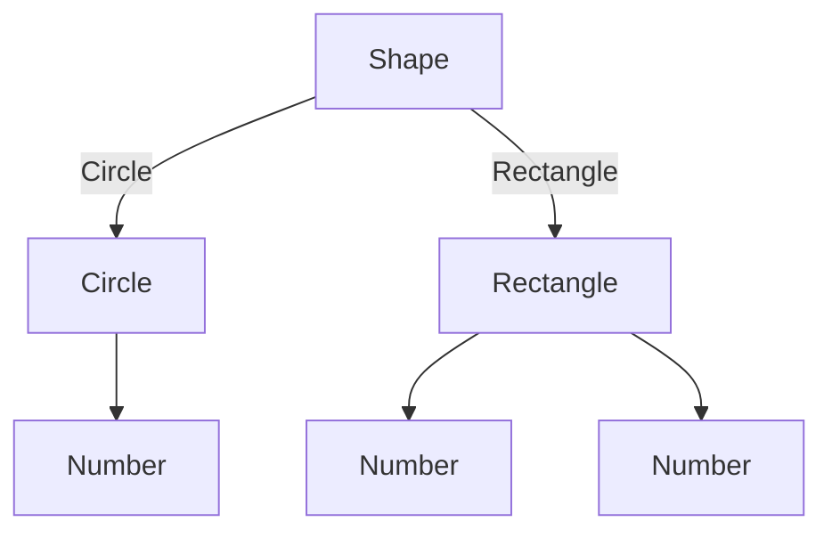

## 4.2. Algebraic Data Types (ADTs)

Algebraic Data Types (ADTs) are a cornerstone of functional programming, providing a powerful way to model data and express computations. They allow developers to define complex data structures in a concise and expressive manner. In this section, we will delve into the concepts of Sum and Product Types, explore the utility of Pattern Matching, and provide pseudocode examples to illustrate how ADTs can be implemented and utilized effectively.

### Introduction to Algebraic Data Types

Algebraic Data Types are a way of defining composite types in functional programming languages. They are called "algebraic" because they are constructed using algebraic operations: sum and product. These operations allow us to build complex types from simpler ones, much like how numbers are constructed from basic arithmetic operations.

#### Sum Types

Sum Types, also known as tagged unions or variant types, represent a choice between different types. They are akin to an "either-or" scenario, where a value can be one of several possible types. This is similar to a union in C or a variant in Pascal, but with added type safety.

**Example of Sum Type:**

Consider a simple example of a `Shape` type that can be either a `Circle` or a `Rectangle`:

```pseudocode
type Shape = Circle(radius: Number) | Rectangle(width: Number, height: Number)
```

In this example, `Shape` is a Sum Type because it can be either a `Circle` or a `Rectangle`. Each variant can have different associated data.

#### Product Types

Product Types, on the other hand, are used to combine multiple types into a single composite type. They are akin to a "both-and" scenario, where a value contains multiple fields, each of a potentially different type. This is similar to a struct in C or a record in Pascal.

**Example of Product Type:**

Consider a `Point` type that consists of an `x` and a `y` coordinate:

```pseudocode
type Point = { x: Number, y: Number }
```

In this example, `Point` is a Product Type because it combines two fields, `x` and `y`, into a single type.

### Pattern Matching

Pattern Matching is a powerful feature in functional programming that allows you to deconstruct and inspect data types in a concise and readable way. It is often used in conjunction with ADTs to handle different cases of Sum Types effectively.

**Example of Pattern Matching:**

Using the `Shape` type defined earlier, we can use pattern matching to calculate the area of a shape:

```pseudocode
function calculateArea(shape: Shape): Number {
  match shape {
    case Circle(radius) => return 3.14 * radius * radius
    case Rectangle(width, height) => return width * height
  }
}
```

In this example, the `match` expression deconstructs the `Shape` type and applies the appropriate logic based on whether the shape is a `Circle` or a `Rectangle`.

### Pseudocode Examples

Let's explore some pseudocode examples to illustrate how ADTs can be defined and utilized in functional programming.

#### Defining Algebraic Data Types

To define an ADT, you typically specify the type and its possible variants. Here is an example of defining a `Result` type that can represent either a success or an error:

```pseudocode
type Result = Success(value: Any) | Error(message: String)
```

This `Result` type is a Sum Type with two variants: `Success` and `Error`. It is commonly used for error handling in functional programming.

#### Using Pattern Matching with ADTs

Pattern matching allows you to handle each variant of an ADT separately. Here is an example of using pattern matching with the `Result` type:

```pseudocode
function handleResult(result: Result): String {
  match result {
    case Success(value) => return "Success with value: " + value.toString()
    case Error(message) => return "Error: " + message
  }
}
```

In this example, the `handleResult` function uses pattern matching to determine whether the `Result` is a `Success` or an `Error` and returns an appropriate message.

### Visualizing Algebraic Data Types

To better understand the structure of ADTs, let's visualize them using a diagram. The following Mermaid.js diagram illustrates the relationship between the `Shape`, `Circle`, and `Rectangle` types:



This diagram shows that `Shape` is a Sum Type with two variants: `Circle` and `Rectangle`. Each variant has its own associated data.

### Practical Applications of ADTs

Algebraic Data Types are widely used in functional programming to model complex data structures and control flow. They are particularly useful in scenarios where you need to represent different states or outcomes, such as:

- **Error Handling:** Using ADTs like `Result` or `Option` to handle errors and optional values safely.
- **State Machines:** Representing different states of a system and transitions between them.
- **Domain Modeling:** Defining domain-specific data structures with clear and expressive types.

### Try It Yourself

To deepen your understanding of ADTs, try modifying the examples provided. Here are some suggestions:

- Add a new variant to the `Shape` type, such as `Triangle`, and update the `calculateArea` function to handle it.
- Create a `TrafficLight` type with variants `Red`, `Yellow`, and `Green`, and use pattern matching to determine the next state.
- Implement a `Maybe` type to represent optional values and practice using pattern matching to handle `Some` and `None` cases.

### Key Takeaways

- **Algebraic Data Types (ADTs)** provide a powerful way to model data in functional programming.
- **Sum Types** represent a choice between different types, while **Product Types** combine multiple types into one.
- **Pattern Matching** is a concise and expressive way to deconstruct and inspect ADTs.
- ADTs are widely used for error handling, state machines, and domain modeling.

### Further Reading

For more information on Algebraic Data Types and their applications, consider exploring the following resources:

- [MDN Web Docs on Data Types](https://developer.mozilla.org/en-US/docs/Web/JavaScript/Data_structures)
- [Haskell Wiki on Algebraic Data Types](https://wiki.haskell.org/Algebraic_data_type)
- [Functional Programming in Scala](https://www.manning.com/books/functional-programming-in-scala)

Remember, this is just the beginning. As you progress, you'll discover more complex and powerful ways to leverage ADTs in your functional programming journey. Keep experimenting, stay curious, and enjoy the journey!

## Quiz Time!



### What is a Sum Type in functional programming?

- [x] A type that represents a choice between different types.
- [ ] A type that combines multiple fields into one.
- [ ] A type that is used for error handling.
- [ ] A type that is only used in imperative programming.

> **Explanation:** A Sum Type represents a choice between different types, allowing a value to be one of several possible types.

### What is a Product Type in functional programming?

- [x] A type that combines multiple fields into one.
- [ ] A type that represents a choice between different types.
- [ ] A type that is used for error handling.
- [ ] A type that is only used in imperative programming.

> **Explanation:** A Product Type combines multiple fields into one, similar to a struct in C.

### How does pattern matching work with ADTs?

- [x] It deconstructs and inspects data types to handle different cases.
- [ ] It combines multiple fields into one type.
- [ ] It is used to represent a choice between different types.
- [ ] It is only used in imperative programming.

> **Explanation:** Pattern matching deconstructs and inspects data types, allowing you to handle different cases of ADTs effectively.

### What is the purpose of the `Result` type in functional programming?

- [x] To represent either a success or an error.
- [ ] To combine multiple fields into one type.
- [ ] To represent a choice between different types.
- [ ] To handle optional values safely.

> **Explanation:** The `Result` type is used to represent either a success or an error, providing a safe way to handle computations that may fail.

### Which of the following is an example of a Sum Type?

- [x] `type Shape = Circle(radius: Number) | Rectangle(width: Number, height: Number)`
- [ ] `type Point = { x: Number, y: Number }`
- [ ] `type Result = Success(value: Any) | Error(message: String)`
- [ ] `type Maybe = Some(value: Any) | None`

> **Explanation:** The `Shape` type is a Sum Type because it represents a choice between `Circle` and `Rectangle`.

### Which of the following is an example of a Product Type?

- [x] `type Point = { x: Number, y: Number }`
- [ ] `type Shape = Circle(radius: Number) | Rectangle(width: Number, height: Number)`
- [ ] `type Result = Success(value: Any) | Error(message: String)`
- [ ] `type Maybe = Some(value: Any) | None`

> **Explanation:** The `Point` type is a Product Type because it combines multiple fields into one.

### What is the benefit of using pattern matching with ADTs?

- [x] It allows for concise and expressive handling of different cases.
- [ ] It combines multiple fields into one type.
- [ ] It represents a choice between different types.
- [ ] It is only used in imperative programming.

> **Explanation:** Pattern matching allows for concise and expressive handling of different cases, making it easier to work with ADTs.

### How can ADTs be used in error handling?

- [x] By using types like `Result` or `Option` to represent success or failure.
- [ ] By combining multiple fields into one type.
- [ ] By representing a choice between different types.
- [ ] By using imperative programming techniques.

> **Explanation:** ADTs like `Result` or `Option` are used to represent success or failure, providing a safe way to handle errors.

### What is the relationship between Sum Types and Product Types?

- [x] Sum Types represent a choice between types, while Product Types combine multiple fields.
- [ ] Sum Types combine multiple fields, while Product Types represent a choice between types.
- [ ] Both Sum and Product Types are used for error handling.
- [ ] Both Sum and Product Types are only used in imperative programming.

> **Explanation:** Sum Types represent a choice between types, while Product Types combine multiple fields into one.

### True or False: Algebraic Data Types are only used in functional programming.

- [ ] True
- [x] False

> **Explanation:** While ADTs are a fundamental concept in functional programming, they can also be used in other programming paradigms to model data and control flow.


