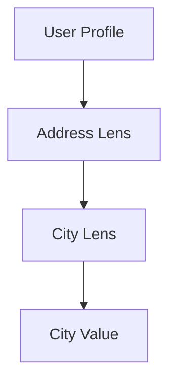

## 4.3. Lens Pattern

In the realm of functional programming, dealing with immutable data structures is a common challenge. The Lens Pattern emerges as a powerful tool to access and modify nested data structures without compromising immutability. This section delves into the intricacies of the Lens Pattern, exploring its concepts, applications, and implementations through detailed explanations and pseudocode examples.

### **Understanding the Lens Pattern**

#### **Immutable Data Structure Manipulation**

In functional programming, immutability is a core principle. It ensures that data structures remain unchanged after they are created, which leads to safer and more predictable code. However, immutability poses a challenge when we need to update or access deeply nested data. The Lens Pattern provides a solution by allowing us to focus on a specific part of a data structure, enabling both reading and updating operations without altering the original structure.

**Key Concepts:**

- **Lens**: A lens is a first-class abstraction that encapsulates the logic for accessing and updating a specific part of a data structure.
- **Get Function**: Retrieves the value from the data structure at the specified focus.
- **Set Function**: Updates the value at the specified focus, returning a new data structure with the modification.

#### **Composing Lenses**

Lenses can be composed to create complex accessors for deeply nested structures. This composition is akin to function composition, where multiple lenses are combined to focus on a specific path within a data structure.

**Benefits of Lens Composition:**

- **Modularity**: Each lens focuses on a single aspect, making the code modular and reusable.
- **Readability**: Composed lenses provide a clear and concise way to express complex data manipulations.
- **Maintainability**: Changes to the data structure require updates only to the relevant lenses, not the entire codebase.

### **Pseudocode Implementation**

Let's explore how to implement lenses using pseudocode. We'll define the basic operations of a lens: `get` and `set`.

```pseudocode
// Define a Lens type with get and set functions
type Lens = {
    get: (data) -> value,
    set: (value, data) -> newData
}

// Create a lens for accessing a property in an object
function createLens(propertyName) {
    return {
        get: (data) -> data[propertyName],
        set: (value, data) -> {
            newData = clone(data) // Ensure immutability
            newData[propertyName] = value
            return newData
        }
    }
}
```

**Explanation:**

- **`createLens` Function**: This function takes a property name and returns a lens that can access and update that property.
- **`get` Method**: Retrieves the value of the specified property.
- **`set` Method**: Clones the original data to maintain immutability, updates the property, and returns the new data structure.

### **Examples**

#### **Updating Deep Structures Immutably**

Consider a nested data structure representing a user profile:

```pseudocode
userProfile = {
    name: "Alice",
    address: {
        street: "123 Main St",
        city: "Wonderland"
    }
}
```

To update the city in the address, we can create a lens for the `address` and another for the `city`:

```pseudocode
addressLens = createLens("address")
cityLens = createLens("city")

// Compose lenses to focus on the city within the address
addressCityLens = composeLenses(addressLens, cityLens)

// Update the city
newUserProfile = addressCityLens.set("New Wonderland", userProfile)
```

**Explanation:**

- **`composeLenses` Function**: Combines two lenses to create a new lens that focuses on a nested property.
- **`addressCityLens`**: A composed lens that allows access and modification of the `city` property within the `address`.

### **Visualizing Lens Composition**

To better understand how lenses work, let's visualize the composition process using a diagram.



**Diagram Explanation:**

- **User Profile**: The root data structure.
- **Address Lens**: Focuses on the `address` property.
- **City Lens**: Focuses on the `city` property within the address.
- **City Value**: The final value accessed or modified by the composed lens.

### **Design Considerations**

When using the Lens Pattern, consider the following:

- **Performance**: Composing multiple lenses can introduce overhead. Optimize by minimizing unnecessary compositions.
- **Complexity**: While lenses simplify access to nested data, they can become complex in deeply nested structures. Use judiciously to maintain code clarity.
- **Error Handling**: Ensure lenses handle cases where the focused property may not exist, preventing runtime errors.

### **Programming Language Specifics**

Different programming languages offer various libraries and tools for implementing lenses. For instance:

- **Haskell**: The `lens` library provides a comprehensive set of tools for working with lenses.
- **Scala**: Libraries like `Monocle` offer lens implementations for Scala developers.
- **JavaScript**: Libraries such as `Ramda` and `Lodash` provide functional utilities that can be used to create lens-like structures.

### **Differences and Similarities**

The Lens Pattern is often compared to other functional patterns like Monads and Functors. While all these patterns deal with data manipulation, lenses specifically focus on accessing and updating parts of a data structure, whereas Monads and Functors are more about handling computations and transformations.

### **Try It Yourself**

To deepen your understanding, try modifying the pseudocode examples:

- **Experiment with Different Structures**: Create lenses for different types of data structures, such as arrays or nested maps.
- **Compose More Lenses**: Build more complex compositions by adding additional layers of nesting.
- **Handle Edge Cases**: Implement error handling for cases where the focused property might be missing.

### **Knowledge Check**

Before moving on, let's reinforce what we've learned:

- **What is a lens in functional programming?**
- **How does lens composition work?**
- **What are the benefits of using lenses for immutable data structures?**

### **Embrace the Journey**

Remember, mastering the Lens Pattern is just one step in your functional programming journey. As you continue to explore, you'll discover more patterns and techniques that will enhance your ability to write clean, efficient, and maintainable code. Keep experimenting, stay curious, and enjoy the journey!

## Quiz Time!



### What is the primary purpose of the Lens Pattern in functional programming?

- [x] To access and modify nested data structures immutably
- [ ] To handle asynchronous operations
- [ ] To manage side effects
- [ ] To optimize performance

> **Explanation:** The Lens Pattern is specifically designed for accessing and modifying nested data structures while maintaining immutability.

### Which of the following is a key component of a lens?

- [x] Get function
- [x] Set function
- [ ] Map function
- [ ] Filter function

> **Explanation:** A lens consists of a get function to access data and a set function to update data.

### How does lens composition benefit code maintainability?

- [x] By making changes to data structures require updates only to relevant lenses
- [ ] By reducing the need for error handling
- [ ] By eliminating the need for immutability
- [ ] By increasing code complexity

> **Explanation:** Lens composition allows changes to be localized to specific lenses, improving maintainability.

### What is the role of the `composeLenses` function in the pseudocode example?

- [x] To combine two lenses into a new lens that focuses on a nested property
- [ ] To create a new data structure
- [ ] To handle errors in lens operations
- [ ] To optimize performance

> **Explanation:** The `composeLenses` function combines two lenses to create a new lens that can access a nested property.

### In the pseudocode example, what does the `set` method do?

- [x] Clones the original data, updates the property, and returns the new data structure
- [ ] Directly modifies the original data structure
- [ ] Deletes the specified property
- [ ] Optimizes the data structure for performance

> **Explanation:** The `set` method ensures immutability by cloning the original data, updating the property, and returning the new structure.

### Which of the following languages offers a library specifically for working with lenses?

- [x] Haskell
- [ ] Python
- [ ] Ruby
- [ ] PHP

> **Explanation:** Haskell offers the `lens` library, which provides tools for working with lenses.

### What is a potential drawback of using lenses in deeply nested structures?

- [x] Increased complexity
- [ ] Reduced readability
- [ ] Decreased performance
- [ ] Lack of modularity

> **Explanation:** While lenses simplify access, they can become complex in deeply nested structures.

### How can lenses improve code readability?

- [x] By providing a clear and concise way to express complex data manipulations
- [ ] By eliminating the need for comments
- [ ] By reducing the number of functions
- [ ] By increasing the use of loops

> **Explanation:** Lenses provide a clear and concise way to express complex data manipulations, improving readability.

### What should be considered when using lenses to ensure performance?

- [x] Minimize unnecessary compositions
- [ ] Avoid using get functions
- [ ] Use lenses only for flat structures
- [ ] Always use lenses for all data manipulations

> **Explanation:** To ensure performance, it's important to minimize unnecessary compositions when using lenses.

### True or False: Lenses can only be used with object data structures.

- [ ] True
- [x] False

> **Explanation:** Lenses can be used with various data structures, including arrays and maps, not just objects.


