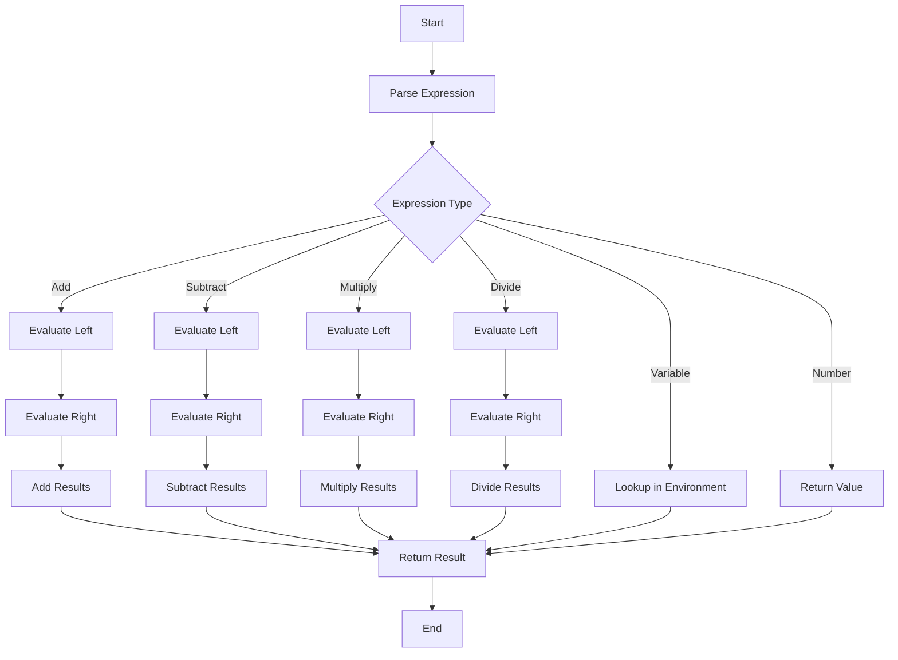

## 4.4. Interpreter Pattern in Functional Programming

The Interpreter Pattern is a powerful tool in the functional programming (FP) paradigm, particularly when it comes to implementing Domain-Specific Languages (DSLs). This pattern allows developers to define a language's grammar and semantics using functions, providing a flexible and composable approach to language design. In this section, we will delve into the concepts of the Interpreter Pattern, explore its advantages over traditional Object-Oriented Programming (OOP) approaches, and provide detailed pseudocode examples to illustrate its implementation.

### Implementing Domain-Specific Languages (DSLs)

Domain-Specific Languages are specialized languages tailored to a specific application domain. They offer a higher level of abstraction, making it easier to express domain concepts directly in code. The Interpreter Pattern in FP is particularly well-suited for creating DSLs due to its emphasis on immutability, pure functions, and higher-order functions.

#### Defining Language Constructs with Functions

In FP, we can define language constructs using functions, which allows us to create a clear and concise representation of the language's grammar. This approach leverages the power of first-class and higher-order functions to build complex language features from simple building blocks.

Let's consider a simple arithmetic expression language as an example. We will define the language constructs using functions:

```pseudocode
// Define a type for expressions
type Expression = Number | Add(Expression, Expression) | Subtract(Expression, Expression)

// Function to evaluate an expression
function evaluate(expr: Expression): Number {
    match expr {
        case Number(value): return value
        case Add(left, right): return evaluate(left) + evaluate(right)
        case Subtract(left, right): return evaluate(left) - evaluate(right)
    }
}

// Example usage
let expr = Add(Number(5), Subtract(Number(10), Number(3)))
let result = evaluate(expr) // Result: 12
```

In this pseudocode, we define an `Expression` type that can be a `Number`, `Add`, or `Subtract`. The `evaluate` function recursively evaluates the expression based on its type, demonstrating how functions can define language constructs.

### Advantages Over OOP Approach

The functional approach to the Interpreter Pattern offers several advantages over the traditional OOP approach:

1. **Simplicity**: FP allows for a more straightforward representation of language constructs using pure functions, reducing the complexity associated with class hierarchies in OOP.

2. **Composability**: Functions can be easily composed to build more complex language features, promoting code reuse and modularity.

3. **Immutability**: FP emphasizes immutable data structures, which simplifies reasoning about code and reduces the likelihood of bugs related to mutable state.

4. **Higher-Order Functions**: FP enables the use of higher-order functions to abstract common patterns and operations, making the language more expressive and flexible.

### Pseudocode Examples: Building a Simple Expression Evaluator

To illustrate the power of the Interpreter Pattern in FP, let's build a simple expression evaluator for a DSL that supports arithmetic operations and variables.

#### Step 1: Define the Language Grammar

First, we define the grammar of our DSL using algebraic data types (ADTs):

```pseudocode
// Define a type for expressions
type Expression = 
    | Number(value: Number)
    | Variable(name: String)
    | Add(left: Expression, right: Expression)
    | Subtract(left: Expression, right: Expression)
    | Multiply(left: Expression, right: Expression)
    | Divide(left: Expression, right: Expression)
```

This grammar includes support for numbers, variables, and basic arithmetic operations.

#### Step 2: Implement the Interpreter

Next, we implement the interpreter function that evaluates expressions based on their type:

```pseudocode
// Function to evaluate an expression with a given environment
function evaluate(expr: Expression, env: Map<String, Number>): Number {
    match expr {
        case Number(value): return value
        case Variable(name): return env.get(name)
        case Add(left, right): return evaluate(left, env) + evaluate(right, env)
        case Subtract(left, right): return evaluate(left, env) - evaluate(right, env)
        case Multiply(left, right): return evaluate(left, env) * evaluate(right, env)
        case Divide(left, right): return evaluate(left, env) / evaluate(right, env)
    }
}

// Example usage
let env = Map("x" -> 10, "y" -> 5)
let expr = Add(Variable("x"), Multiply(Number(2), Variable("y")))
let result = evaluate(expr, env) // Result: 20
```

In this example, the `evaluate` function takes an expression and an environment (a mapping of variable names to values) and evaluates the expression accordingly. This demonstrates how the Interpreter Pattern can handle variables and arithmetic operations.

### Visualizing the Interpreter Pattern

To better understand the flow of the Interpreter Pattern, let's visualize the evaluation process using a flowchart:



This flowchart illustrates the decision-making process within the `evaluate` function, showing how different types of expressions are handled.

### Try It Yourself

To deepen your understanding of the Interpreter Pattern in FP, try modifying the code examples provided:

- **Add New Operations**: Extend the language to support additional operations, such as modulus or exponentiation.
- **Implement Functions**: Introduce support for functions and function calls within the language.
- **Enhance Error Handling**: Implement error handling for division by zero or undefined variables.

### Design Considerations

When implementing the Interpreter Pattern in FP, consider the following:

- **Performance**: Recursive evaluation can lead to performance issues for deeply nested expressions. Consider optimizations such as tail recursion or memoization.
- **Extensibility**: Design the language grammar and interpreter to be easily extensible, allowing for the addition of new features without significant refactoring.
- **Error Handling**: Implement robust error handling to manage invalid expressions or runtime errors gracefully.

### Differences and Similarities

The Interpreter Pattern is often compared to the Visitor Pattern. While both patterns involve traversing a structure, the Interpreter Pattern focuses on evaluating expressions, whereas the Visitor Pattern is more about performing operations on elements of an object structure.

### Conclusion

The Interpreter Pattern in FP provides a powerful and flexible approach to implementing DSLs. By leveraging the strengths of functional programming, such as immutability, higher-order functions, and composability, developers can create expressive and maintainable language interpreters. As you continue your journey in functional programming, consider exploring more complex DSLs and experimenting with different language features.

## Quiz Time!



### What is the primary advantage of using the Interpreter Pattern in functional programming for DSLs?

- [x] Simplicity and composability
- [ ] Faster execution speed
- [ ] Reduced memory usage
- [ ] Enhanced security features

> **Explanation:** The primary advantage of using the Interpreter Pattern in functional programming for DSLs is simplicity and composability, allowing for clear and concise language definitions.

### In the provided pseudocode, what does the `evaluate` function do?

- [x] Evaluates an expression based on its type
- [ ] Parses the expression into tokens
- [ ] Compiles the expression into machine code
- [ ] Translates the expression into another language

> **Explanation:** The `evaluate` function evaluates an expression based on its type, returning the computed result.

### Which of the following is NOT a benefit of using functional programming for the Interpreter Pattern?

- [ ] Immutability
- [ ] Higher-order functions
- [x] Complex class hierarchies
- [ ] Composability

> **Explanation:** Complex class hierarchies are not a benefit of functional programming; FP emphasizes simplicity and composability.

### What type of data structure is used to represent the environment in the pseudocode example?

- [ ] List
- [ ] Array
- [x] Map
- [ ] Set

> **Explanation:** A `Map` data structure is used to represent the environment, mapping variable names to their values.

### How can the Interpreter Pattern be extended to support new operations?

- [x] By adding new cases to the expression type and updating the `evaluate` function
- [ ] By rewriting the entire interpreter from scratch
- [ ] By using inheritance to create new classes
- [ ] By modifying the existing environment

> **Explanation:** The Interpreter Pattern can be extended by adding new cases to the expression type and updating the `evaluate` function to handle them.

### What is the role of higher-order functions in the Interpreter Pattern?

- [ ] To increase execution speed
- [x] To abstract common patterns and operations
- [ ] To reduce memory usage
- [ ] To enhance security

> **Explanation:** Higher-order functions are used to abstract common patterns and operations, making the language more expressive and flexible.

### Which pattern is often compared to the Interpreter Pattern?

- [ ] Singleton Pattern
- [ ] Factory Pattern
- [x] Visitor Pattern
- [ ] Observer Pattern

> **Explanation:** The Interpreter Pattern is often compared to the Visitor Pattern, as both involve traversing structures but have different focuses.

### What is a Domain-Specific Language (DSL)?

- [x] A specialized language tailored to a specific application domain
- [ ] A general-purpose programming language
- [ ] A language used for web development
- [ ] A language for database management

> **Explanation:** A Domain-Specific Language (DSL) is a specialized language tailored to a specific application domain.

### True or False: The Interpreter Pattern in FP can handle variables and arithmetic operations.

- [x] True
- [ ] False

> **Explanation:** True. The Interpreter Pattern in FP can handle variables and arithmetic operations, as demonstrated in the pseudocode example.

### What is one way to optimize the performance of the Interpreter Pattern in FP?

- [ ] Use complex class hierarchies
- [ ] Avoid using functions
- [x] Implement tail recursion or memoization
- [ ] Increase the size of the environment

> **Explanation:** Implementing tail recursion or memoization can optimize the performance of the Interpreter Pattern in FP by reducing the overhead of recursive evaluation.


