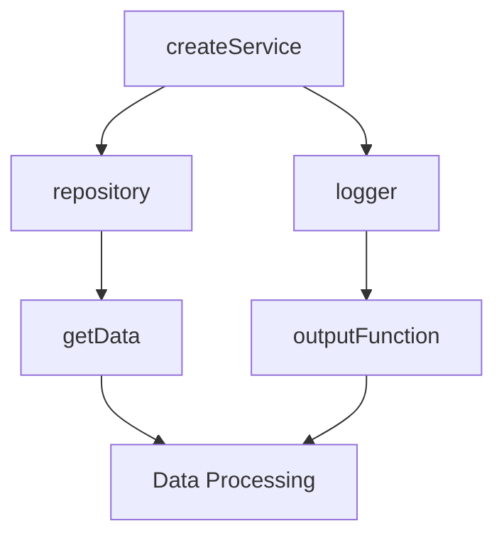

## 4.5. Dependency Injection in FP

In the realm of software development, achieving modularity and testability is a crucial goal. Dependency Injection (DI) is a design pattern that facilitates this by promoting the inversion of control. In functional programming (FP), DI takes on a unique form, leveraging the power of higher-order functions to pass dependencies explicitly. This section delves into the intricacies of Dependency Injection in FP, highlighting its benefits, providing pseudocode implementations, and offering insights into its practical applications.

### Understanding Dependency Injection

**Dependency Injection** is a design pattern used to implement Inversion of Control (IoC), a principle that decouples the creation of an object from its usage. In traditional object-oriented programming (OOP), DI often involves frameworks or containers that manage the lifecycle and injection of dependencies. However, in FP, we can achieve DI through simpler and more elegant means by using higher-order functions.

#### Inversion of Control

Inversion of Control is a fundamental concept in software design where the control flow of a program is inverted. Instead of the program dictating the flow, the control is handed over to a framework or external entity. DI is a specific form of IoC where dependencies are provided to a component rather than being created by the component itself.

**Example:**

In a typical OOP scenario, a class might instantiate its dependencies directly:

```pseudocode
class Service {
    constructor() {
        this.repository = new Repository();
    }
}
```

With DI, the dependencies are injected:

```pseudocode
class Service {
    constructor(repository) {
        this.repository = repository;
    }
}
```

In FP, we achieve a similar effect using functions:

```pseudocode
function createService(repository) {
    return function() {
        // Use the repository
    };
}
```

### Benefits of Dependency Injection in FP

Dependency Injection offers several advantages, particularly in the context of functional programming:

#### 1. Modularity

By decoupling dependencies, DI promotes modularity. Each component can be developed and tested independently, leading to a more maintainable codebase.

#### 2. Testability

DI enhances testability by allowing dependencies to be easily replaced with mocks or stubs during testing. This is particularly beneficial in FP, where pure functions and immutability already contribute to a test-friendly environment.

#### 3. Flexibility

With DI, changing a dependency is straightforward, as it involves altering the injected component rather than modifying the dependent code. This flexibility is crucial in adapting to changing requirements.

#### 4. Reusability

Components designed with DI in mind are inherently more reusable, as they are not tightly coupled to specific implementations of their dependencies.

### Implementing Dependency Injection in FP

In functional programming, we can implement Dependency Injection using higher-order functions. These functions take other functions as arguments or return them, allowing us to inject dependencies seamlessly.

#### Higher-Order Functions

Higher-order functions are a cornerstone of FP. They enable us to abstract and encapsulate behavior, making it easier to manage dependencies.

**Example:**

Consider a simple logging function:

```pseudocode
function log(message) {
    print(message);
}
```

We can enhance this function with DI:

```pseudocode
function createLogger(outputFunction) {
    return function(message) {
        outputFunction(message);
    };
}

// Usage
const consoleLogger = createLogger(print);
consoleLogger("Hello, World!");
```

In this example, `createLogger` is a higher-order function that injects the `outputFunction` dependency into the logger.

#### Pseudocode Implementation

Let's explore a more comprehensive example involving a service that depends on a repository and a logger.

```pseudocode
function createRepository() {
    return {
        getData: function() {
            // Fetch data from a source
        }
    };
}

function createLogger(outputFunction) {
    return function(message) {
        outputFunction(message);
    };
}

function createService(repository, logger) {
    return function() {
        const data = repository.getData();
        logger("Data fetched: " + data);
        // Process data
    };
}

// Usage
const repository = createRepository();
const logger = createLogger(print);
const service = createService(repository, logger);
service();
```

In this pseudocode, `createService` is a higher-order function that receives its dependencies (`repository` and `logger`) as arguments. This approach allows us to easily swap out these dependencies for testing or other purposes.

### Visualizing Dependency Injection in FP

To better understand how Dependency Injection works in functional programming, let's visualize the flow using a diagram.



**Diagram Description:** This diagram illustrates the flow of dependencies in a functional program using Dependency Injection. The `createService` function receives `repository` and `logger` as dependencies, which are then used in data processing.

### Practical Applications

Dependency Injection is widely applicable in various scenarios within functional programming:

#### 1. Configurable Systems

DI allows for the creation of systems that can be easily configured with different components, such as databases, logging mechanisms, or external services.

#### 2. Testing and Mocking

By injecting dependencies, we can replace them with mock implementations during testing, ensuring that tests are isolated and reliable.

#### 3. Plugin Architectures

DI facilitates the development of plugin architectures, where components can be dynamically injected or replaced without altering the core system.

### Try It Yourself

To solidify your understanding of Dependency Injection in FP, try modifying the pseudocode examples provided. Experiment with different dependencies, such as alternative logging mechanisms or data sources. Observe how easily you can swap these components without changing the core logic of your functions.

### Knowledge Check

Before we conclude, let's reinforce the key concepts covered in this section:

- **Dependency Injection** promotes modularity, testability, flexibility, and reusability.
- **Higher-order functions** are a powerful tool for implementing DI in functional programming.
- **Inversion of Control** is achieved by passing dependencies explicitly, rather than creating them within a component.

### Conclusion

Dependency Injection is a valuable pattern in functional programming, offering numerous benefits in terms of modularity, testability, and flexibility. By leveraging higher-order functions, we can implement DI in a clean and efficient manner, enhancing the overall quality of our code.

Remember, this is just the beginning. As you progress, you'll discover more advanced techniques and patterns that build upon these foundational concepts. Keep experimenting, stay curious, and enjoy the journey!

## Quiz Time!



### What is Dependency Injection in functional programming?

- [x] A pattern that involves passing dependencies explicitly using higher-order functions.
- [ ] A pattern that involves creating dependencies within a component.
- [ ] A pattern that involves using global variables for dependencies.
- [ ] A pattern that involves hardcoding dependencies in functions.

> **Explanation:** Dependency Injection in FP involves passing dependencies explicitly using higher-order functions, promoting modularity and testability.

### What is Inversion of Control?

- [x] A principle where the control flow of a program is inverted.
- [ ] A principle where dependencies are created within a component.
- [ ] A principle where global variables are used for dependencies.
- [ ] A principle where functions are hardcoded with dependencies.

> **Explanation:** Inversion of Control is a principle where the control flow of a program is inverted, often achieved through Dependency Injection.

### How does Dependency Injection enhance testability?

- [x] By allowing dependencies to be easily replaced with mocks or stubs during testing.
- [ ] By making dependencies global variables.
- [ ] By hardcoding dependencies in functions.
- [ ] By creating dependencies within a component.

> **Explanation:** DI enhances testability by allowing dependencies to be easily replaced with mocks or stubs during testing.

### What is a higher-order function?

- [x] A function that takes other functions as arguments or returns them.
- [ ] A function that creates dependencies within a component.
- [ ] A function that uses global variables for dependencies.
- [ ] A function that hardcodes dependencies.

> **Explanation:** A higher-order function is a function that takes other functions as arguments or returns them, enabling Dependency Injection in FP.

### What is the main benefit of using Dependency Injection?

- [x] It promotes modularity and testability.
- [ ] It makes dependencies global variables.
- [ ] It hardcodes dependencies in functions.
- [ ] It creates dependencies within a component.

> **Explanation:** The main benefit of using Dependency Injection is that it promotes modularity and testability.

### How can Dependency Injection be implemented in FP?

- [x] Using higher-order functions to pass dependencies explicitly.
- [ ] Using global variables for dependencies.
- [ ] Hardcoding dependencies in functions.
- [ ] Creating dependencies within a component.

> **Explanation:** Dependency Injection can be implemented in FP using higher-order functions to pass dependencies explicitly.

### What is the role of a logger in Dependency Injection?

- [x] It is a dependency that can be injected into a function to handle logging.
- [ ] It is a global variable used for logging.
- [ ] It is a hardcoded function for logging.
- [ ] It is a component that creates dependencies.

> **Explanation:** A logger is a dependency that can be injected into a function to handle logging, demonstrating DI in action.

### What is the advantage of using Dependency Injection in plugin architectures?

- [x] It allows components to be dynamically injected or replaced without altering the core system.
- [ ] It makes dependencies global variables.
- [ ] It hardcodes dependencies in functions.
- [ ] It creates dependencies within a component.

> **Explanation:** DI allows components to be dynamically injected or replaced without altering the core system, benefiting plugin architectures.

### What is the purpose of the `createService` function in the pseudocode example?

- [x] To create a service with injected dependencies for repository and logger.
- [ ] To create dependencies within the service.
- [ ] To use global variables for dependencies.
- [ ] To hardcode dependencies in the service.

> **Explanation:** The `createService` function creates a service with injected dependencies for repository and logger, illustrating DI.

### True or False: Dependency Injection is only applicable in object-oriented programming.

- [ ] True
- [x] False

> **Explanation:** False. Dependency Injection is applicable in functional programming as well, using higher-order functions for implementation.


