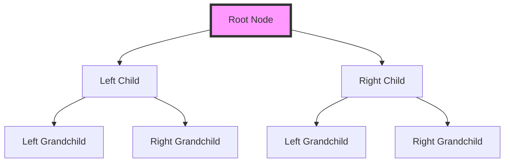

## 4.6. Zipper Pattern

In the realm of functional programming, the Zipper Pattern emerges as a powerful technique for navigating and updating immutable data structures. By providing a focus within a structure, it allows for efficient modifications without compromising immutability. This section delves into the intricacies of the Zipper Pattern, exploring its use cases, implementation, and benefits.

### Navigating and Updating Immutable Data Structures

Functional programming emphasizes immutability, where data structures remain unchanged once created. While this approach offers numerous benefits, such as thread safety and predictability, it can pose challenges when updates are necessary. The Zipper Pattern addresses this by enabling localized updates within a structure, maintaining the overall immutability.

#### Providing a Focus Within a Structure

The Zipper Pattern introduces the concept of a "focus" within a data structure. Imagine a cursor or pointer that highlights a specific element, allowing for targeted operations. This focus is achieved by splitting the structure into two parts: the element of interest and its context. By manipulating the focus, we can efficiently traverse and update the structure.

### Use Cases

The Zipper Pattern is particularly useful in scenarios involving complex data structures like trees and lists. Let's explore some common use cases:

- **Editing Trees:** Trees are hierarchical structures with nodes connected by edges. Navigating and updating nodes in a tree can be cumbersome, especially when maintaining immutability. The Zipper Pattern simplifies this process by providing a focus on a specific node, allowing for efficient updates.

- **Editing Lists:** Lists are linear structures where elements are arranged sequentially. While lists are simpler than trees, updating elements in an immutable list can still be challenging. The Zipper Pattern enables targeted updates by focusing on a specific element, facilitating efficient modifications.

### Pseudocode Implementation

To understand the Zipper Pattern, let's explore its implementation through pseudocode. We'll define movement and update functions to navigate and modify a simple binary tree.

#### Defining Movement Functions

Movement functions allow us to traverse the structure by shifting the focus. In a binary tree, we can move left or right to navigate between nodes.

```pseudocode
// Define a binary tree node
Node {
  value: Any
  left: Node
  right: Node
}

// Define a zipper for a binary tree
Zipper {
  focus: Node
  context: List[Context]
}

// Define a context for a node
Context {
  direction: String // "left" or "right"
  sibling: Node
  parent: Node
}

// Move focus to the left child
function moveLeft(zipper: Zipper): Zipper {
  if zipper.focus.left is not null {
    newContext = Context("left", zipper.focus.right, zipper.focus)
    newFocus = zipper.focus.left
    return Zipper(newFocus, [newContext] + zipper.context)
  } else {
    throw Error("No left child")
  }
}

// Move focus to the right child
function moveRight(zipper: Zipper): Zipper {
  if zipper.focus.right is not null {
    newContext = Context("right", zipper.focus.left, zipper.focus)
    newFocus = zipper.focus.right
    return Zipper(newFocus, [newContext] + zipper.context)
  } else {
    throw Error("No right child")
  }
}

// Move focus to the parent node
function moveUp(zipper: Zipper): Zipper {
  if zipper.context is not empty {
    context = zipper.context[0]
    if context.direction == "left" {
      newFocus = Node(context.parent.value, zipper.focus, context.sibling)
    } else {
      newFocus = Node(context.parent.value, context.sibling, zipper.focus)
    }
    return Zipper(newFocus, zipper.context[1:])
  } else {
    throw Error("No parent node")
  }
}
```

#### Defining Update Functions

Update functions allow us to modify the focused element while maintaining the immutability of the overall structure.

```pseudocode
// Update the value of the focused node
function updateValue(zipper: Zipper, newValue: Any): Zipper {
  newFocus = Node(newValue, zipper.focus.left, zipper.focus.right)
  return Zipper(newFocus, zipper.context)
}
```

### Visualizing the Zipper Pattern

To better understand the Zipper Pattern, let's visualize its operation on a binary tree. The following diagram illustrates the movement and update process:



In this diagram, the root node is highlighted as the focus. By applying movement functions, we can shift the focus to different nodes, enabling targeted updates.

### Key Participants

The Zipper Pattern involves several key participants:

- **Node:** Represents an element in the data structure, such as a tree node or list element.
- **Zipper:** Encapsulates the focus and context, providing a mechanism for navigation and updates.
- **Context:** Stores information about the focus's position within the structure, enabling movement and restoration.

### Applicability

The Zipper Pattern is applicable in scenarios where efficient navigation and updates are required within immutable data structures. It is particularly useful in functional programming languages that emphasize immutability, such as Haskell, Scala, and Clojure.

### Design Considerations

When implementing the Zipper Pattern, consider the following design considerations:

- **Complexity:** While the Zipper Pattern simplifies navigation and updates, it introduces additional complexity in managing the focus and context. Ensure that the benefits outweigh the added complexity.

- **Performance:** The Zipper Pattern can improve performance by reducing the need for full structure copies during updates. However, the overhead of managing the focus and context may impact performance in certain scenarios.

- **Use Cases:** Evaluate the suitability of the Zipper Pattern for your specific use case. It is most effective in scenarios involving complex data structures with frequent updates.

### Programming Language Specifics

The Zipper Pattern is well-suited for functional programming languages that support immutability and higher-order functions. While it can be implemented in imperative languages, the benefits are more pronounced in functional languages.

### Differences and Similarities

The Zipper Pattern is often compared to other navigation and update patterns, such as the Iterator Pattern and the Visitor Pattern. While all three patterns facilitate traversal and updates, the Zipper Pattern is unique in its focus on immutability and localized updates.

### Try It Yourself

To deepen your understanding of the Zipper Pattern, try modifying the pseudocode examples provided. Experiment with different movement and update functions, and observe how the focus and context change. Consider implementing the Zipper Pattern for other data structures, such as linked lists or graphs.

### Knowledge Check

Before we conclude, let's reinforce your understanding with a few questions:

- How does the Zipper Pattern facilitate updates in immutable data structures?
- What are the key participants in the Zipper Pattern?
- How does the Zipper Pattern differ from the Iterator Pattern?

### Embrace the Journey

Remember, mastering the Zipper Pattern is just one step in your functional programming journey. As you continue to explore functional programming patterns, you'll gain a deeper understanding of how to leverage immutability and higher-order functions to build efficient and maintainable software. Keep experimenting, stay curious, and enjoy the journey!

## Quiz Time!



### What is the primary purpose of the Zipper Pattern in functional programming?

- [x] To navigate and update immutable data structures efficiently
- [ ] To sort data structures in ascending order
- [ ] To compress data for storage
- [ ] To encrypt data for security

> **Explanation:** The Zipper Pattern is designed to navigate and update immutable data structures efficiently by providing a focus within the structure.

### Which of the following is a key participant in the Zipper Pattern?

- [x] Node
- [ ] Iterator
- [ ] Visitor
- [ ] Factory

> **Explanation:** The Node is a key participant in the Zipper Pattern, representing an element in the data structure.

### How does the Zipper Pattern maintain immutability while allowing updates?

- [x] By providing a focus and context for localized updates
- [ ] By copying the entire data structure for each update
- [ ] By using global variables to store changes
- [ ] By locking the data structure during updates

> **Explanation:** The Zipper Pattern maintains immutability by providing a focus and context for localized updates, avoiding the need to copy the entire structure.

### What is a common use case for the Zipper Pattern?

- [x] Editing trees
- [ ] Sorting arrays
- [ ] Encrypting data
- [ ] Compressing files

> **Explanation:** A common use case for the Zipper Pattern is editing trees, where it facilitates efficient navigation and updates.

### Which function is used to move the focus to the left child in a binary tree zipper?

- [x] moveLeft
- [ ] moveRight
- [ ] moveUp
- [ ] moveDown

> **Explanation:** The `moveLeft` function is used to move the focus to the left child in a binary tree zipper.

### What does the context in a Zipper Pattern store?

- [x] Information about the focus's position within the structure
- [ ] The entire data structure
- [ ] The history of all updates
- [ ] The size of the data structure

> **Explanation:** The context in a Zipper Pattern stores information about the focus's position within the structure, enabling movement and restoration.

### In which programming paradigm is the Zipper Pattern most effective?

- [x] Functional programming
- [ ] Object-oriented programming
- [ ] Procedural programming
- [ ] Logic programming

> **Explanation:** The Zipper Pattern is most effective in functional programming, where immutability and higher-order functions are emphasized.

### How does the Zipper Pattern differ from the Iterator Pattern?

- [x] The Zipper Pattern focuses on immutability and localized updates
- [ ] The Zipper Pattern is used for sorting data
- [ ] The Zipper Pattern compresses data for storage
- [ ] The Zipper Pattern encrypts data for security

> **Explanation:** The Zipper Pattern differs from the Iterator Pattern by focusing on immutability and localized updates, rather than simple traversal.

### What is a potential drawback of the Zipper Pattern?

- [x] Increased complexity in managing focus and context
- [ ] Reduced data security
- [ ] Slower data compression
- [ ] Less efficient sorting

> **Explanation:** A potential drawback of the Zipper Pattern is the increased complexity in managing focus and context, which may impact performance.

### True or False: The Zipper Pattern can be implemented in imperative languages.

- [x] True
- [ ] False

> **Explanation:** True. While the Zipper Pattern is well-suited for functional programming languages, it can also be implemented in imperative languages.


