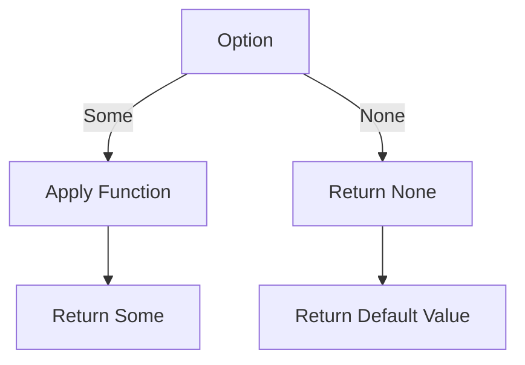

## 5.1. Option/Maybe Monad

In functional programming, dealing with nullable values is a common challenge. The Option/Maybe Monad offers a robust solution to this problem, allowing developers to handle potential null values safely and elegantly. This section will delve into the concept of the Option/Maybe Monad, its operations, and how to implement it using pseudocode.

### Representing Nullable Values Safely

Null reference errors are notorious for causing runtime exceptions in many programming languages. The Option/Maybe Monad provides a way to represent nullable values explicitly, reducing the risk of such errors. By encapsulating a value that might be absent, the Option/Maybe Monad forces developers to handle the absence of a value explicitly, promoting safer and more predictable code.

#### What is the Option/Maybe Monad?

The Option/Maybe Monad is a design pattern used to represent optional values. It is a container that can either hold a value (Some) or be empty (None). This pattern is prevalent in functional programming languages like Haskell, Scala, and F#. The primary goal of the Option/Maybe Monad is to eliminate null references by providing a type-safe way to handle optional values.

### Operations with Option Types

The Option/Maybe Monad provides several operations that allow developers to work with optional values effectively. These operations include `map`, `flatMap`, and `getOrElse`.

#### Map

The `map` operation applies a function to the value inside the Option/Maybe Monad if it exists. If the Option/Maybe Monad is empty, it returns None. This operation allows for the transformation of the contained value without having to check for its presence explicitly.

```pseudocode
function map(option, func):
    if option is Some(value):
        return Some(func(value))
    else:
        return None
```

#### FlatMap

The `flatMap` operation is similar to `map`, but it is used when the function returns another Option/Maybe Monad. It allows for chaining operations that may also return optional values, flattening the nested structure into a single Option/Maybe Monad.

```pseudocode
function flatMap(option, func):
    if option is Some(value):
        return func(value)
    else:
        return None
```

#### GetOrElse

The `getOrElse` operation provides a default value in case the Option/Maybe Monad is empty. This operation is useful for providing fallback values when the optional value is absent.

```pseudocode
function getOrElse(option, defaultValue):
    if option is Some(value):
        return value
    else:
        return defaultValue
```

### Pseudocode Implementation

Let's implement the Option/Maybe Monad using pseudocode. We'll define the `Some` and `None` cases, along with the operations discussed above.

```pseudocode
class Option:
    pass

class Some(Option):
    def __init__(self, value):
        self.value = value

class None(Option):
    pass

function map(option, func):
    if option is Some:
        return Some(func(option.value))
    else:
        return None

function flatMap(option, func):
    if option is Some:
        return func(option.value)
    else:
        return None

function getOrElse(option, defaultValue):
    if option is Some:
        return option.value
    else:
        return defaultValue
```

### Visualizing the Option/Maybe Monad

To better understand the flow of operations within the Option/Maybe Monad, let's visualize it using a flowchart. This diagram will illustrate how the `map`, `flatMap`, and `getOrElse` operations interact with the `Some` and `None` cases.



### Key Participants

- **Some**: Represents the presence of a value within the Option/Maybe Monad.
- **None**: Represents the absence of a value, indicating an empty Option/Maybe Monad.
- **Map**: Transforms the contained value if present.
- **FlatMap**: Chains operations that return optional values.
- **GetOrElse**: Provides a default value if the Option/Maybe Monad is empty.

### Applicability

The Option/Maybe Monad is applicable in scenarios where values may be absent, such as:

- **Database Queries**: Handling missing records.
- **Configuration Files**: Managing optional settings.
- **User Input**: Dealing with optional form fields.

### Design Considerations

When using the Option/Maybe Monad, consider the following:

- **Explicit Handling**: Always handle both `Some` and `None` cases to avoid unexpected behavior.
- **Chaining Operations**: Use `flatMap` for chaining operations that return optional values.
- **Providing Defaults**: Use `getOrElse` to provide sensible default values.

### Differences and Similarities

The Option/Maybe Monad is often compared to other patterns like the `Either` Monad, which represents computations with two possible outcomes (success or failure). While both patterns handle optional values, the `Either` Monad provides additional context for errors.

### Try It Yourself

To deepen your understanding of the Option/Maybe Monad, try modifying the pseudocode examples. Experiment with different functions in the `map` and `flatMap` operations, and explore how the `getOrElse` operation behaves with various default values.

### References and Links

For further reading on the Option/Maybe Monad, consider the following resources:

- [MDN Web Docs: Nullish Coalescing Operator](https://developer.mozilla.org/en-US/docs/Web/JavaScript/Reference/Operators/Nullish_coalescing_operator)
- [Scala Documentation: Option](https://docs.scala-lang.org/overviews/scala-book/options.html)
- [Haskell Wiki: Maybe](https://wiki.haskell.org/Maybe)

### Knowledge Check

To reinforce your understanding of the Option/Maybe Monad, consider the following questions:

- What are the key operations provided by the Option/Maybe Monad?
- How does the `flatMap` operation differ from `map`?
- In what scenarios is the Option/Maybe Monad particularly useful?

### Embrace the Journey

Remember, mastering the Option/Maybe Monad is just one step in your functional programming journey. As you continue to explore functional patterns, you'll discover new ways to write safer and more expressive code. Keep experimenting, stay curious, and enjoy the journey!

## Quiz Time!



### What is the primary purpose of the Option/Maybe Monad?

- [x] To safely handle nullable values and avoid null reference errors.
- [ ] To perform mathematical operations on numbers.
- [ ] To manage state in an application.
- [ ] To handle asynchronous operations.

> **Explanation:** The Option/Maybe Monad is designed to safely handle nullable values, providing a type-safe way to represent optional values and avoid null reference errors.

### Which operation applies a function to the value inside the Option/Maybe Monad if it exists?

- [x] map
- [ ] flatMap
- [ ] getOrElse
- [ ] filter

> **Explanation:** The `map` operation applies a function to the value inside the Option/Maybe Monad if it exists, transforming the contained value.

### How does the `flatMap` operation differ from `map`?

- [x] `flatMap` is used when the function returns another Option/Maybe Monad.
- [ ] `flatMap` is used to provide a default value.
- [ ] `flatMap` is used to filter values.
- [ ] `flatMap` is used to perform mathematical operations.

> **Explanation:** The `flatMap` operation is used when the function returns another Option/Maybe Monad, allowing for chaining operations that may also return optional values.

### What does the `getOrElse` operation do?

- [x] Provides a default value if the Option/Maybe Monad is empty.
- [ ] Transforms the contained value.
- [ ] Chains operations that return optional values.
- [ ] Filters values based on a condition.

> **Explanation:** The `getOrElse` operation provides a default value if the Option/Maybe Monad is empty, ensuring that a value is always returned.

### In which scenarios is the Option/Maybe Monad particularly useful?

- [x] Handling missing records in database queries.
- [x] Managing optional settings in configuration files.
- [ ] Performing mathematical operations.
- [ ] Handling asynchronous operations.

> **Explanation:** The Option/Maybe Monad is particularly useful in scenarios where values may be absent, such as handling missing records in database queries and managing optional settings in configuration files.

### What are the two cases of the Option/Maybe Monad?

- [x] Some and None
- [ ] Success and Failure
- [ ] True and False
- [ ] Left and Right

> **Explanation:** The two cases of the Option/Maybe Monad are `Some`, which represents the presence of a value, and `None`, which represents the absence of a value.

### Which operation allows for chaining operations that return optional values?

- [x] flatMap
- [ ] map
- [ ] getOrElse
- [ ] filter

> **Explanation:** The `flatMap` operation allows for chaining operations that return optional values, flattening the nested structure into a single Option/Maybe Monad.

### What is the benefit of using the Option/Maybe Monad?

- [x] It reduces the risk of null reference errors.
- [ ] It increases the complexity of the code.
- [ ] It makes the code run faster.
- [ ] It allows for asynchronous operations.

> **Explanation:** The Option/Maybe Monad reduces the risk of null reference errors by providing a type-safe way to handle optional values.

### Which operation provides a default value in case the Option/Maybe Monad is empty?

- [x] getOrElse
- [ ] map
- [ ] flatMap
- [ ] filter

> **Explanation:** The `getOrElse` operation provides a default value in case the Option/Maybe Monad is empty, ensuring that a value is always returned.

### True or False: The Option/Maybe Monad is often compared to the Either Monad.

- [x] True
- [ ] False

> **Explanation:** True. The Option/Maybe Monad is often compared to the Either Monad, which represents computations with two possible outcomes (success or failure).


