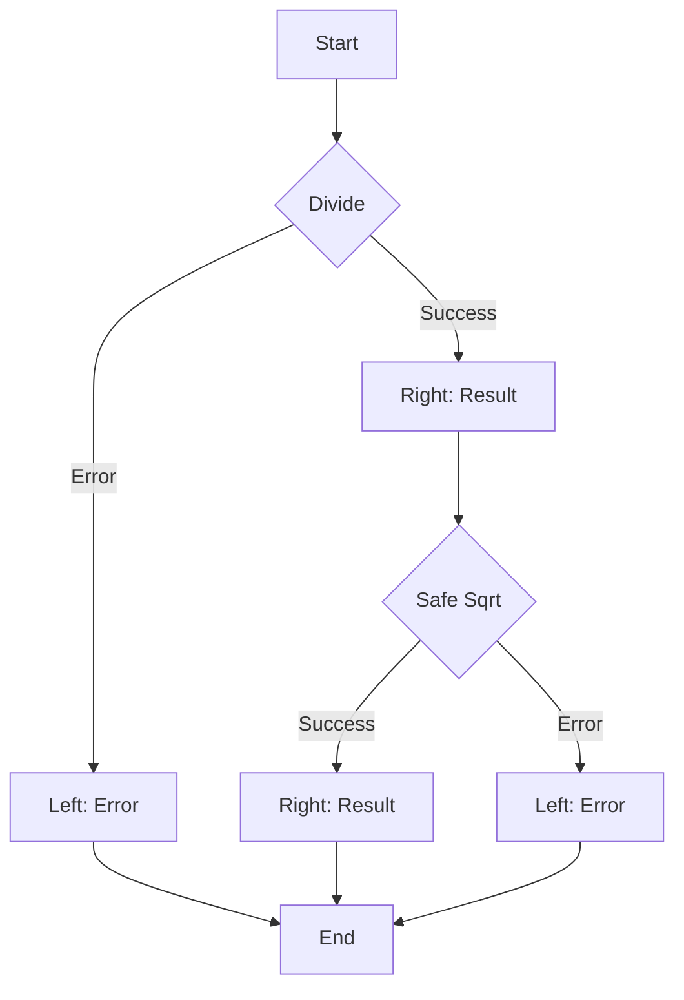

## 5.2. Either Monad

### Introduction

In functional programming, handling computations that can result in success or failure is a common requirement. The Either Monad is a powerful pattern that provides a structured way to manage these dual-outcome computations. By representing success and failure explicitly, the Either Monad enhances code clarity and robustness, allowing developers to handle errors gracefully without resorting to exceptions or null values.

### Intent

The primary intent of the Either Monad is to encapsulate computations that may result in two distinct outcomes: a successful result or an error. This pattern is particularly useful in scenarios where operations can fail, such as file I/O, network requests, or data parsing. By using the Either Monad, developers can chain computations together, propagating errors seamlessly and handling them at a higher level in the application.

### Key Participants

- **Either Monad**: The core structure representing a computation with two possible outcomes.
- **Left**: Represents the error or failure case, typically carrying error information.
- **Right**: Represents the success case, carrying the successful result of the computation.

### Applicability

The Either Monad is applicable in any situation where a computation can result in success or failure. It is particularly useful in functional programming languages that emphasize immutability and pure functions, as it allows for error handling without side effects. Common use cases include:

- Validating user input
- Handling network requests
- Parsing data
- Managing file I/O operations

### Working with Left and Right

The Either Monad consists of two primary components: Left and Right. These components are used to represent the two possible outcomes of a computation.

- **Left**: This component is used to represent the error or failure case. It typically carries error information, such as an error message or error code. In functional programming, using Left to represent errors allows developers to handle errors explicitly, avoiding the pitfalls of exceptions or null values.

- **Right**: This component is used to represent the success case. It carries the successful result of the computation. By using Right to represent success, developers can chain computations together, propagating the successful result through the chain.

### Pseudocode Examples

Let's explore some pseudocode examples to illustrate how the Either Monad can be used to handle computations with two possible outcomes.

#### Example 1: Basic Either Monad

```pseudocode
// Define the Either Monad
class Either:
    def __init__(self, is_right, value):
        self.is_right = is_right
        self.value = value

    def is_left(self):
        return not self.is_right

    def is_right(self):
        return self.is_right

// Create a function that returns an Either Monad
function divide(a, b):
    if b == 0:
        return Either(False, "Division by zero error")
    else:
        return Either(True, a / b)

// Usage
result = divide(10, 2)
if result.is_right():
    print("Success:", result.value)
else:
    print("Error:", result.value)
```

In this example, we define a simple Either Monad with a constructor that takes a boolean indicating whether the result is a success (Right) or an error (Left), along with the value. The `divide` function returns an Either Monad, representing either a successful division or an error if division by zero is attempted.

#### Example 2: Chaining Computations

```pseudocode
// Define a function to chain computations
function chain(either, func):
    if either.is_right():
        return func(either.value)
    else:
        return either

// Define a function that may fail
function safe_sqrt(x):
    if x < 0:
        return Either(False, "Cannot take square root of negative number")
    else:
        return Either(True, sqrt(x))

// Usage
result = chain(divide(10, 2), safe_sqrt)
if result.is_right():
    print("Success:", result.value)
else:
    print("Error:", result.value)
```

In this example, we define a `chain` function that takes an Either Monad and a function. If the Either Monad represents a success (Right), the function is applied to the value. If it represents an error (Left), the error is propagated. This allows us to chain computations together, handling errors gracefully.

### Visualizing the Either Monad

To better understand the flow of computations with the Either Monad, let's visualize the process using a flowchart.



**Caption:** This flowchart illustrates the process of chaining computations with the Either Monad. The computation starts with a division operation, which can result in either a success (Right) or an error (Left). If successful, the result is passed to the `safe_sqrt` function, which can also result in a success or error. The final result is either a successful computation or an error.

### Design Considerations

When using the Either Monad, consider the following:

- **Error Propagation**: The Either Monad allows for seamless error propagation through chained computations. Ensure that error information is meaningful and provides enough context for debugging.
- **Type Safety**: In statically typed languages, the Either Monad can enhance type safety by explicitly representing success and failure cases.
- **Performance**: While the Either Monad provides a clean way to handle errors, consider the performance implications of creating and handling monadic structures, especially in performance-critical applications.

### Programming Language Specifics

The Either Monad is a common pattern in functional programming languages such as Haskell, Scala, and F#. However, it can also be implemented in multi-paradigm languages like JavaScript and Python. When implementing the Either Monad in different languages, consider the language's support for functional programming constructs, such as higher-order functions and immutability.

### Differences and Similarities

The Either Monad is often compared to the Option/Maybe Monad. While both patterns handle computations with two possible outcomes, the Either Monad explicitly represents errors, whereas the Option/Maybe Monad represents the presence or absence of a value. Use the Either Monad when you need to carry error information, and the Option/Maybe Monad when the absence of a value is sufficient.

### Try It Yourself

To deepen your understanding of the Either Monad, try modifying the pseudocode examples provided. Experiment with different functions that may fail, and chain them together using the Either Monad. Consider how you might handle different types of errors and how you can propagate them through the computation chain.

### Knowledge Check

- What are the two primary components of the Either Monad?
- How does the Either Monad enhance error handling in functional programming?
- What are some common use cases for the Either Monad?
- How does the Either Monad differ from the Option/Maybe Monad?

### Embrace the Journey

Remember, mastering the Either Monad is just one step in your functional programming journey. As you continue to explore functional programming patterns, you'll discover new ways to write clean, robust, and maintainable code. Keep experimenting, stay curious, and enjoy the journey!

## Quiz Time!



### What is the primary purpose of the Either Monad?

- [x] To handle computations with two possible outcomes: success and failure.
- [ ] To represent only successful computations.
- [ ] To manage stateful computations.
- [ ] To encapsulate side effects.

> **Explanation:** The Either Monad is designed to handle computations that can result in either success or failure, providing a structured way to manage these outcomes.

### What does the Left component of the Either Monad represent?

- [x] The error or failure case.
- [ ] The success case.
- [ ] The absence of a value.
- [ ] The presence of a value.

> **Explanation:** The Left component of the Either Monad is used to represent the error or failure case, typically carrying error information.

### How does the Either Monad differ from the Option/Maybe Monad?

- [x] The Either Monad explicitly represents errors, while the Option/Maybe Monad represents the presence or absence of a value.
- [ ] The Either Monad is used for stateful computations, while the Option/Maybe Monad is not.
- [ ] The Either Monad is only used in imperative programming, while the Option/Maybe Monad is used in functional programming.
- [ ] The Either Monad is used for handling side effects, while the Option/Maybe Monad is not.

> **Explanation:** The Either Monad explicitly represents errors, making it suitable for scenarios where error information is important, while the Option/Maybe Monad is used to represent the presence or absence of a value.

### What is the role of the chain function in the Either Monad?

- [x] To chain computations together, propagating errors or successful results.
- [ ] To encapsulate side effects.
- [ ] To manage stateful computations.
- [ ] To represent the absence of a value.

> **Explanation:** The chain function is used to chain computations together, allowing for the propagation of errors or successful results through the computation chain.

### In which scenarios is the Either Monad particularly useful?

- [x] Validating user input, handling network requests, parsing data, managing file I/O operations.
- [ ] Managing stateful computations, encapsulating side effects, representing the absence of a value.
- [ ] Performing mathematical calculations, managing concurrency, handling side effects.
- [ ] Representing only successful computations, managing stateful computations, encapsulating side effects.

> **Explanation:** The Either Monad is particularly useful in scenarios where computations can result in success or failure, such as validating user input, handling network requests, parsing data, and managing file I/O operations.

### What is the primary advantage of using the Either Monad for error handling?

- [x] It allows for explicit error handling without resorting to exceptions or null values.
- [ ] It simplifies state management in functional programming.
- [ ] It enhances performance by reducing computation time.
- [ ] It provides a way to encapsulate side effects.

> **Explanation:** The Either Monad allows for explicit error handling, avoiding the pitfalls of exceptions or null values, and providing a structured way to manage errors.

### How can the Either Monad enhance type safety in statically typed languages?

- [x] By explicitly representing success and failure cases, enhancing type safety.
- [ ] By managing stateful computations, enhancing type safety.
- [ ] By encapsulating side effects, enhancing type safety.
- [ ] By reducing computation time, enhancing type safety.

> **Explanation:** In statically typed languages, the Either Monad enhances type safety by explicitly representing success and failure cases, allowing the type system to enforce correct handling of these outcomes.

### What should be considered when using the Either Monad in performance-critical applications?

- [x] The performance implications of creating and handling monadic structures.
- [ ] The ability to manage stateful computations.
- [ ] The encapsulation of side effects.
- [ ] The representation of the absence of a value.

> **Explanation:** When using the Either Monad in performance-critical applications, consider the performance implications of creating and handling monadic structures, as they may impact performance.

### What is the significance of error propagation in the Either Monad?

- [x] It allows for seamless error propagation through chained computations.
- [ ] It simplifies state management in functional programming.
- [ ] It enhances performance by reducing computation time.
- [ ] It provides a way to encapsulate side effects.

> **Explanation:** Error propagation is significant in the Either Monad as it allows for seamless propagation of errors through chained computations, enabling graceful error handling.

### True or False: The Either Monad can be implemented in both functional and multi-paradigm languages.

- [x] True
- [ ] False

> **Explanation:** The Either Monad can be implemented in both functional programming languages and multi-paradigm languages, allowing for flexible error handling across different programming environments.


