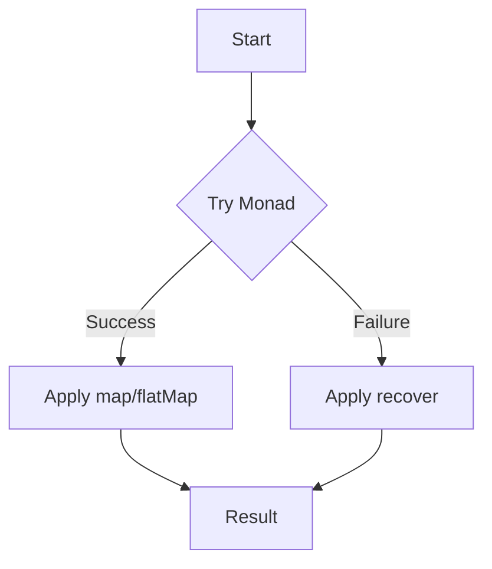

## 5.3. Try Monad

In the realm of functional programming, handling errors and exceptions in a clean and predictable manner is crucial. The Try Monad is a powerful pattern that allows us to encapsulate exceptions as values, providing a robust mechanism for managing errors without resorting to traditional try-catch blocks. This section will delve into the Try Monad, exploring its operations, transformations, and practical implementations through pseudocode examples.

### Encapsulating Exceptions

In imperative programming, exceptions are typically handled using try-catch blocks, which can lead to scattered error-handling logic and less readable code. The Try Monad offers a functional approach by encapsulating exceptions as values, allowing us to work with them in a more declarative and composable manner.

#### Key Concepts

- **Try Monad**: A monadic structure that represents a computation that may either result in a value (Success) or an exception (Failure).
- **Success**: Represents a successful computation with a resulting value.
- **Failure**: Represents a computation that has failed with an exception.

By treating exceptions as values, the Try Monad enables us to chain operations and transformations while maintaining a clear separation between successful and failed computations.

### Operations and Transformations

The Try Monad provides several operations and transformations that allow us to work with computations in a functional style. Let's explore some of the key operations:

#### map

The `map` operation allows us to transform the value contained within a `Success`, while leaving a `Failure` unchanged. This operation is useful for applying a function to the result of a successful computation.

```pseudocode
function map(tryInstance, transformFunction):
    if tryInstance is Success:
        return Success(transformFunction(tryInstance.value))
    else:
        return tryInstance
```

#### flatMap

The `flatMap` operation is similar to `map`, but it allows us to chain computations that return a Try Monad. This is particularly useful for composing multiple operations that may each result in a Success or Failure.

```pseudocode
function flatMap(tryInstance, transformFunction):
    if tryInstance is Success:
        return transformFunction(tryInstance.value)
    else:
        return tryInstance
```

#### recover

The `recover` operation provides a way to handle failures by supplying an alternative value or computation. It allows us to specify a fallback mechanism when a computation fails.

```pseudocode
function recover(tryInstance, recoveryFunction):
    if tryInstance is Failure:
        return Success(recoveryFunction(tryInstance.exception))
    else:
        return tryInstance
```

### Pseudocode Implementation

Let's implement the Try Monad in pseudocode, demonstrating how it can be used to wrap operations that might throw exceptions.

```pseudocode
class Try:
    def __init__(self, computation):
        try:
            self.value = computation()
            self.isSuccess = True
        except Exception as e:
            self.exception = e
            self.isSuccess = False

    def map(self, transformFunction):
        if self.isSuccess:
            return Try(lambda: transformFunction(self.value))
        else:
            return self

    def flatMap(self, transformFunction):
        if self.isSuccess:
            return transformFunction(self.value)
        else:
            return self

    def recover(self, recoveryFunction):
        if not self.isSuccess:
            return Try(lambda: recoveryFunction(self.exception))
        else:
            return self

def divide(a, b):
    return a / b

result = Try(lambda: divide(10, 0)) \
    .map(lambda x: x * 2) \
    .recover(lambda e: 0)

print(result.value)  # Output: 0
```

### Visualizing the Try Monad

To better understand the flow of operations within the Try Monad, let's visualize the process using a flowchart.



**Figure 1**: Visualizing the flow of operations in the Try Monad.

### Design Considerations

When using the Try Monad, consider the following design considerations:

- **Error Propagation**: The Try Monad allows errors to propagate through a chain of operations, enabling centralized error handling.
- **Composability**: By encapsulating exceptions as values, the Try Monad enhances composability, allowing us to build complex computations from simple components.
- **Readability**: The declarative nature of the Try Monad improves code readability by reducing the need for explicit error-handling logic.

### Programming Language Specifics

While the Try Monad is a concept rooted in functional programming, it can be implemented in various programming languages. Some languages, like Scala, provide built-in support for the Try Monad, while others may require custom implementations.

### Differences and Similarities

The Try Monad is often compared to other error-handling patterns, such as the Option/Maybe Monad and the Either Monad. While all these patterns aim to manage errors functionally, the Try Monad is specifically designed for handling exceptions, whereas the Option/Maybe Monad deals with nullable values, and the Either Monad represents computations with two possible outcomes.

### Try It Yourself

To deepen your understanding of the Try Monad, try modifying the pseudocode examples to handle different types of exceptions or to chain additional operations. Experiment with different recovery strategies and observe how the Try Monad simplifies error handling.

### Knowledge Check

- What are the key differences between the Try Monad and traditional try-catch blocks?
- How does the Try Monad enhance the composability of error-handling logic?
- In what scenarios would you choose the Try Monad over other error-handling patterns?

### Embrace the Journey

Remember, mastering the Try Monad is just one step in your functional programming journey. As you continue to explore functional patterns, you'll discover new ways to write clean, maintainable, and robust code. Keep experimenting, stay curious, and enjoy the journey!

## Quiz Time!



### What is the primary purpose of the Try Monad?

- [x] To encapsulate exceptions as values
- [ ] To handle nullable values
- [ ] To represent computations with two possible outcomes
- [ ] To improve performance

> **Explanation:** The Try Monad is designed to encapsulate exceptions as values, allowing for functional error handling.

### Which operation allows you to transform the value within a Success?

- [x] map
- [ ] flatMap
- [ ] recover
- [ ] filter

> **Explanation:** The map operation is used to transform the value within a Success, leaving a Failure unchanged.

### What does the flatMap operation enable you to do?

- [x] Chain computations that return a Try Monad
- [ ] Transform the value within a Success
- [ ] Handle failures with a fallback value
- [ ] Filter values based on a condition

> **Explanation:** The flatMap operation allows chaining computations that return a Try Monad, enabling composition of multiple operations.

### How does the recover operation handle failures?

- [x] By supplying an alternative value or computation
- [ ] By transforming the value within a Success
- [ ] By chaining computations
- [ ] By filtering values

> **Explanation:** The recover operation provides a way to handle failures by supplying an alternative value or computation.

### What is a key benefit of using the Try Monad?

- [x] Centralized error handling
- [ ] Improved performance
- [ ] Reduced memory usage
- [ ] Simplified syntax

> **Explanation:** The Try Monad allows for centralized error handling, enhancing code readability and maintainability.

### In which programming language is the Try Monad built-in?

- [x] Scala
- [ ] Java
- [ ] Python
- [ ] JavaScript

> **Explanation:** Scala provides built-in support for the Try Monad, making it easier to use in functional programming.

### What is the difference between the Try Monad and the Option/Maybe Monad?

- [x] The Try Monad handles exceptions, while the Option/Maybe Monad deals with nullable values
- [ ] The Try Monad improves performance, while the Option/Maybe Monad enhances readability
- [ ] The Try Monad is used for concurrency, while the Option/Maybe Monad is used for error handling
- [ ] The Try Monad is more efficient than the Option/Maybe Monad

> **Explanation:** The Try Monad is specifically designed for handling exceptions, whereas the Option/Maybe Monad deals with nullable values.

### What is a common use case for the Try Monad?

- [x] Handling computations that may throw exceptions
- [ ] Managing nullable values
- [ ] Representing success and failure outcomes
- [ ] Improving code performance

> **Explanation:** The Try Monad is commonly used for handling computations that may throw exceptions, providing a functional approach to error handling.

### How does the Try Monad improve code readability?

- [x] By reducing the need for explicit error-handling logic
- [ ] By simplifying syntax
- [ ] By improving performance
- [ ] By reducing memory usage

> **Explanation:** The Try Monad improves code readability by encapsulating exceptions as values, reducing the need for explicit error-handling logic.

### True or False: The Try Monad can be used to handle asynchronous operations.

- [ ] True
- [x] False

> **Explanation:** The Try Monad is not designed for handling asynchronous operations; it is used for managing exceptions in synchronous computations.


