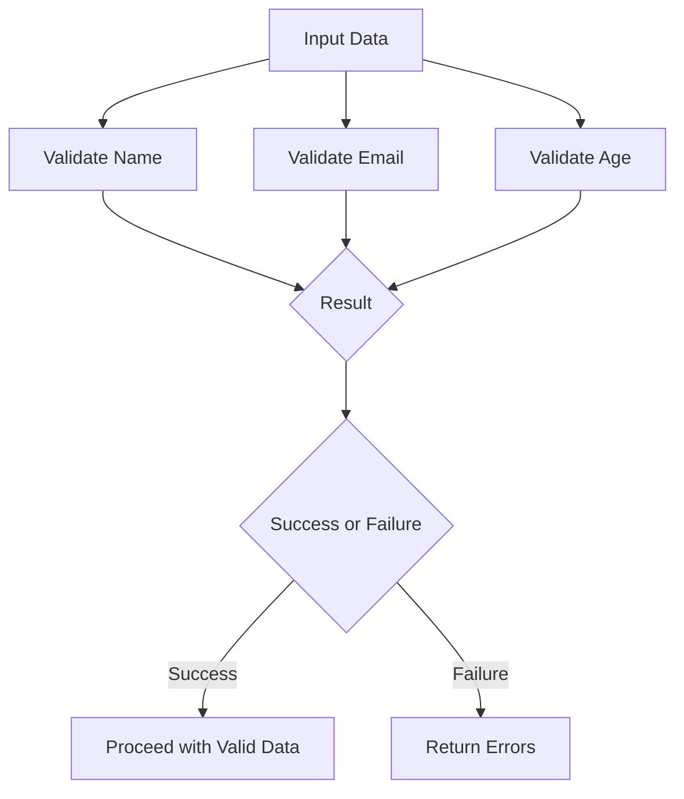

## 5.4. Validated Data

In functional programming, handling errors gracefully and effectively is crucial for building robust applications. One powerful approach to error handling is through the concept of validated data, which allows us to accumulate multiple errors and combine validations efficiently. This section will delve into the principles of validated data, explore the use of applicative functors for parallel validation, and provide comprehensive pseudocode examples to illustrate these concepts.

### Accumulating Errors

When validating data, especially user input, it's common to encounter multiple errors. Instead of stopping at the first error, accumulating errors allows us to gather all validation issues at once. This approach provides a more comprehensive feedback mechanism, which is particularly useful in user interfaces where multiple fields might need correction.

#### Why Accumulate Errors?

- **Comprehensive Feedback**: Users receive all error messages at once, reducing the need for multiple submission attempts.
- **Improved User Experience**: By highlighting all issues simultaneously, users can address them in one go.
- **Simplified Debugging**: Developers can see all potential issues in a single run, making it easier to identify patterns or common mistakes.

#### Implementing Error Accumulation

To implement error accumulation, we need a structure that can hold multiple errors. A common choice is a list or a similar collection type. Let's explore how we can achieve this in pseudocode.

```pseudocode
// Define a Result type that can either be a Success or a Failure
type Result[T] = Success[T] | Failure[List[String]]

// Function to validate a single field
function validateField(value, validationRules) -> Result[String]:
    errors = []
    for rule in validationRules:
        if not rule(value):
            errors.append("Validation failed for rule: " + rule.name)
    if errors.isEmpty():
        return Success(value)
    else:
        return Failure(errors)

// Example usage
nameValidationRules = [isNotEmpty, isAlpha]
result = validateField("John123", nameValidationRules)

if result is Failure:
    print("Errors: " + result.errors)
else:
    print("Validation successful: " + result.value)
```

In this example, the `validateField` function applies a list of validation rules to a given value. If any rule fails, it accumulates the error messages in a list and returns a `Failure` containing all errors. Otherwise, it returns a `Success` with the validated value.

### Combining Validations

In many scenarios, we need to validate multiple fields or inputs simultaneously. Combining these validations efficiently is where applicative functors come into play. Applicative functors allow us to apply functions to arguments wrapped in a context, such as a validation result, without having to sequence them.

#### Understanding Applicative Functors

Applicative functors are a powerful abstraction in functional programming that enable us to perform computations on wrapped values. They are particularly useful for combining independent computations, such as validations, in parallel.

#### Applying Applicative Functors for Validation

Let's see how we can use applicative functors to combine multiple validations in pseudocode.

```pseudocode
// Define an Applicative interface
interface Applicative[F[_]]:
    def pure[A](value: A) -> F[A]
    def apply[A, B](f: F[A -> B], fa: F[A]) -> F[B]

// Implement Applicative for the Result type
class ResultApplicative extends Applicative[Result]:
    def pure[A](value: A) -> Result[A]:
        return Success(value)

    def apply[A, B](f: Result[A -> B], fa: Result[A]) -> Result[B]:
        match (f, fa):
            case (Success(func), Success(value)):
                return Success(func(value))
            case (Failure(errors1), Failure(errors2)):
                return Failure(errors1 + errors2)
            case (Failure(errors), _):
                return Failure(errors)
            case (_, Failure(errors)):
                return Failure(errors)

// Function to combine validations
function validateForm(fields, validationRules) -> Result[Form]:
    applicative = ResultApplicative()
    nameResult = validateField(fields.name, validationRules.name)
    ageResult = validateField(fields.age, validationRules.age)
    return applicative.apply(applicative.apply(applicative.pure(Form), nameResult), ageResult)

// Example usage
formValidationRules = {
    name: [isNotEmpty, isAlpha],
    age: [isPositiveNumber]
}
fields = {name: "John123", age: -5}
result = validateForm(fields, formValidationRules)

if result is Failure:
    print("Errors: " + result.errors)
else:
    print("Form is valid: " + result.value)
```

In this example, the `ResultApplicative` class implements the `Applicative` interface for the `Result` type. The `validateForm` function uses this applicative to combine the results of validating multiple fields. If any validation fails, all errors are accumulated and returned.

### Pseudocode Examples

To further illustrate the concept of validated data, let's consider a more complex example involving a user registration form with multiple fields.

```pseudocode
// Define a User type
type User = {name: String, email: String, age: Int}

// Function to validate user registration
function validateUserRegistration(fields) -> Result[User]:
    applicative = ResultApplicative()
    nameResult = validateField(fields.name, [isNotEmpty, isAlpha])
    emailResult = validateField(fields.email, [isValidEmail])
    ageResult = validateField(fields.age, [isPositiveNumber, isAdult])
    return applicative.apply(
        applicative.apply(
            applicative.apply(applicative.pure(User), nameResult),
            emailResult
        ),
        ageResult
    )

// Example usage
userFields = {name: "John123", email: "john@example", age: 17}
result = validateUserRegistration(userFields)

if result is Failure:
    print("Errors: " + result.errors)
else:
    print("User registration is valid: " + result.value)
```

In this example, the `validateUserRegistration` function validates a user's name, email, and age using a series of rules. The applicative functor is used to combine these validations, ensuring that all errors are accumulated and returned if any validation fails.

### Visualizing Validated Data Flow

To better understand how validated data flows through the system, let's visualize the process using a Mermaid.js diagram.



This diagram illustrates the flow of input data through multiple validation steps. Each validation step produces a result, which is then combined to determine the overall success or failure of the validation process.

### Try It Yourself

To deepen your understanding of validated data, try modifying the pseudocode examples provided. Here are some suggestions:

- **Add New Validation Rules**: Implement additional validation rules, such as checking for a minimum password length or ensuring a username is unique.
- **Experiment with Different Data Structures**: Use different data structures for accumulating errors, such as sets or maps, and observe how it affects the error messages.
- **Implement Custom Error Messages**: Customize the error messages to provide more detailed feedback to users.

### Knowledge Check

Before moving on, let's review some key points:

- **What is the primary benefit of accumulating errors during validation?**
- **How do applicative functors help in combining multiple validations?**
- **What is the role of the `ResultApplicative` class in the pseudocode examples?**

### Embrace the Journey

Remember, mastering validated data and error handling in functional programming is a journey. As you continue to explore these concepts, you'll find new ways to apply them to real-world problems. Keep experimenting, stay curious, and enjoy the process!

## Quiz Time!



### What is the primary benefit of accumulating errors during validation?

- [x] Comprehensive feedback for users
- [ ] Faster validation process
- [ ] Simplified code structure
- [ ] Reduced memory usage

> **Explanation:** Accumulating errors provides comprehensive feedback, allowing users to see all validation issues at once.

### How do applicative functors help in combining multiple validations?

- [x] They allow parallel validation without sequencing
- [ ] They optimize the validation process for speed
- [ ] They reduce the complexity of validation rules
- [ ] They ensure all validations are independent

> **Explanation:** Applicative functors enable parallel validation by applying functions to arguments wrapped in a context, without requiring sequencing.

### What is the role of the `ResultApplicative` class in the pseudocode examples?

- [x] It implements the applicative interface for the Result type
- [ ] It defines custom validation rules
- [ ] It optimizes the validation process
- [ ] It handles user input directly

> **Explanation:** The `ResultApplicative` class implements the applicative interface, allowing us to combine multiple validation results.

### Which data structure is commonly used to accumulate errors?

- [x] List
- [ ] Set
- [ ] Map
- [ ] Queue

> **Explanation:** A list is commonly used to accumulate errors, as it can easily hold multiple error messages.

### What is the purpose of the `pure` function in the `Applicative` interface?

- [x] To wrap a value in a context
- [ ] To apply a function to a value
- [ ] To combine multiple values
- [ ] To validate a single field

> **Explanation:** The `pure` function wraps a value in a context, allowing it to be used in applicative computations.

### In the pseudocode examples, what happens if all validations succeed?

- [x] A Success result is returned
- [ ] A Failure result is returned
- [ ] An exception is thrown
- [ ] The process is terminated

> **Explanation:** If all validations succeed, a Success result is returned, containing the validated data.

### What is the main advantage of using applicative functors over monads for validation?

- [x] Applicative functors allow parallel validation
- [ ] Monads are more efficient
- [ ] Applicative functors are simpler to implement
- [ ] Monads provide better error messages

> **Explanation:** Applicative functors allow parallel validation, making them more suitable for combining independent validations.

### How can you customize error messages in the pseudocode examples?

- [x] By modifying the error accumulation logic
- [ ] By changing the data structure used
- [ ] By implementing new validation rules
- [ ] By using a different programming language

> **Explanation:** Customizing error messages involves modifying the error accumulation logic to provide more detailed feedback.

### What is the role of the `apply` function in the `Applicative` interface?

- [x] To apply a function to a value wrapped in a context
- [ ] To wrap a value in a context
- [ ] To validate a single field
- [ ] To accumulate errors

> **Explanation:** The `apply` function applies a function to a value wrapped in a context, enabling parallel computations.

### True or False: Accumulating errors during validation improves user experience.

- [x] True
- [ ] False

> **Explanation:** True. Accumulating errors provides comprehensive feedback, improving user experience by allowing users to address all issues at once.


