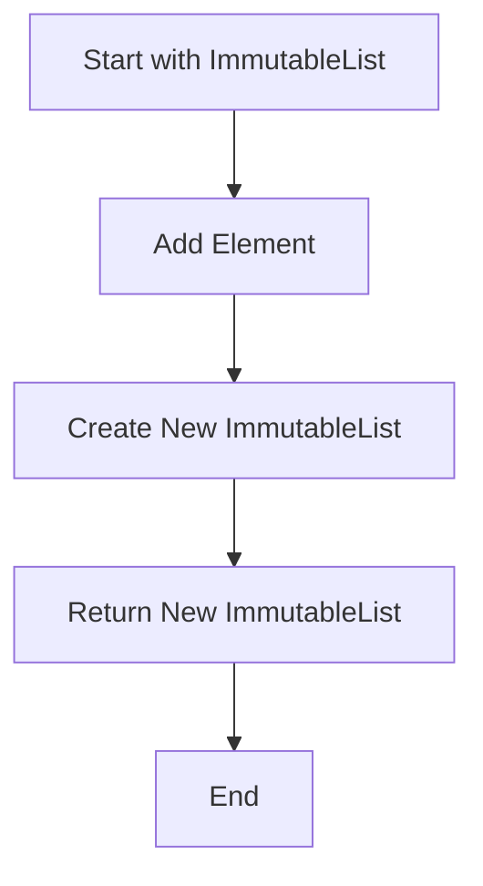

## 6.1. Immutable Collections

In the realm of functional programming, immutability is a cornerstone principle that significantly influences how data structures are designed and utilized. Immutable collections, such as lists, sets, and maps, offer numerous advantages, including enhanced safety, predictability, and ease of reasoning about code. This section delves into the concept of immutable collections, their benefits, and how they can be implemented using pseudocode.

### Understanding Immutability

Immutability refers to the inability to change an object after it has been created. In functional programming, this concept is applied to data structures to prevent unintended side effects and to facilitate concurrent programming. When a collection is immutable, any modification operation results in the creation of a new collection rather than altering the existing one.

#### Benefits of Immutability

1. **Predictability**: Immutable collections ensure that data remains consistent throughout the program's execution, making it easier to understand and predict the behavior of the code.

2. **Thread Safety**: Since immutable objects cannot be altered, they are inherently thread-safe, eliminating the need for synchronization mechanisms in concurrent environments.

3. **Ease of Reasoning**: With immutability, developers can reason about code more effectively, as the state of data does not change unexpectedly.

4. **Functional Purity**: Immutability aligns with the principles of functional programming, promoting the use of pure functions that do not produce side effects.

5. **Cache Efficiency**: Immutable objects can be safely cached and reused, reducing the overhead of object creation and garbage collection.

### Implementing Immutable Data Structures

Let's explore how to implement common immutable collections such as lists, sets, and maps using pseudocode. These examples will illustrate the core concepts and operations associated with each collection type.

#### Immutable Lists

An immutable list is a sequence of elements that cannot be modified after creation. Common operations include adding, removing, and accessing elements, all of which result in the creation of a new list.

```pseudocode
class ImmutableList:
    def __init__(self, elements):
        self.elements = elements

    def add(self, element):
        # Return a new list with the added element
        return ImmutableList(self.elements + [element])

    def remove(self, element):
        # Return a new list with the element removed
        return ImmutableList([e for e in self.elements if e != element])

    def get(self, index):
        # Access an element by index
        return self.elements[index]

list1 = ImmutableList([1, 2, 3])
list2 = list1.add(4)
list3 = list2.remove(2)

print(list1.elements)  # Output: [1, 2, 3]
print(list2.elements)  # Output: [1, 2, 3, 4]
print(list3.elements)  # Output: [1, 3, 4]
```

In this example, the `add` and `remove` methods create new instances of `ImmutableList`, preserving the original list's state.

#### Immutable Sets

Immutable sets are collections of unique elements. They support operations such as adding, removing, and checking for membership, all while maintaining immutability.

```pseudocode
class ImmutableSet:
    def __init__(self, elements):
        self.elements = set(elements)

    def add(self, element):
        # Return a new set with the added element
        new_elements = self.elements.copy()
        new_elements.add(element)
        return ImmutableSet(new_elements)

    def remove(self, element):
        # Return a new set with the element removed
        new_elements = self.elements.copy()
        new_elements.discard(element)
        return ImmutableSet(new_elements)

    def contains(self, element):
        # Check if the set contains an element
        return element in self.elements

set1 = ImmutableSet([1, 2, 3])
set2 = set1.add(4)
set3 = set2.remove(2)

print(set1.elements)  # Output: {1, 2, 3}
print(set2.elements)  # Output: {1, 2, 3, 4}
print(set3.elements)  # Output: {1, 3, 4}
```

The `add` and `remove` methods in `ImmutableSet` create new sets, ensuring that the original set remains unchanged.

#### Immutable Maps

Immutable maps, also known as dictionaries or associative arrays, store key-value pairs. Operations include adding, removing, and updating entries, all of which result in new map instances.

```pseudocode
class ImmutableMap:
    def __init__(self, entries):
        self.entries = dict(entries)

    def put(self, key, value):
        # Return a new map with the added or updated entry
        new_entries = self.entries.copy()
        new_entries[key] = value
        return ImmutableMap(new_entries)

    def remove(self, key):
        # Return a new map with the entry removed
        new_entries = self.entries.copy()
        if key in new_entries:
            del new_entries[key]
        return ImmutableMap(new_entries)

    def get(self, key):
        # Access a value by key
        return self.entries.get(key)

map1 = ImmutableMap({'a': 1, 'b': 2})
map2 = map1.put('c', 3)
map3 = map2.remove('b')

print(map1.entries)  # Output: {'a': 1, 'b': 2}
print(map2.entries)  # Output: {'a': 1, 'b': 2, 'c': 3}
print(map3.entries)  # Output: {'a': 1, 'c': 3}
```

In `ImmutableMap`, the `put` and `remove` methods create new maps, preserving the immutability of the original map.

### Visualizing Immutable Collections

To better understand the concept of immutable collections, let's visualize the process of adding an element to an immutable list using a flowchart.



**Figure 1**: This flowchart illustrates the process of adding an element to an immutable list, resulting in the creation of a new list.

### Try It Yourself

Experiment with the pseudocode examples provided above. Try modifying the code to:

- Add multiple elements at once to an immutable list or set.
- Implement a method to merge two immutable maps.
- Create a function that filters elements in an immutable list based on a condition.

### Knowledge Check

1. What are the key benefits of using immutable collections?
2. How do immutable collections differ from mutable collections in terms of thread safety?
3. Why is immutability important in functional programming?

### Conclusion

Immutable collections are a fundamental aspect of functional programming, offering numerous benefits such as predictability, thread safety, and ease of reasoning. By understanding and implementing immutable lists, sets, and maps, developers can create more robust and maintainable code.

### Further Reading

For more information on immutable collections and functional programming, consider exploring the following resources:

- [MDN Web Docs on Immutable Data Structures](https://developer.mozilla.org/en-US/docs/Web/JavaScript/Reference/Global_Objects/Immutable)
- [Functional Programming in Scala](https://www.manning.com/books/functional-programming-in-scala)
- [Clojure for the Brave and True](https://www.braveclojure.com/)

## Quiz Time!



### What is immutability in the context of functional programming?

- [x] The inability to change an object after it has been created.
- [ ] The ability to change an object at any time.
- [ ] The process of making objects mutable.
- [ ] The concept of changing data structures in place.

> **Explanation:** Immutability refers to the inability to change an object after it has been created, which is a key principle in functional programming.

### Which of the following is a benefit of immutable collections?

- [x] Thread safety
- [ ] Increased memory usage
- [ ] Slower performance
- [ ] Complexity in code

> **Explanation:** Immutable collections are inherently thread-safe because they cannot be altered, eliminating the need for synchronization.

### How does an immutable list handle the addition of a new element?

- [x] It creates a new list with the added element.
- [ ] It modifies the existing list in place.
- [ ] It throws an error.
- [ ] It ignores the addition.

> **Explanation:** When adding a new element to an immutable list, a new list is created with the added element, preserving the original list.

### What operation does an immutable set perform when removing an element?

- [x] It creates a new set without the removed element.
- [ ] It modifies the existing set in place.
- [ ] It throws an error.
- [ ] It ignores the removal.

> **Explanation:** Removing an element from an immutable set results in the creation of a new set without the removed element.

### Which method is used to add an entry to an immutable map?

- [x] `put`
- [ ] `add`
- [ ] `insert`
- [ ] `append`

> **Explanation:** The `put` method is used to add or update an entry in an immutable map, resulting in a new map.

### What is the primary advantage of using immutable collections in concurrent programming?

- [x] They are inherently thread-safe.
- [ ] They require complex synchronization.
- [ ] They are faster than mutable collections.
- [ ] They use less memory.

> **Explanation:** Immutable collections are inherently thread-safe because they cannot be altered, eliminating the need for synchronization.

### How does immutability contribute to functional purity?

- [x] By preventing side effects
- [ ] By allowing side effects
- [ ] By enabling mutable state
- [ ] By complicating code

> **Explanation:** Immutability prevents side effects, which is essential for maintaining functional purity in programming.

### What happens when you attempt to modify an immutable collection?

- [x] A new collection is created with the modification.
- [ ] The existing collection is modified in place.
- [ ] An error is thrown.
- [ ] The modification is ignored.

> **Explanation:** Modifying an immutable collection results in the creation of a new collection with the modification, preserving the original.

### Which of the following is NOT a characteristic of immutable collections?

- [x] They can be modified in place.
- [ ] They are thread-safe.
- [ ] They prevent side effects.
- [ ] They facilitate reasoning about code.

> **Explanation:** Immutable collections cannot be modified in place; they are thread-safe, prevent side effects, and facilitate reasoning about code.

### True or False: Immutable collections are always slower than mutable collections.

- [ ] True
- [x] False

> **Explanation:** While immutable collections may have some performance overhead due to the creation of new instances, they offer benefits such as thread safety and predictability that can outweigh the cost in many scenarios.


