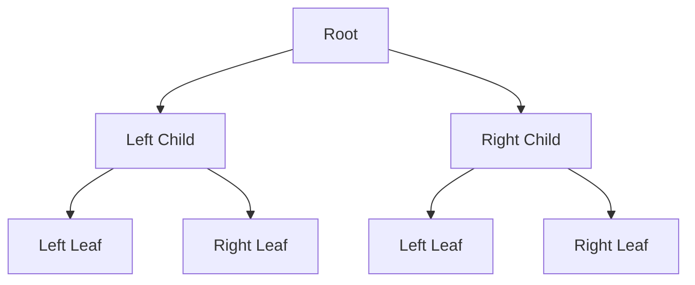
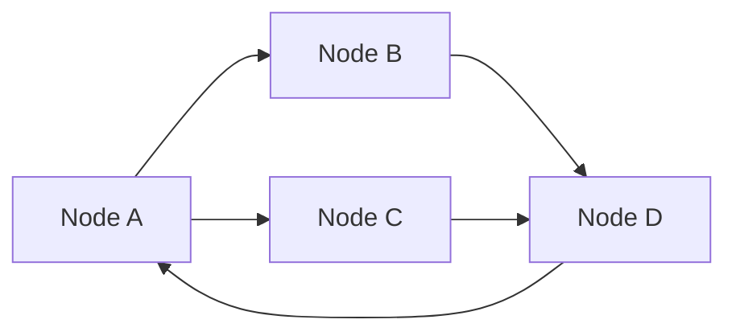

## 6.2. Trees and Graphs

In functional programming, trees and graphs are fundamental data structures that enable efficient data organization and manipulation. Their recursive nature aligns well with functional paradigms, allowing for elegant and concise implementations. In this section, we will explore the functional representation of trees and graphs, delve into traversal algorithms, and provide pseudocode implementations to navigate and manipulate these structures.

### Functional Representation

#### Building Recursive Data Structures

Functional programming emphasizes immutability and recursion, making it a natural fit for representing trees and graphs. Let's begin by understanding how these structures can be defined recursively.

**Trees**

A tree is a hierarchical data structure consisting of nodes, where each node has zero or more child nodes. The topmost node is called the root, and nodes with no children are called leaves. In functional programming, trees can be represented using recursive data types.

**Binary Tree Example**

A binary tree is a tree data structure where each node has at most two children, referred to as the left and right child. Here's how we can define a binary tree in pseudocode:

```pseudocode
type BinaryTree = 
  | Empty
  | Node(value, left: BinaryTree, right: BinaryTree)
```

In this representation, a `BinaryTree` is either `Empty` or a `Node` containing a value and two subtrees (`left` and `right`).

**General Tree Example**

A general tree allows each node to have an arbitrary number of children. We can define it as follows:

```pseudocode
type Tree = 
  | Empty
  | Node(value, children: List<Tree>)
```

Here, a `Tree` is either `Empty` or a `Node` with a value and a list of child trees.

**Graphs**

Graphs are more complex structures consisting of nodes (vertices) connected by edges. They can be directed or undirected, and may contain cycles. In functional programming, graphs are often represented using adjacency lists or adjacency matrices.

**Adjacency List Example**

An adjacency list represents a graph as a collection of lists, where each list corresponds to a node and contains the nodes it is connected to.

```pseudocode
type Graph = Map<Node, List<Node>>
```

In this representation, a `Graph` is a map where each node is associated with a list of adjacent nodes.

**Adjacency Matrix Example**

An adjacency matrix is a 2D array where each cell `(i, j)` indicates the presence or absence of an edge between nodes `i` and `j`.

```pseudocode
type Graph = Matrix[Boolean]
```

### Traversal Algorithms

Traversal algorithms are essential for exploring trees and graphs. They allow us to visit each node in a specific order, enabling operations like searching, sorting, and modifying the structure.

#### Depth-First Traversal

Depth-first traversal explores as far as possible along each branch before backtracking. It can be implemented using recursion or a stack.

**Depth-First Search (DFS) for Trees**

Here's a pseudocode implementation of DFS for a binary tree:

```pseudocode
function dfs(tree: BinaryTree):
  if tree is Empty:
    return
  print(tree.value)
  dfs(tree.left)
  dfs(tree.right)
```

In this implementation, we recursively visit the left and right subtrees after processing the current node.

**Depth-First Search (DFS) for Graphs**

For graphs, DFS can be implemented using a stack to keep track of visited nodes:

```pseudocode
function dfs(graph: Graph, start: Node):
  stack = [start]
  visited = Set()

  while stack is not empty:
    node = stack.pop()
    if node not in visited:
      print(node)
      visited.add(node)
      for neighbor in graph[node]:
        if neighbor not in visited:
          stack.push(neighbor)
```

#### Breadth-First Traversal

Breadth-first traversal explores all nodes at the present depth before moving on to nodes at the next depth level. It is typically implemented using a queue.

**Breadth-First Search (BFS) for Trees**

Here's a pseudocode implementation of BFS for a binary tree:

```pseudocode
function bfs(tree: BinaryTree):
  queue = [tree]

  while queue is not empty:
    node = queue.dequeue()
    if node is not Empty:
      print(node.value)
      queue.enqueue(node.left)
      queue.enqueue(node.right)
```

In this implementation, we use a queue to process nodes level by level.

**Breadth-First Search (BFS) for Graphs**

For graphs, BFS can be implemented using a queue to explore nodes layer by layer:

```pseudocode
function bfs(graph: Graph, start: Node):
  queue = [start]
  visited = Set()

  while queue is not empty:
    node = queue.dequeue()
    if node not in visited:
      print(node)
      visited.add(node)
      for neighbor in graph[node]:
        if neighbor not in visited:
          queue.enqueue(neighbor)
```

### Pseudocode Implementations

#### Navigating and Manipulating Trees and Graphs

Functional programming allows us to elegantly navigate and manipulate trees and graphs using recursive functions and higher-order functions.

**Tree Manipulation Example**

Let's implement a function to calculate the sum of all values in a binary tree:

```pseudocode
function sumTree(tree: BinaryTree) -> Integer:
  if tree is Empty:
    return 0
  return tree.value + sumTree(tree.left) + sumTree(tree.right)
```

This function recursively calculates the sum by adding the value of the current node to the sums of the left and right subtrees.

**Graph Manipulation Example**

Consider a function to find all paths between two nodes in a graph:

```pseudocode
function findAllPaths(graph: Graph, start: Node, end: Node) -> List<List<Node>>:
  def dfs(current: Node, path: List<Node], paths: List<List<Node>>):
    path.append(current)
    if current == end:
      paths.append(path.copy())
    else:
      for neighbor in graph[current]:
        if neighbor not in path:
          dfs(neighbor, path, paths)
    path.pop()

  paths = []
  dfs(start, [], paths)
  return paths
```

This function uses a recursive helper function `dfs` to explore all possible paths from the start node to the end node.

### Visualizing Trees and Graphs

Visualizing trees and graphs can greatly enhance our understanding of these structures. Let's use Mermaid.js to create diagrams that illustrate the concepts we've discussed.

#### Binary Tree Visualization



*Caption: A simple binary tree with a root node and two levels of children.*

#### Graph Visualization



*Caption: A directed graph with nodes and edges illustrating connections.*

### Try It Yourself

To deepen your understanding, try modifying the provided pseudocode examples:

- **Modify the DFS and BFS implementations** to track the depth of each node visited.
- **Implement a function** to count the number of leaf nodes in a binary tree.
- **Create a function** to detect cycles in a graph using DFS.

### Knowledge Check

Reflect on the following questions to reinforce your learning:

- What are the key differences between depth-first and breadth-first traversal?
- How does the recursive nature of functional programming benefit tree and graph manipulation?
- Why might you choose an adjacency list over an adjacency matrix for graph representation?

### Embrace the Journey

Remember, mastering trees and graphs in functional programming is a journey. As you continue to explore these structures, you'll discover new ways to apply them in solving complex problems. Keep experimenting, stay curious, and enjoy the journey!

## Quiz Time!



### What is a binary tree?

- [x] A tree where each node has at most two children
- [ ] A tree where each node has exactly two children
- [ ] A tree where each node has at least two children
- [ ] A tree with no nodes

> **Explanation:** A binary tree is a tree data structure where each node has at most two children, typically referred to as the left and right child.

### How is a graph typically represented in functional programming?

- [x] Using adjacency lists or adjacency matrices
- [ ] Using linked lists
- [ ] Using hash tables
- [ ] Using stacks

> **Explanation:** In functional programming, graphs are often represented using adjacency lists or adjacency matrices to efficiently manage connections between nodes.

### What is the primary difference between DFS and BFS?

- [x] DFS explores as far as possible along each branch before backtracking, while BFS explores all nodes at the present depth before moving on to the next depth level.
- [ ] DFS uses a queue, while BFS uses a stack.
- [ ] DFS is used for trees, while BFS is used for graphs.
- [ ] DFS is faster than BFS.

> **Explanation:** DFS explores as far as possible along each branch before backtracking, while BFS explores all nodes at the current depth before moving to the next level.

### What is the purpose of a stack in DFS for graphs?

- [x] To keep track of visited nodes and explore paths
- [ ] To store the shortest path
- [ ] To maintain a list of all nodes
- [ ] To ensure nodes are visited in alphabetical order

> **Explanation:** In DFS for graphs, a stack is used to keep track of visited nodes and explore paths by pushing and popping nodes as the traversal progresses.

### What is the advantage of using recursion in tree manipulation?

- [x] It aligns with the recursive nature of trees and simplifies code
- [ ] It reduces memory usage
- [ ] It guarantees faster execution
- [ ] It eliminates the need for data structures

> **Explanation:** Recursion aligns with the recursive nature of trees, allowing for simpler and more elegant code when manipulating tree structures.

### What does an adjacency matrix represent?

- [x] A 2D array indicating the presence or absence of edges between nodes
- [ ] A list of nodes and their degrees
- [ ] A tree structure with nodes and edges
- [ ] A set of nodes with no connections

> **Explanation:** An adjacency matrix is a 2D array where each cell indicates the presence or absence of an edge between nodes, providing a compact representation of a graph.

### How can cycles be detected in a graph?

- [x] Using DFS to track visited nodes and back edges
- [ ] Using BFS to find the shortest path
- [ ] Using a stack to store all nodes
- [ ] Using an adjacency matrix to list all edges

> **Explanation:** Cycles in a graph can be detected using DFS by tracking visited nodes and identifying back edges that indicate a cycle.

### What is a leaf node in a tree?

- [x] A node with no children
- [ ] A node with exactly one child
- [ ] A node with two children
- [ ] A node with three children

> **Explanation:** A leaf node in a tree is a node with no children, representing the end of a branch.

### Why might you choose an adjacency list over an adjacency matrix?

- [x] It is more space-efficient for sparse graphs
- [ ] It is faster for dense graphs
- [ ] It requires less memory for dense graphs
- [ ] It is easier to implement for all graphs

> **Explanation:** An adjacency list is more space-efficient for sparse graphs, as it only stores existing connections, unlike an adjacency matrix which requires space for all possible connections.

### True or False: In functional programming, trees and graphs are often manipulated using mutable data structures.

- [ ] True
- [x] False

> **Explanation:** In functional programming, trees and graphs are typically manipulated using immutable data structures, aligning with the principles of immutability and recursion.




