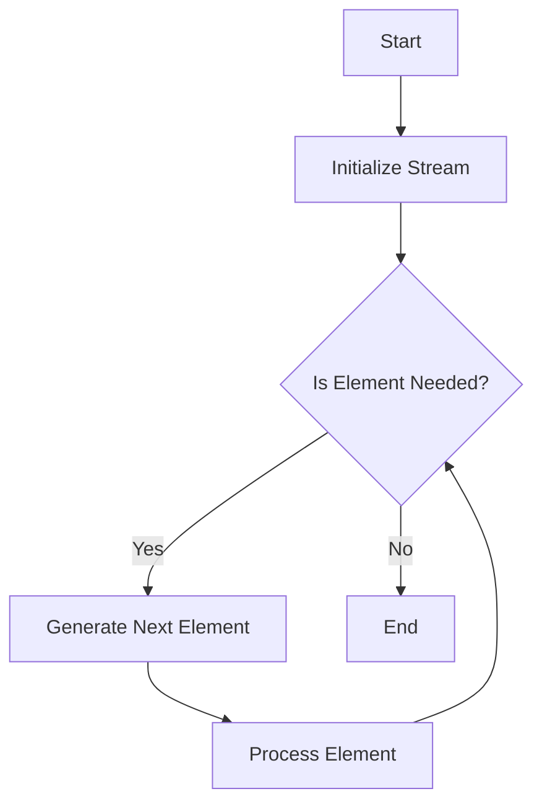

## 6.3. Streams and Infinite Sequences

In the realm of functional programming, streams and infinite sequences are powerful constructs that allow us to handle potentially infinite data in a memory-efficient manner. By leveraging lazy evaluation, we can defer computation until it is absolutely necessary, enabling us to work with large or even unbounded datasets without overwhelming system resources. In this section, we will delve into the concepts of streams and infinite sequences, explore the operations that can be performed on them, and provide pseudocode examples to illustrate their practical applications.

### Lazy Evaluation with Streams

Lazy evaluation is a cornerstone of functional programming that allows expressions to be evaluated only when their values are needed. This approach is particularly useful when working with streams and infinite sequences, as it enables the creation of data structures that can represent potentially infinite data without consuming infinite memory.

#### Understanding Lazy Evaluation

Lazy evaluation defers the computation of expressions until their results are required. This can lead to significant performance improvements, especially when dealing with large datasets or complex computations. In the context of streams, lazy evaluation allows us to construct sequences of data that are generated on-the-fly, rather than being precomputed and stored in memory.

Consider the following pseudocode example that demonstrates lazy evaluation in action:

```pseudocode
function lazyRange(start, step):
    return function():
        current = start
        while true:
            yield current
            current = current + step

stream = lazyRange(0, 1)
print(stream())  // Outputs: 0
print(stream())  // Outputs: 1
print(stream())  // Outputs: 2
```

In this example, `lazyRange` is a function that returns a generator function. Each time the generator is called, it yields the next value in the sequence, computed lazily.

#### Benefits of Lazy Evaluation

- **Memory Efficiency**: By generating values on demand, lazy evaluation reduces memory usage, as only the necessary parts of the data structure are kept in memory.
- **Performance Optimization**: Computations are performed only when needed, which can lead to faster execution times for programs that do not require the entire dataset.
- **Infinite Data Structures**: Lazy evaluation enables the creation of infinite data structures, such as streams, which can represent unbounded sequences of data.

### Representing Potentially Infinite Data

Streams are a type of data structure that can represent potentially infinite sequences of data. Unlike traditional collections, such as arrays or lists, streams do not store their elements in memory. Instead, they generate elements on-the-fly, using lazy evaluation.

#### Defining Streams

A stream is typically defined as a sequence of elements that can be computed incrementally. In functional programming, streams are often implemented using higher-order functions and closures, which allow for the encapsulation of state and behavior.

Consider the following pseudocode example that defines a simple stream:

```pseudocode
function streamFrom(start, step):
    return function():
        current = start
        while true:
            yield current
            current = current + step

stream = streamFrom(0, 1)
```

In this example, `streamFrom` is a function that returns a generator function. Each time the generator is called, it yields the next value in the sequence, computed incrementally.

#### Infinite Sequences

Infinite sequences are a special type of stream that can represent unbounded sequences of data. These sequences are particularly useful when working with mathematical series, such as the Fibonacci sequence or prime numbers.

Consider the following pseudocode example that defines an infinite sequence of Fibonacci numbers:

```pseudocode
function fibonacci():
    a = 0
    b = 1
    while true:
        yield a
        a, b = b, a + b

fibStream = fibonacci()
```

In this example, `fibonacci` is a generator function that yields the next Fibonacci number each time it is called. The sequence is infinite, as it continues to generate numbers indefinitely.

### Operations on Streams

Streams support a variety of operations that allow us to manipulate and transform the data they represent. These operations are typically implemented as higher-order functions, which take other functions as arguments and return new streams.

#### Map

The `map` operation applies a given function to each element of a stream, producing a new stream of transformed elements. This operation is analogous to the `map` function in many functional programming languages.

Consider the following pseudocode example that demonstrates the `map` operation:

```pseudocode
function map(stream, transform):
    return function():
        for element in stream():
            yield transform(element)

stream = streamFrom(0, 1)
squaredStream = map(stream, lambda x: x * x)
```

In this example, `map` takes a stream and a transformation function as arguments, and returns a new stream of squared numbers.

#### Filter

The `filter` operation selects elements from a stream that satisfy a given predicate function, producing a new stream of filtered elements.

Consider the following pseudocode example that demonstrates the `filter` operation:

```pseudocode
function filter(stream, predicate):
    return function():
        for element in stream():
            if predicate(element):
                yield element

stream = streamFrom(0, 1)
evenStream = filter(stream, lambda x: x % 2 == 0)
```

In this example, `filter` takes a stream and a predicate function as arguments, and returns a new stream of even numbers.

#### Take

The `take` operation extracts a specified number of elements from a stream, producing a new stream of limited length.

Consider the following pseudocode example that demonstrates the `take` operation:

```pseudocode
function take(stream, n):
    return function():
        count = 0
        for element in stream():
            if count < n:
                yield element
                count = count + 1
            else:
                break

stream = streamFrom(0, 1)
limitedStream = take(stream, 5)
```

In this example, `take` takes a stream and a number `n` as arguments, and returns a new stream containing the first `n` elements.

#### Drop

The `drop` operation skips a specified number of elements from a stream, producing a new stream that starts after the skipped elements.

Consider the following pseudocode example that demonstrates the `drop` operation:

```pseudocode
function drop(stream, n):
    return function():
        count = 0
        for element in stream():
            if count >= n:
                yield element
            count = count + 1

stream = streamFrom(0, 1)
skippedStream = drop(stream, 5)
```

In this example, `drop` takes a stream and a number `n` as arguments, and returns a new stream that starts after the first `n` elements.

### Pseudocode Examples

Let's explore some practical examples that demonstrate the creation and use of streams in functional programming.

#### Example 1: Generating an Infinite Sequence of Natural Numbers

```pseudocode
function naturalNumbers():
    n = 0
    while true:
        yield n
        n = n + 1

naturalStream = naturalNumbers()
```

In this example, `naturalNumbers` is a generator function that yields an infinite sequence of natural numbers, starting from 0.

#### Example 2: Filtering Prime Numbers from a Stream

```pseudocode
function isPrime(n):
    if n < 2:
        return false
    for i in range(2, sqrt(n) + 1):
        if n % i == 0:
            return false
    return true

function primeNumbers():
    return filter(naturalNumbers(), isPrime)

primeStream = primeNumbers()
```

In this example, `primeNumbers` is a function that returns a stream of prime numbers, filtered from the infinite sequence of natural numbers.

#### Example 3: Creating a Stream of Fibonacci Numbers

```pseudocode
function fibonacci():
    a = 0
    b = 1
    while true:
        yield a
        a, b = b, a + b

fibStream = fibonacci()
```

In this example, `fibonacci` is a generator function that yields an infinite sequence of Fibonacci numbers.

### Visualizing Streams and Infinite Sequences

To better understand the flow of data in streams and infinite sequences, let's visualize the process using a flowchart.



**Figure 1: Flowchart of Stream Processing**

This flowchart illustrates the process of generating and processing elements in a stream. The stream is initialized, and elements are generated on demand, processed, and then the process repeats until no more elements are needed.

### Try It Yourself

Now that we've explored the concepts and operations of streams and infinite sequences, it's time to experiment with the examples provided. Try modifying the pseudocode to create your own streams and apply different operations. For instance, you could:

- Create a stream that generates the squares of natural numbers.
- Implement a stream that filters out odd numbers from a sequence.
- Experiment with different starting points and steps in the `streamFrom` function.

### Knowledge Check

To reinforce your understanding of streams and infinite sequences, consider the following questions:

- How does lazy evaluation benefit the use of streams in functional programming?
- What is the difference between the `map` and `filter` operations on a stream?
- How can you create an infinite sequence of prime numbers using streams?

### Summary

In this section, we've explored the concept of streams and infinite sequences in functional programming. We've seen how lazy evaluation allows us to represent potentially infinite data structures efficiently, and we've examined various operations that can be performed on streams. By leveraging these concepts, we can build powerful and flexible data processing pipelines that handle large or unbounded datasets with ease.

Remember, this is just the beginning. As you continue your journey in functional programming, keep experimenting with streams and infinite sequences, and explore their applications in real-world scenarios. Stay curious, and enjoy the process of discovery!

## Quiz Time!



### What is lazy evaluation?

- [x] A technique that defers computation until the result is needed.
- [ ] A method of precomputing all values in a sequence.
- [ ] A way to store all elements of a sequence in memory.
- [ ] A process of evaluating expressions in parallel.

> **Explanation:** Lazy evaluation defers computation until the result is needed, allowing for efficient memory usage and performance optimization.

### How does a stream differ from a traditional list?

- [x] A stream generates elements on-the-fly, while a list stores all elements in memory.
- [ ] A stream is always finite, while a list can be infinite.
- [ ] A stream cannot be filtered, while a list can.
- [ ] A stream is immutable, while a list is mutable.

> **Explanation:** A stream generates elements on-the-fly using lazy evaluation, whereas a list stores all elements in memory.

### What operation would you use to transform each element of a stream?

- [x] map
- [ ] filter
- [ ] take
- [ ] drop

> **Explanation:** The `map` operation applies a transformation function to each element of a stream, producing a new stream of transformed elements.

### Which operation would you use to select elements from a stream that satisfy a condition?

- [ ] map
- [x] filter
- [ ] take
- [ ] drop

> **Explanation:** The `filter` operation selects elements from a stream that satisfy a given predicate function.

### How can you create an infinite sequence of Fibonacci numbers?

- [x] By using a generator function that yields Fibonacci numbers indefinitely.
- [ ] By precomputing all Fibonacci numbers and storing them in a list.
- [ ] By using the `take` operation on a finite list of numbers.
- [ ] By applying the `map` operation to a list of natural numbers.

> **Explanation:** An infinite sequence of Fibonacci numbers can be created using a generator function that yields Fibonacci numbers indefinitely.

### What is the purpose of the `take` operation on a stream?

- [x] To extract a specified number of elements from a stream.
- [ ] To skip a specified number of elements in a stream.
- [ ] To transform each element of a stream.
- [ ] To filter elements from a stream based on a condition.

> **Explanation:** The `take` operation extracts a specified number of elements from a stream, producing a new stream of limited length.

### How does the `drop` operation affect a stream?

- [x] It skips a specified number of elements, producing a new stream that starts after the skipped elements.
- [ ] It extracts a specified number of elements from the beginning of the stream.
- [ ] It transforms each element of the stream.
- [ ] It filters elements from the stream based on a condition.

> **Explanation:** The `drop` operation skips a specified number of elements, producing a new stream that starts after the skipped elements.

### What is a key benefit of using streams in functional programming?

- [x] They allow for efficient handling of potentially infinite data.
- [ ] They store all elements in memory for quick access.
- [ ] They require precomputation of all values.
- [ ] They are always finite in length.

> **Explanation:** Streams allow for efficient handling of potentially infinite data by generating elements on-the-fly using lazy evaluation.

### Can streams be used to represent finite sequences?

- [x] True
- [ ] False

> **Explanation:** Streams can represent both finite and infinite sequences, depending on how they are defined and used.

### What is the main advantage of using lazy evaluation with streams?

- [x] It reduces memory usage by generating values only when needed.
- [ ] It increases memory usage by storing all values in memory.
- [ ] It speeds up computation by precomputing all values.
- [ ] It simplifies code by eliminating the need for functions.

> **Explanation:** Lazy evaluation reduces memory usage by generating values only when needed, allowing for efficient handling of large or infinite datasets.


