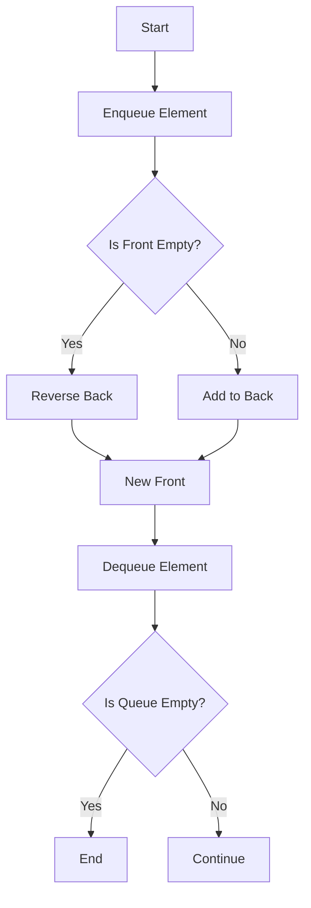
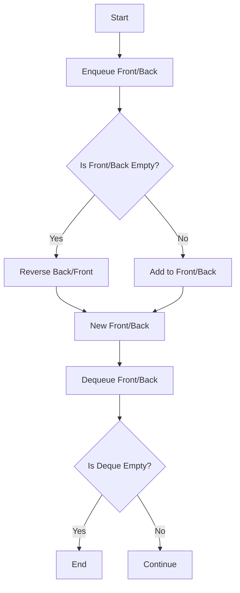

## 6.4. Functional Queues and Deques

In the realm of functional programming, data structures play a pivotal role in ensuring that our programs are both efficient and maintainable. Among these structures, queues and deques stand out due to their ability to manage collections of data with specific access patterns. In this section, we will delve into the intricacies of functional queues and deques, exploring their efficient access patterns, understanding amortized time complexity, and providing pseudocode implementations to build persistent queues.

### Introduction to Queues and Deques

Queues and deques are fundamental data structures used to manage collections of elements. A **queue** is a First-In-First-Out (FIFO) structure where elements are added to the back and removed from the front. A **deque** (double-ended queue) allows insertion and removal of elements from both ends, providing more flexibility.

#### Key Characteristics

- **Queue**: 
  - Operations: `enqueue` (add to back), `dequeue` (remove from front).
  - Access Pattern: FIFO.
  
- **Deque**:
  - Operations: `enqueueFront`, `enqueueBack`, `dequeueFront`, `dequeueBack`.
  - Access Pattern: Allows both FIFO and LIFO (Last-In-First-Out).

### Efficient Access Patterns

Functional programming emphasizes immutability, which can complicate the implementation of data structures like queues and deques. However, by leveraging persistent data structures, we can efficiently implement these structures while maintaining immutability.

#### Persistent Data Structures

A persistent data structure preserves the previous version of itself when modified. This is crucial in functional programming, where immutability is a core principle. Persistent queues and deques allow us to perform operations without altering the original structure, thus maintaining previous states.

#### Implementing Functional Queues

To implement a functional queue, we can use two lists: one for the front and one for the back. This approach allows us to efficiently manage the queue operations while maintaining immutability.

**Pseudocode for Functional Queue:**

```pseudocode
class FunctionalQueue:
    front: List
    back: List

    def __init__(self):
        self.front = []
        self.back = []

    def enqueue(self, element):
        return FunctionalQueue(self.front, [element] + self.back)

    def dequeue(self):
        if not self.front:
            if not self.back:
                raise Exception("Queue is empty")
            else:
                new_front = reverse(self.back)
                return FunctionalQueue(new_front[1:], [])
        else:
            return FunctionalQueue(self.front[1:], self.back)

    def peek(self):
        if not self.front:
            if not self.back:
                raise Exception("Queue is empty")
            else:
                new_front = reverse(self.back)
                return new_front[0]
        else:
            return self.front[0]

    def isEmpty(self):
        return not self.front and not self.back
```

**Explanation:**

- **Enqueue**: Adds an element to the back list, maintaining the order.
- **Dequeue**: Removes an element from the front list. If the front list is empty, it reverses the back list to create a new front.
- **Peek**: Retrieves the front element without removing it.
- **isEmpty**: Checks if both lists are empty.

### Amortized Time Complexity

Understanding the performance of our data structures is crucial. In functional queues, operations like `enqueue` and `dequeue` can be optimized using amortized analysis.

#### Amortized Analysis

Amortized analysis provides an average time per operation over a sequence of operations, smoothing out the cost of expensive operations. For functional queues, the amortized time complexity for `enqueue` and `dequeue` is O(1), despite the potential O(n) cost of reversing the back list.

**Why Amortized O(1)?**

- **Enqueue**: Directly adds to the back list, O(1).
- **Dequeue**: If the front list is empty, reversing the back list takes O(n). However, this reversal happens infrequently (only when the front is empty), spreading the cost over multiple operations.

### Pseudocode Implementations

Let's explore how to build persistent queues and deques using pseudocode.

#### Persistent Queue Implementation

The persistent queue uses two lists to manage elements efficiently.

```pseudocode
class PersistentQueue:
    front: List
    back: List

    def __init__(self, front=[], back=[]):
        self.front = front
        self.back = back

    def enqueue(self, element):
        return PersistentQueue(self.front, [element] + self.back)

    def dequeue(self):
        if not self.front:
            if not self.back:
                raise Exception("Queue is empty")
            else:
                new_front = reverse(self.back)
                return PersistentQueue(new_front[1:], [])
        else:
            return PersistentQueue(self.front[1:], self.back)

    def peek(self):
        if not self.front:
            if not self.back:
                raise Exception("Queue is empty")
            else:
                new_front = reverse(self.back)
                return new_front[0]
        else:
            return self.front[0]

    def isEmpty(self):
        return not self.front and not self.back
```

#### Persistent Deque Implementation

A persistent deque allows operations on both ends, requiring careful management of two lists.

```pseudocode
class PersistentDeque:
    front: List
    back: List

    def __init__(self, front=[], back=[]):
        self.front = front
        self.back = back

    def enqueueFront(self, element):
        return PersistentDeque([element] + self.front, self.back)

    def enqueueBack(self, element):
        return PersistentDeque(self.front, [element] + self.back)

    def dequeueFront(self):
        if not self.front:
            if not self.back:
                raise Exception("Deque is empty")
            else:
                new_front = reverse(self.back)
                return PersistentDeque(new_front[1:], [])
        else:
            return PersistentDeque(self.front[1:], self.back)

    def dequeueBack(self):
        if not self.back:
            if not self.front:
                raise Exception("Deque is empty")
            else:
                new_back = reverse(self.front)
                return PersistentDeque([], new_back[1:])
        else:
            return PersistentDeque(self.front, self.back[1:])

    def peekFront(self):
        if not self.front:
            if not self.back:
                raise Exception("Deque is empty")
            else:
                new_front = reverse(self.back)
                return new_front[0]
        else:
            return self.front[0]

    def peekBack(self):
        if not self.back:
            if not self.front:
                raise Exception("Deque is empty")
            else:
                new_back = reverse(self.front)
                return new_back[0]
        else:
            return self.back[0]

    def isEmpty(self):
        return not self.front and not self.back
```

### Visualizing Queue and Deque Operations

To better understand the operations of queues and deques, let's visualize them using Mermaid.js diagrams.

#### Queue Operations



**Diagram Explanation:**

- **Enqueue**: Adds an element to the back.
- **Dequeue**: Checks if the front is empty, reverses the back if needed, and removes the front element.

#### Deque Operations



**Diagram Explanation:**

- **Enqueue Front/Back**: Adds an element to the respective end.
- **Dequeue Front/Back**: Checks if the respective end is empty, reverses if needed, and removes the element.

### Try It Yourself

To deepen your understanding, try modifying the pseudocode examples:

- **Experiment with Different Data Types**: Implement queues and deques for different data types, such as strings or custom objects.
- **Optimize Reversal Logic**: Explore alternative methods to optimize the reversal of lists.
- **Add Additional Operations**: Implement additional operations like `size` or `contains`.

### References and Links

For further reading on functional data structures and queues, consider the following resources:

- [MDN Web Docs on Data Structures](https://developer.mozilla.org/en-US/docs/Web/JavaScript/Data_structures)
- [Functional Programming in Scala](https://www.manning.com/books/functional-programming-in-scala)
- [Okasaki, Chris. "Purely Functional Data Structures"](https://www.cambridge.org/core/books/purely-functional-data-structures/)

### Knowledge Check

To reinforce your learning, consider the following questions:

1. What is the primary advantage of using persistent data structures in functional programming?
2. How does amortized analysis help in understanding the performance of functional queues?
3. What are the key differences between a queue and a deque?
4. How can reversing a list impact the performance of a functional queue?

### Embrace the Journey

Remember, mastering functional data structures is a journey. As you continue to explore and experiment, you'll gain a deeper understanding of how to leverage these structures to write efficient and maintainable code. Keep experimenting, stay curious, and enjoy the journey!

## Quiz Time!



### What is the primary characteristic of a functional queue?

- [x] It maintains immutability while allowing efficient access patterns.
- [ ] It allows elements to be added and removed from both ends.
- [ ] It is always implemented using arrays.
- [ ] It requires mutable state to function correctly.

> **Explanation:** A functional queue maintains immutability, which is a core principle of functional programming, while allowing efficient access patterns through persistent data structures.

### How does a functional deque differ from a functional queue?

- [x] A deque allows insertion and removal from both ends, while a queue does not.
- [ ] A deque is always faster than a queue.
- [ ] A deque uses mutable state, while a queue does not.
- [ ] A deque requires more memory than a queue.

> **Explanation:** A functional deque allows insertion and removal of elements from both ends, providing more flexibility compared to a queue, which follows a strict FIFO order.

### What is the amortized time complexity of enqueue and dequeue operations in a functional queue?

- [x] O(1)
- [ ] O(n)
- [ ] O(log n)
- [ ] O(n^2)

> **Explanation:** The amortized time complexity for enqueue and dequeue operations in a functional queue is O(1), as the cost of reversing the back list is spread over multiple operations.

### What is the purpose of using two lists in a functional queue implementation?

- [x] To efficiently manage enqueue and dequeue operations while maintaining immutability.
- [ ] To store elements in a sorted order.
- [ ] To allow random access to elements.
- [ ] To reduce memory usage.

> **Explanation:** Using two lists in a functional queue allows efficient management of enqueue and dequeue operations while maintaining immutability, as one list can be used for the front and the other for the back.

### Which operation is unique to a deque compared to a queue?

- [x] dequeueBack
- [ ] enqueue
- [ ] dequeue
- [ ] peek

> **Explanation:** The `dequeueBack` operation is unique to a deque, allowing elements to be removed from the back, which is not possible in a standard queue.

### What is a persistent data structure?

- [x] A data structure that preserves previous versions when modified.
- [ ] A data structure that uses mutable state.
- [ ] A data structure that cannot be modified.
- [ ] A data structure that is always stored in memory.

> **Explanation:** A persistent data structure preserves previous versions of itself when modified, which is crucial in functional programming to maintain immutability.

### Why is reversing a list in a functional queue considered an O(n) operation?

- [x] Because it involves traversing the entire list to reverse its elements.
- [ ] Because it requires additional memory allocation.
- [ ] Because it involves sorting the list.
- [ ] Because it modifies the list in place.

> **Explanation:** Reversing a list is considered an O(n) operation because it involves traversing the entire list to reverse its elements, which takes linear time.

### What is the benefit of using amortized analysis for functional queues?

- [x] It provides an average time per operation over a sequence of operations.
- [ ] It guarantees the worst-case time complexity for each operation.
- [ ] It reduces the memory usage of the data structure.
- [ ] It simplifies the implementation of the data structure.

> **Explanation:** Amortized analysis provides an average time per operation over a sequence of operations, smoothing out the cost of expensive operations and giving a more realistic performance measure.

### Which of the following operations is not typically supported by a functional queue?

- [x] dequeueBack
- [ ] enqueue
- [ ] dequeue
- [ ] peek

> **Explanation:** The `dequeueBack` operation is not typically supported by a functional queue, as it follows a strict FIFO order and does not allow removal from the back.

### True or False: A functional deque can be used to implement both FIFO and LIFO access patterns.

- [x] True
- [ ] False

> **Explanation:** True. A functional deque can be used to implement both FIFO and LIFO access patterns, as it allows insertion and removal of elements from both ends.


