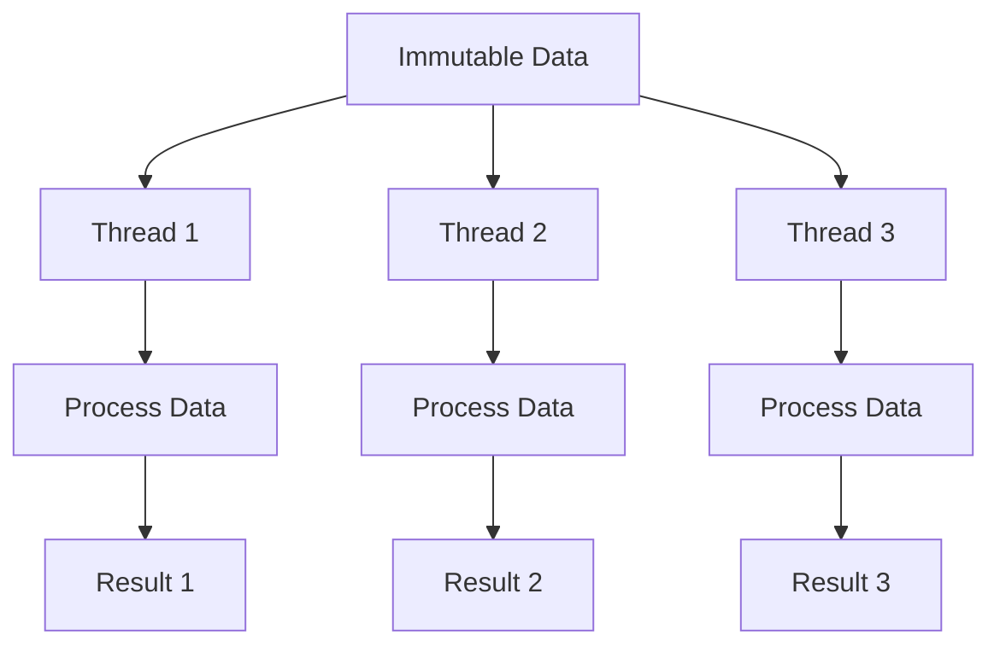

## 7.1. Immutable State and Concurrency

Concurrency and parallelism are crucial aspects of modern software development, especially in an era where applications must efficiently utilize multi-core processors. Functional programming (FP) offers powerful tools and patterns to handle concurrency safely and effectively. In this section, we will explore how immutability and pure functions, core principles of FP, can be leveraged to design concurrent programs that are both robust and maintainable.

### Benefits of Immutability in Multithreading

Immutability is a cornerstone of functional programming. It refers to the practice of creating data structures that cannot be modified after they are created. This concept offers several advantages when dealing with multithreading:

- **Avoiding Race Conditions**: Since immutable data cannot be changed, multiple threads can access the same data without the risk of race conditions. This eliminates the need for complex synchronization mechanisms like locks or semaphores, which can lead to deadlocks or performance bottlenecks.

- **Simplifying Reasoning**: Immutable data structures simplify reasoning about code. When data cannot change, developers can be confident that functions will behave consistently, regardless of the execution context or order.

- **Enabling Safe Sharing**: Immutability allows data to be safely shared across threads without the need for defensive copying. This reduces memory overhead and improves performance.

- **Facilitating Concurrent Modifications**: While immutable data cannot be changed, new versions of data structures can be created efficiently. This allows for concurrent modifications without affecting the original data.

#### Example: Immutable Data Structures

Let's consider a simple example of an immutable list in pseudocode:

```pseudocode
class ImmutableList:
    def __init__(self, elements):
        self._elements = elements

    def add(self, element):
        return ImmutableList(self._elements + [element])

    def get(self, index):
        return self._elements[index]

list1 = ImmutableList([1, 2, 3])
list2 = list1.add(4)

print(list1.get(2))  # Output: 3
print(list2.get(3))  # Output: 4
```

In this example, `ImmutableList` provides an `add` method that returns a new list with the added element, leaving the original list unchanged. This ensures that `list1` can be safely shared across threads without the risk of concurrent modifications.

### Designing Concurrent Functional Programs

Functional programming encourages the use of pure functions, which are functions that always produce the same output for the same input and have no side effects. Pure functions are inherently thread-safe, making them ideal for concurrent programming.

#### Leveraging Pure Functions for Safe Concurrency

Pure functions can be executed concurrently without any risk of interference between threads. This is because they do not rely on or modify shared state. Let's explore how pure functions can be used to design concurrent programs.

#### Example: Concurrent Map Function

Consider a scenario where we need to apply a function to each element of a list concurrently. We can achieve this using a concurrent map function:

```pseudocode
function concurrentMap(func, list):
    results = []
    threads = []

    for element in list:
        thread = createThread(lambda: results.append(func(element)))
        threads.append(thread)
        thread.start()

    for thread in threads:
        thread.join()

    return results

def square(x):
    return x * x

numbers = [1, 2, 3, 4, 5]
squaredNumbers = concurrentMap(square, numbers)
print(squaredNumbers)  # Output: [1, 4, 9, 16, 25]
```

In this example, `concurrentMap` creates a new thread for each element in the list, applying the function `func` concurrently. The use of pure functions ensures that each thread operates independently, without side effects.

### Visualizing Immutability and Concurrency

To better understand how immutability and concurrency interact, let's visualize the process using a diagram.



**Diagram Description**: This diagram illustrates how immutable data can be accessed by multiple threads simultaneously. Each thread processes the data independently, producing separate results without interfering with each other.

### Practical Considerations

While immutability and pure functions provide significant advantages for concurrency, there are practical considerations to keep in mind:

- **Performance Overhead**: Creating new versions of data structures can introduce performance overhead. It's important to use efficient data structures and algorithms to minimize this impact.

- **Memory Usage**: Immutable data structures can lead to increased memory usage, especially if large data sets are frequently copied. Techniques like structural sharing can help mitigate this issue.

- **Interfacing with Mutable Systems**: In real-world applications, you may need to interface with mutable systems or libraries. It's important to carefully manage these interactions to maintain the benefits of immutability.

### Try It Yourself

To deepen your understanding, try modifying the `concurrentMap` function to handle errors gracefully. Consider how you might use a functional error handling pattern, such as the `Either` monad, to manage exceptions that occur during concurrent execution.

### Further Reading

For more information on immutability and concurrency in functional programming, consider exploring the following resources:

- [MDN Web Docs: Concurrency model and the event loop](https://developer.mozilla.org/en-US/docs/Web/JavaScript/EventLoop)
- [Haskell Wiki: Immutability](https://wiki.haskell.org/Immutability)
- [Clojure Documentation: Concurrency](https://clojure.org/about/concurrency)

### Knowledge Check

- What are the benefits of using immutable data structures in concurrent programming?
- How do pure functions contribute to safe concurrency?
- What are some potential challenges when using immutability in real-world applications?

### Conclusion

Immutability and pure functions are powerful tools for designing concurrent programs in functional programming. By avoiding shared mutable state and leveraging the inherent thread-safety of pure functions, developers can create robust and maintainable concurrent applications. As you continue your journey in functional programming, remember to embrace these principles and explore their applications in your projects.

## Quiz Time!



### What is a key benefit of using immutable data structures in multithreading?

- [x] Avoiding race conditions
- [ ] Reducing memory usage
- [ ] Increasing execution speed
- [ ] Simplifying syntax

> **Explanation:** Immutable data structures prevent race conditions by ensuring that data cannot be modified by multiple threads simultaneously.

### How do pure functions contribute to concurrency?

- [x] They have no side effects and do not rely on shared state.
- [ ] They execute faster than impure functions.
- [ ] They require less memory.
- [ ] They simplify syntax.

> **Explanation:** Pure functions are thread-safe because they do not modify shared state and always produce the same output for the same input.

### What is a potential downside of using immutable data structures?

- [ ] They increase race conditions.
- [x] They can lead to increased memory usage.
- [ ] They simplify reasoning about code.
- [ ] They reduce performance overhead.

> **Explanation:** Immutable data structures can lead to increased memory usage due to the creation of new versions of data.

### What is a common technique to mitigate memory usage in immutable data structures?

- [ ] Using larger data structures
- [ ] Avoiding concurrency
- [x] Structural sharing
- [ ] Increasing thread count

> **Explanation:** Structural sharing allows parts of data structures to be reused, reducing memory overhead.

### Which of the following is NOT a benefit of immutability?

- [x] Increased execution speed
- [ ] Avoiding race conditions
- [ ] Simplifying reasoning
- [ ] Enabling safe sharing

> **Explanation:** While immutability offers many benefits, it does not inherently increase execution speed.

### What is the role of the `concurrentMap` function in the example?

- [ ] To modify shared state
- [x] To apply a function concurrently to each element of a list
- [ ] To increase memory usage
- [ ] To simplify syntax

> **Explanation:** The `concurrentMap` function applies a given function to each element of a list concurrently, leveraging pure functions for safe concurrency.

### What is a challenge when interfacing with mutable systems in functional programming?

- [ ] Simplifying code
- [x] Maintaining the benefits of immutability
- [ ] Reducing memory usage
- [ ] Increasing execution speed

> **Explanation:** Interfacing with mutable systems can compromise the benefits of immutability, requiring careful management.

### How can pure functions be executed in a concurrent program?

- [x] Independently, without risk of interference
- [ ] By modifying shared state
- [ ] By using locks and semaphores
- [ ] By increasing memory usage

> **Explanation:** Pure functions can be executed concurrently without interference because they do not rely on or modify shared state.

### What is the primary advantage of using pure functions in concurrent programming?

- [x] Thread safety
- [ ] Increased execution speed
- [ ] Reduced memory usage
- [ ] Simplified syntax

> **Explanation:** Pure functions are inherently thread-safe, making them ideal for concurrent programming.

### True or False: Immutability eliminates the need for synchronization mechanisms like locks.

- [x] True
- [ ] False

> **Explanation:** Immutability ensures that data cannot be modified, eliminating the need for synchronization mechanisms to prevent race conditions.


