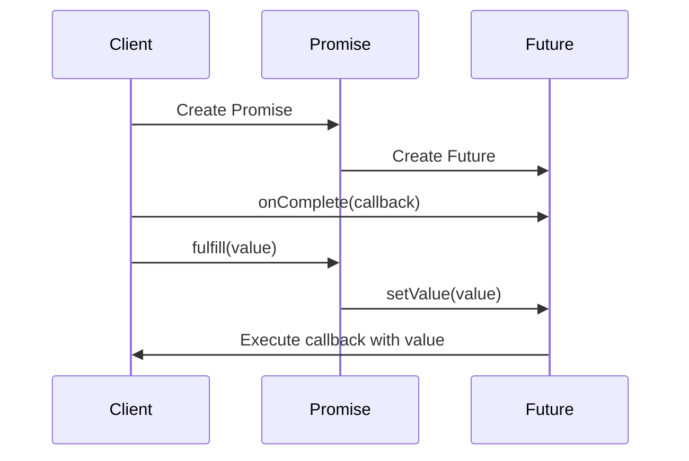

## 7.2. Futures and Promises

In the realm of functional programming, managing asynchronous computations is a crucial aspect of building efficient and responsive applications. Futures and Promises are two powerful abstractions that help developers handle asynchronous operations seamlessly. In this section, we will delve into the concepts of Futures and Promises, explore how they represent values that will be available later, and demonstrate how to compose Futures to combine asynchronous operations effectively. We will also provide detailed pseudocode implementations to illustrate these concepts.

### Understanding Futures and Promises

#### What are Futures?

A **Future** is an abstraction that represents a value that may not yet be available but will be at some point in the future. It acts as a placeholder for the result of an asynchronous computation. Futures allow developers to write non-blocking code, enabling applications to continue executing other tasks while waiting for the result of an asynchronous operation.

#### What are Promises?

A **Promise** is a complementary abstraction to Futures. It represents a computation that will eventually produce a result or fail with an error. Promises provide a mechanism to fulfill or reject a Future, allowing developers to handle the completion or failure of asynchronous operations.

#### Key Differences

While Futures and Promises are closely related, they serve different purposes:

- **Future**: Represents a read-only view of a value that will be available later. It cannot be directly completed or modified.
- **Promise**: Provides a mechanism to complete a Future by fulfilling it with a value or rejecting it with an error.

### Managing Asynchronous Computations

In functional programming, managing asynchronous computations involves representing operations that may not complete immediately. Futures and Promises provide a structured way to handle these computations, allowing developers to write clean and maintainable code.

#### Representing Values That Will Be Available Later

Futures and Promises enable developers to represent values that will be available at a later time. This is particularly useful in scenarios where operations involve network requests, file I/O, or other time-consuming tasks. By using Futures and Promises, developers can avoid blocking the main execution thread and improve the responsiveness of their applications.

#### Composing Futures

Composing Futures involves combining multiple asynchronous operations to create more complex workflows. This can be achieved through various techniques, such as chaining, mapping, and flat-mapping. By composing Futures, developers can build intricate asynchronous processes while maintaining code readability and modularity.

### Pseudocode Implementation

Let's explore how to create and handle Futures using pseudocode. We'll start by defining a basic Future and then demonstrate how to compose Futures to handle more complex asynchronous workflows.

#### Creating a Future

To create a Future, we need a mechanism to represent an asynchronous computation. Here's a simple pseudocode implementation of a Future:

```pseudocode
class Future {
    constructor() {
        this.value = null
        this.callbacks = []
    }

    // Method to set the value of the Future
    setValue(value) {
        this.value = value
        this.callbacks.forEach(callback => callback(value))
    }

    // Method to add a callback to be executed when the value is available
    onComplete(callback) {
        if (this.value !== null) {
            callback(this.value)
        } else {
            this.callbacks.push(callback)
        }
    }
}
```

In this implementation, the `Future` class has a `value` property to store the result of the computation and a `callbacks` array to hold functions that will be executed once the value is available. The `setValue` method sets the value and executes all registered callbacks, while the `onComplete` method allows adding callbacks to be executed when the value is ready.

#### Handling Asynchronous Operations with Promises

To handle asynchronous operations, we use Promises to fulfill or reject Futures. Here's how we can implement a simple Promise:

```pseudocode
class Promise {
    constructor() {
        this.future = new Future()
    }

    // Method to fulfill the Promise with a value
    fulfill(value) {
        this.future.setValue(value)
    }

    // Method to reject the Promise with an error
    reject(error) {
        // Handle error (not implemented in this simple example)
    }

    // Method to get the associated Future
    getFuture() {
        return this.future
    }
}
```

The `Promise` class encapsulates a `Future` and provides methods to fulfill or reject it. The `fulfill` method sets the value of the associated Future, while the `reject` method handles errors (not implemented in this simple example).

#### Composing Futures

Composing Futures involves chaining operations to create more complex workflows. Let's see how we can chain Futures using pseudocode:

```pseudocode
function chainFutures(future1, future2) {
    let resultFuture = new Future()

    future1.onComplete(value1 => {
        future2.onComplete(value2 => {
            resultFuture.setValue(value1 + value2)
        })
    })

    return resultFuture
}

// Example usage
let promise1 = new Promise()
let promise2 = new Promise()

let future1 = promise1.getFuture()
let future2 = promise2.getFuture()

let chainedFuture = chainFutures(future1, future2)

chainedFuture.onComplete(result => {
    print("Result of chained futures: " + result)
})

// Fulfill the promises
promise1.fulfill(10)
promise2.fulfill(20)
```

In this example, the `chainFutures` function takes two Futures as input and returns a new Future that represents the result of combining the values of the input Futures. The `onComplete` method is used to chain the operations, ensuring that the result is only available once both input Futures are fulfilled.

### Visualizing Futures and Promises

To better understand the interaction between Futures and Promises, let's visualize the process using a sequence diagram:



**Diagram Description:** This sequence diagram illustrates the interaction between a Client, a Promise, and a Future. The Client creates a Promise, which in turn creates a Future. The Client registers a callback with the Future using `onComplete`. When the Promise is fulfilled with a value, it sets the value of the Future, triggering the execution of the registered callback.

### Try It Yourself

To deepen your understanding of Futures and Promises, try modifying the pseudocode examples provided. Here are a few suggestions:

1. **Implement Error Handling:** Extend the `Promise` class to handle errors and propagate them through the Future chain.

2. **Add Timeout Support:** Modify the `Future` class to support timeouts, allowing callbacks to be executed if the value is not available within a specified time.

3. **Compose Multiple Futures:** Experiment with composing more than two Futures to create complex asynchronous workflows.

### Knowledge Check

Before we conclude, let's summarize the key takeaways from this section:

- **Futures** represent values that will be available later, allowing non-blocking code execution.
- **Promises** provide a mechanism to fulfill or reject Futures, enabling the handling of asynchronous operations.
- **Composing Futures** involves chaining operations to create complex workflows, improving code readability and modularity.

### Embrace the Journey

Remember, mastering Futures and Promises is just the beginning of your journey into functional programming. As you progress, you'll build more complex and efficient asynchronous systems. Keep experimenting, stay curious, and enjoy the journey!

## Quiz Time!



### What is a Future in functional programming?

- [x] A placeholder for a value that will be available later
- [ ] A mechanism to handle synchronous computations
- [ ] A data structure for storing values
- [ ] A type of loop for iterating over collections

> **Explanation:** A Future is an abstraction representing a value that may not yet be available but will be at some point in the future.

### What is the primary role of a Promise?

- [x] To fulfill or reject a Future
- [ ] To store multiple values
- [ ] To execute synchronous code
- [ ] To manage memory allocation

> **Explanation:** A Promise provides a mechanism to complete a Future by fulfilling it with a value or rejecting it with an error.

### How can you compose multiple Futures?

- [x] By chaining operations using methods like `onComplete`
- [ ] By using loops to iterate over them
- [ ] By storing them in a list
- [ ] By converting them to synchronous operations

> **Explanation:** Composing Futures involves chaining operations to create more complex workflows, often using methods like `onComplete`.

### What is the purpose of the `onComplete` method in a Future?

- [x] To register a callback to be executed when the Future's value is available
- [ ] To immediately execute a function
- [ ] To store a value in the Future
- [ ] To reject the Future with an error

> **Explanation:** The `onComplete` method allows adding callbacks to be executed when the Future's value is ready.

### Which of the following is a key difference between Futures and Promises?

- [x] Futures are read-only, while Promises can fulfill or reject Futures
- [ ] Futures can store multiple values, while Promises can only store one
- [ ] Futures are synchronous, while Promises are asynchronous
- [ ] Futures are used for error handling, while Promises are not

> **Explanation:** Futures represent a read-only view of a value that will be available later, while Promises provide a mechanism to complete a Future.

### What is a common use case for Futures and Promises?

- [x] Managing asynchronous computations
- [ ] Storing large amounts of data
- [ ] Executing synchronous code
- [ ] Iterating over collections

> **Explanation:** Futures and Promises are used to manage asynchronous computations, allowing non-blocking code execution.

### How can you handle errors in a Future chain?

- [x] By extending the Promise class to propagate errors
- [ ] By using loops to catch exceptions
- [ ] By storing errors in a list
- [ ] By converting errors to synchronous operations

> **Explanation:** Extending the Promise class to handle errors and propagate them through the Future chain is a common approach.

### What is the benefit of using Futures and Promises in functional programming?

- [x] They enable non-blocking code execution
- [ ] They simplify synchronous code
- [ ] They increase memory usage
- [ ] They make code execution slower

> **Explanation:** Futures and Promises enable non-blocking code execution, improving the responsiveness of applications.

### What does the `setValue` method do in a Future?

- [x] Sets the value of the Future and executes all registered callbacks
- [ ] Stores a value in a list
- [ ] Executes a function immediately
- [ ] Rejects the Future with an error

> **Explanation:** The `setValue` method sets the value of the Future and executes all registered callbacks.

### True or False: Promises can only fulfill Futures with values, not reject them with errors.

- [ ] True
- [x] False

> **Explanation:** Promises can fulfill Futures with values or reject them with errors, providing a mechanism to handle both success and failure.


