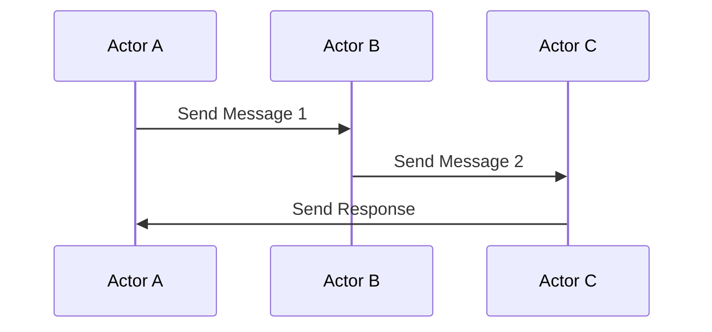

## 7.3. Actors Model

In the realm of functional programming, managing concurrency and parallelism is crucial for building efficient and scalable systems. The Actors Model is a powerful design pattern that provides a robust framework for handling concurrency by isolating state and using message passing for communication. This section delves into the intricacies of the Actors Model, exploring its core concepts, benefits, and practical implementations through pseudocode examples.

### Isolating State with Actors

The Actors Model is a conceptual model that treats "actors" as the fundamental units of computation. Each actor is an independent entity that encapsulates state and behavior, allowing it to operate concurrently with other actors. This encapsulation is key to achieving state isolation, a critical aspect of functional programming that minimizes side effects and enhances system reliability.

#### Key Concepts

- **Actor**: An independent computational entity that can process messages, maintain state, and create new actors.
- **State Isolation**: Each actor maintains its own state, preventing direct access by other actors. This isolation ensures that state changes are localized and controlled.
- **Concurrency**: Actors operate concurrently, processing messages asynchronously and independently of each other.

#### Benefits of State Isolation

- **Reduced Complexity**: By isolating state within actors, the complexity of managing shared state across concurrent processes is significantly reduced.
- **Enhanced Reliability**: State isolation minimizes the risk of race conditions and data corruption, leading to more reliable systems.
- **Scalability**: The independent nature of actors allows systems to scale horizontally, as actors can be distributed across multiple nodes or machines.

### Message Passing Concurrency

In the Actors Model, communication between actors is achieved through message passing. This approach eliminates the need for shared memory and locks, which are common sources of concurrency issues in traditional programming models.

#### Core Principles

- **Asynchronous Communication**: Actors communicate by sending and receiving messages asynchronously. This non-blocking communication model allows actors to continue processing other messages while waiting for a response.
- **Decoupled Interactions**: Message passing decouples the sender and receiver, allowing actors to interact without direct dependencies.
- **Fault Tolerance**: The message-driven nature of actors facilitates fault tolerance, as actors can handle failures and retries independently.

#### Implementing Message Passing

To implement message passing in the Actors Model, we define a protocol for sending and receiving messages. This protocol ensures that actors can communicate effectively while maintaining state isolation.

### Pseudocode Examples

Let's explore how to implement the Actors Model using pseudocode. We'll start by defining a simple actor system and demonstrate message passing between actors.

#### Defining an Actor

In our pseudocode, an actor is represented as an object with a state and a behavior function. The behavior function processes incoming messages and updates the actor's state accordingly.

```pseudocode
class Actor:
    def __init__(self, initial_state):
        self.state = initial_state

    def receive(self, message):
        # Process the incoming message and update state
        self.state = self.behavior(self.state, message)

    def behavior(self, state, message):
        # Define the actor's behavior based on the message
        # This is a placeholder function to be overridden by specific actors
        return state
```

#### Creating and Sending Messages

Actors communicate by sending messages to each other. In our pseudocode, we'll define a simple message structure and a function to send messages between actors.

```pseudocode
class Message:
    def __init__(self, content, sender):
        self.content = content
        self.sender = sender

def send_message(actor, message):
    # Deliver the message to the target actor
    actor.receive(message)
```

#### Example: Counter Actor

Let's implement a simple counter actor that increments its state based on received messages.

```pseudocode
class CounterActor(Actor):
    def behavior(self, state, message):
        if message.content == "increment":
            return state + 1
        elif message.content == "decrement":
            return state - 1
        else:
            return state

counter = CounterActor(0)

send_message(counter, Message("increment", None))
send_message(counter, Message("increment", None))
send_message(counter, Message("decrement", None))

print(counter.state)  # Output: 1
```

### Visualizing the Actors Model

To better understand the Actors Model, let's visualize the interaction between actors using a sequence diagram.



**Diagram Description**: This sequence diagram illustrates the message passing between three actors (A, B, and C). Actor A sends a message to Actor B, which in turn sends a message to Actor C. Actor C processes the message and sends a response back to Actor A.

### Design Considerations

When implementing the Actors Model, consider the following design considerations:

- **Message Protocols**: Define clear protocols for message formats and handling to ensure consistent communication between actors.
- **Error Handling**: Implement robust error handling mechanisms to manage failures and retries in message processing.
- **Scalability**: Design actors to be stateless or minimally stateful to facilitate scaling across distributed systems.

### Programming Language Specifics

The Actors Model is supported by various programming languages and frameworks, each offering unique features and capabilities. Here are some notable examples:

- **Erlang**: Known for its robust support for the Actors Model, Erlang provides built-in concurrency primitives and fault tolerance mechanisms.
- **Akka (Scala/Java)**: Akka is a popular framework for implementing the Actors Model in Scala and Java, offering powerful tools for building distributed systems.
- **Elixir**: Built on the Erlang VM, Elixir leverages the Actors Model to provide scalable and fault-tolerant applications.

### Differences and Similarities

The Actors Model shares similarities with other concurrency models, such as the CSP (Communicating Sequential Processes) model. However, it differs in its emphasis on state isolation and message-driven interactions. Understanding these differences is crucial for selecting the appropriate model for your application.

### Try It Yourself

To deepen your understanding of the Actors Model, try modifying the pseudocode examples provided. Experiment with different message types, actor behaviors, and state transitions. Consider implementing a more complex actor system, such as a chat application or a distributed task scheduler.

### Knowledge Check

- **What are the key benefits of state isolation in the Actors Model?**
- **How does message passing enhance concurrency in the Actors Model?**
- **What are some design considerations when implementing the Actors Model?**

### Embrace the Journey

Remember, mastering the Actors Model is a journey. As you explore and experiment with this powerful pattern, you'll gain valuable insights into building concurrent and scalable systems. Stay curious, keep experimenting, and enjoy the process!

## Quiz Time!



### What is the primary purpose of state isolation in the Actors Model?

- [x] To minimize side effects and enhance system reliability
- [ ] To increase the complexity of the system
- [ ] To allow direct access to the state by other actors
- [ ] To enable synchronous communication between actors

> **Explanation:** State isolation minimizes side effects and enhances system reliability by preventing direct access to an actor's state by other actors.

### How do actors communicate in the Actors Model?

- [x] Through asynchronous message passing
- [ ] By sharing memory
- [ ] Using synchronous function calls
- [ ] Through global variables

> **Explanation:** Actors communicate through asynchronous message passing, which decouples the sender and receiver and avoids shared memory.

### What is a key benefit of using message passing in the Actors Model?

- [x] It eliminates the need for locks and shared memory
- [ ] It increases the risk of race conditions
- [ ] It requires complex synchronization mechanisms
- [ ] It makes actors dependent on each other

> **Explanation:** Message passing eliminates the need for locks and shared memory, reducing the risk of race conditions and simplifying concurrency management.

### Which programming language is known for its robust support for the Actors Model?

- [x] Erlang
- [ ] Python
- [ ] JavaScript
- [ ] C++

> **Explanation:** Erlang is known for its robust support for the Actors Model, providing built-in concurrency primitives and fault tolerance mechanisms.

### What is a common design consideration when implementing the Actors Model?

- [x] Defining clear message protocols
- [ ] Using shared memory for communication
- [ ] Avoiding error handling
- [ ] Making actors stateful

> **Explanation:** Defining clear message protocols is crucial for consistent communication between actors in the Actors Model.

### What is the role of the behavior function in an actor?

- [x] To process incoming messages and update the actor's state
- [ ] To send messages to other actors
- [ ] To create new actors
- [ ] To manage shared memory

> **Explanation:** The behavior function processes incoming messages and updates the actor's state based on the message content.

### How does the Actors Model enhance scalability?

- [x] By allowing actors to be distributed across multiple nodes
- [ ] By increasing the complexity of the system
- [ ] By using shared memory for communication
- [ ] By making actors dependent on each other

> **Explanation:** The independent nature of actors allows them to be distributed across multiple nodes, enhancing scalability.

### What is a key difference between the Actors Model and CSP?

- [x] The Actors Model emphasizes state isolation and message-driven interactions
- [ ] CSP uses shared memory for communication
- [ ] The Actors Model requires synchronous communication
- [ ] CSP does not support concurrency

> **Explanation:** The Actors Model emphasizes state isolation and message-driven interactions, while CSP focuses on process synchronization and communication.

### What is a common use case for the Actors Model?

- [x] Building distributed systems
- [ ] Managing global variables
- [ ] Implementing synchronous function calls
- [ ] Using shared memory for communication

> **Explanation:** The Actors Model is commonly used for building distributed systems due to its support for concurrency and scalability.

### True or False: The Actors Model requires actors to share memory for communication.

- [ ] True
- [x] False

> **Explanation:** False. The Actors Model uses message passing for communication, eliminating the need for shared memory.


