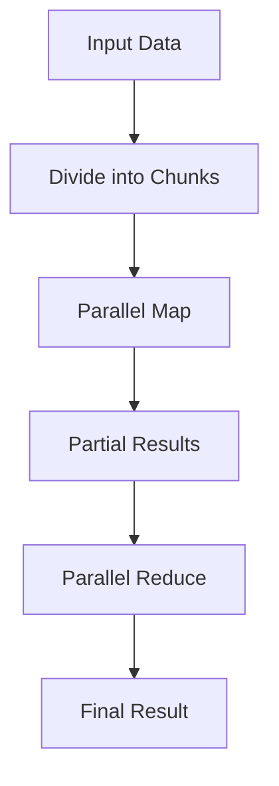

## 7.4. Data Parallelism with Functional Patterns

In the realm of functional programming, data parallelism is a powerful concept that allows us to perform computations concurrently, thereby improving efficiency and performance. This section delves into the intricacies of data parallelism, focusing on the use of functional patterns such as map-reduce, and the role of immutable data structures in ensuring thread safety during parallel processing. By the end of this section, you'll have a comprehensive understanding of how to leverage these patterns to perform parallel computations effectively.

### Understanding Data Parallelism

Data parallelism is a form of parallelization across multiple processors in parallel computing environments. It involves distributing data across different parallel computing nodes and performing the same operation on each node simultaneously. This approach is particularly beneficial for operations that can be performed independently on different pieces of data, such as element-wise operations on arrays or lists.

#### Key Concepts

- **Parallelizing Operations**: The process of dividing a task into smaller sub-tasks that can be processed simultaneously.
- **Immutable Data Structures**: Data structures that cannot be modified after they are created, ensuring thread safety in concurrent environments.
- **Map-Reduce Pattern**: A functional programming pattern that simplifies data processing by dividing tasks into map and reduce operations.

### Parallelizing Operations with Map-Reduce

The map-reduce pattern is a cornerstone of data parallelism in functional programming. It allows us to process large datasets efficiently by dividing the task into two main operations: map and reduce.

#### Map Operation

The map operation applies a given function to each element of a collection, producing a new collection with the results. This operation is inherently parallelizable because each element can be processed independently.

```pseudocode
function map(collection, func):
    result = []
    for element in collection:
        result.append(func(element))
    return result
```

#### Reduce Operation

The reduce operation aggregates the results of the map operation into a single output. It takes a binary function and an initial accumulator value, then applies the function cumulatively to the elements of the collection.

```pseudocode
function reduce(collection, func, initial):
    accumulator = initial
    for element in collection:
        accumulator = func(accumulator, element)
    return accumulator
```

#### Combining Map and Reduce

By combining map and reduce, we can perform complex data processing tasks in parallel. Here's a simple example of using map-reduce to calculate the sum of squares of a list of numbers:

```pseudocode
function sumOfSquares(numbers):
    squares = map(numbers, lambda x: x * x)
    return reduce(squares, lambda acc, x: acc + x, 0)
```

### Immutable Data Structures in Parallel Processing

Immutable data structures play a crucial role in parallel processing by ensuring that data is not modified during computation, thus preventing race conditions and ensuring thread safety.

#### Benefits of Immutability

- **Thread Safety**: Since immutable data cannot be changed, there is no risk of data corruption due to concurrent modifications.
- **Predictability**: Immutable data structures lead to more predictable and reliable code, as the state of data remains consistent throughout the computation.

#### Common Immutable Data Structures

- **Lists**: Immutable lists allow safe concurrent access and modifications without affecting the original data.
- **Sets**: Immutable sets provide efficient membership testing and set operations.
- **Maps**: Immutable maps ensure that key-value pairs remain consistent across parallel operations.

### Pseudocode Implementation of Parallel Computations

Let's explore how to implement parallel computations using functional patterns and immutable data structures. We'll demonstrate this with a parallel version of the map-reduce pattern.

#### Parallel Map

To perform the map operation in parallel, we can divide the collection into smaller chunks and process each chunk concurrently.

```pseudocode
function parallelMap(collection, func):
    chunkSize = ceil(length(collection) / numberOfThreads)
    results = []
    parallel for i from 0 to numberOfThreads:
        chunk = collection[i * chunkSize : (i + 1) * chunkSize]
        results.append(map(chunk, func))
    return flatten(results)
```

#### Parallel Reduce

The reduce operation can also be parallelized by performing partial reductions on each chunk and then combining the results.

```pseudocode
function parallelReduce(collection, func, initial):
    chunkSize = ceil(length(collection) / numberOfThreads)
    partialResults = []
    parallel for i from 0 to numberOfThreads:
        chunk = collection[i * chunkSize : (i + 1) * chunkSize]
        partialResults.append(reduce(chunk, func, initial))
    return reduce(partialResults, func, initial)
```

#### Complete Parallel Map-Reduce

Combining parallel map and reduce, we can implement a complete parallel map-reduce function.

```pseudocode
function parallelMapReduce(collection, mapFunc, reduceFunc, initial):
    mapped = parallelMap(collection, mapFunc)
    return parallelReduce(mapped, reduceFunc, initial)
```

### Visualizing Data Parallelism

To better understand how data parallelism works, let's visualize the process using a flowchart.



**Figure 1: Data Parallelism Flowchart**

This flowchart illustrates the process of dividing input data into chunks, applying the map operation in parallel, and then reducing the partial results to obtain the final output.

### Try It Yourself

To deepen your understanding of data parallelism, try modifying the pseudocode examples provided. Experiment with different functions for the map and reduce operations, and observe how the results change. Consider implementing parallel map-reduce for other data processing tasks, such as filtering or transforming data.

### References and Further Reading

- [MapReduce on Wikipedia](https://en.wikipedia.org/wiki/MapReduce)
- [Concurrency in Functional Programming](https://www.manning.com/books/concurrent-programming-in-scala)
- [Immutable Data Structures](https://immutable-js.github.io/immutable-js/)

### Knowledge Check

- Explain the benefits of using immutable data structures in parallel processing.
- Describe how the map-reduce pattern facilitates data parallelism.
- Implement a parallel map-reduce function for a different data processing task.

### Embrace the Journey

Remember, mastering data parallelism with functional patterns is a journey. As you continue to explore and experiment, you'll discover new ways to optimize and enhance your parallel computations. Keep pushing the boundaries of what's possible, and enjoy the process of learning and growing as a functional programmer.

## Quiz Time!



### What is data parallelism?

- [x] A form of parallelization across multiple processors where the same operation is performed on different pieces of data simultaneously.
- [ ] A method of sequential processing of data.
- [ ] A technique for optimizing memory usage.
- [ ] A way to serialize data for storage.

> **Explanation:** Data parallelism involves distributing data across different computing nodes and performing the same operation on each node simultaneously.

### What is the primary benefit of using immutable data structures in parallel processing?

- [x] Ensuring thread safety by preventing data modification.
- [ ] Increasing memory usage.
- [ ] Allowing data to be changed concurrently.
- [ ] Reducing code readability.

> **Explanation:** Immutable data structures cannot be modified, which prevents race conditions and ensures thread safety in concurrent environments.

### Which operation in the map-reduce pattern applies a function to each element of a collection?

- [x] Map
- [ ] Reduce
- [ ] Filter
- [ ] Sort

> **Explanation:** The map operation applies a given function to each element of a collection, producing a new collection with the results.

### What does the reduce operation do in the map-reduce pattern?

- [x] Aggregates the results of the map operation into a single output.
- [ ] Splits data into smaller chunks.
- [ ] Filters elements based on a condition.
- [ ] Sorts elements in a collection.

> **Explanation:** The reduce operation takes a binary function and an initial accumulator value, then applies the function cumulatively to the elements of the collection.

### How can the map operation be parallelized?

- [x] By dividing the collection into smaller chunks and processing each chunk concurrently.
- [ ] By processing each element sequentially.
- [ ] By using a single thread for all operations.
- [ ] By avoiding the use of functions.

> **Explanation:** To perform the map operation in parallel, the collection can be divided into smaller chunks, and each chunk can be processed concurrently.

### What is the purpose of the parallelReduce function?

- [x] To perform the reduce operation in parallel by combining partial results.
- [ ] To perform the map operation sequentially.
- [ ] To increase the complexity of the code.
- [ ] To decrease the number of threads used.

> **Explanation:** The parallelReduce function performs partial reductions on each chunk and then combines the results to obtain the final output.

### What is the role of the initial accumulator value in the reduce operation?

- [x] It serves as the starting point for the reduction process.
- [ ] It is used to split the data into chunks.
- [ ] It determines the number of threads to use.
- [ ] It is ignored during the reduction process.

> **Explanation:** The initial accumulator value serves as the starting point for the reduction process, and the binary function is applied cumulatively to the elements of the collection.

### Which of the following is a common immutable data structure?

- [x] List
- [ ] Array
- [ ] Variable
- [ ] Pointer

> **Explanation:** Immutable lists allow safe concurrent access and modifications without affecting the original data.

### What does the flatten function do in the parallelMap pseudocode?

- [x] Combines the results of each chunk into a single collection.
- [ ] Splits the collection into smaller chunks.
- [ ] Applies a function to each element.
- [ ] Sorts the elements in the collection.

> **Explanation:** The flatten function combines the results of each chunk into a single collection, ensuring that the final output is a single list of results.

### True or False: The map-reduce pattern is only applicable to functional programming languages.

- [ ] True
- [x] False

> **Explanation:** While the map-reduce pattern is a functional programming concept, it can be applied in various programming paradigms and languages, not just functional ones.


