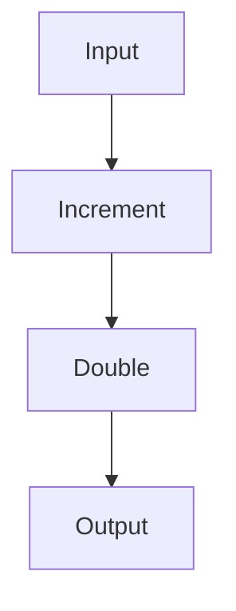
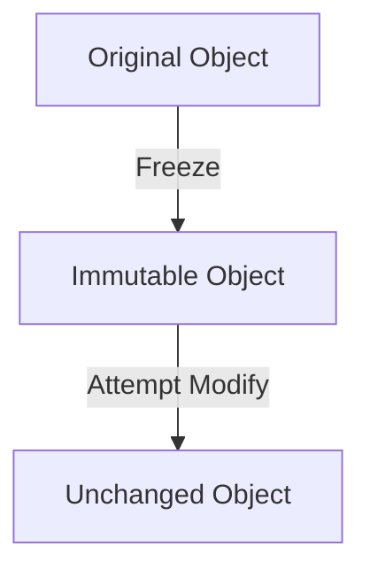

## 8.1. Functional Programming in JavaScript

Functional programming (FP) has gained significant traction in the JavaScript community, offering a paradigm that emphasizes immutability, pure functions, and higher-order functions. In this section, we will delve into how JavaScript, a language traditionally known for its imperative style, can embrace functional programming concepts. We will explore popular FP libraries such as Lodash, Ramda, and Immutable.js, and demonstrate how to apply these concepts effectively in JavaScript code.

### Introduction to Functional Programming in JavaScript

JavaScript is a versatile language that supports multiple programming paradigms, including imperative, object-oriented, and functional programming. The functional programming paradigm focuses on writing code that is declarative, predictable, and easier to test. By leveraging FP in JavaScript, developers can create more maintainable and scalable applications.

#### Key Concepts of Functional Programming

Before diving into the specifics of functional programming in JavaScript, let's revisit some fundamental FP concepts:

- **Pure Functions**: Functions that do not cause side effects and return the same output given the same input.
- **Immutability**: Data structures that cannot be modified after creation.
- **Higher-Order Functions**: Functions that take other functions as arguments or return them as results.
- **Function Composition**: Combining simple functions to build more complex ones.
- **Recursion**: A technique where a function calls itself to solve a problem.

### Using FP Libraries in JavaScript

JavaScript's native capabilities are enhanced by several libraries that facilitate functional programming. Let's explore three popular libraries: Lodash, Ramda, and Immutable.js.

#### Lodash

Lodash is a utility library that provides a wide range of functions for common programming tasks, including those that support functional programming. It offers methods for manipulating arrays, objects, strings, and more.

**Example: Using Lodash for Functional Programming**

```javascript
// Import Lodash
const _ = require('lodash');

// Example of using Lodash's map function
const numbers = [1, 2, 3, 4, 5];
const doubled = _.map(numbers, (n) => n * 2);

console.log(doubled); // Output: [2, 4, 6, 8, 10]
```

In this example, we use Lodash's `map` function to double each number in an array. Lodash provides a functional approach to array manipulation, making the code more concise and expressive.

#### Ramda

Ramda is a functional programming library for JavaScript that emphasizes immutability and function composition. It provides a suite of functions that are designed to be used in a functional style.

**Example: Function Composition with Ramda**

```javascript
// Import Ramda
const R = require('ramda');

// Define simple functions
const add = (a, b) => a + b;
const multiply = (a, b) => a * b;

// Compose functions using Ramda
const addAndMultiply = R.compose(
  R.multiply(2),
  R.add(10)
);

console.log(addAndMultiply(5)); // Output: 30
```

Here, we use Ramda's `compose` function to create a new function that first adds 10 to a number and then multiplies the result by 2. Function composition allows us to build complex operations from simple functions.

#### Immutable.js

Immutable.js is a library that provides immutable data structures for JavaScript. It helps manage state in a functional way by ensuring that data cannot be changed once created.

**Example: Using Immutable.js for Immutable Data Structures**

```javascript
// Import Immutable.js
const { Map } = require('immutable');

// Create an immutable map
const map1 = Map({ a: 1, b: 2, c: 3 });

// Update the map immutably
const map2 = map1.set('b', 50);

console.log(map1.get('b')); // Output: 2
console.log(map2.get('b')); // Output: 50
```

In this example, we create an immutable map using Immutable.js. When we update the map, a new map is returned, leaving the original map unchanged. This immutability is crucial for maintaining predictable state in applications.

### Applying FP Concepts in JavaScript Code

Now that we have explored some libraries, let's apply functional programming concepts directly in JavaScript code.

#### Pure Functions

Pure functions are a cornerstone of functional programming. They are predictable and easy to test because they do not rely on external state.

**Example: Implementing a Pure Function**

```javascript
// Pure function to calculate the square of a number
const square = (n) => n * n;

console.log(square(4)); // Output: 16
console.log(square(4)); // Output: 16 (always the same result)
```

The `square` function is pure because it always returns the same result for the same input and does not cause any side effects.

#### Higher-Order Functions

Higher-order functions are functions that operate on other functions, either by taking them as arguments or by returning them.

**Example: Using Higher-Order Functions**

```javascript
// Higher-order function that takes a function as an argument
const applyOperation = (operation, a, b) => operation(a, b);

// Define simple operations
const add = (x, y) => x + y;
const subtract = (x, y) => x - y;

console.log(applyOperation(add, 5, 3)); // Output: 8
console.log(applyOperation(subtract, 5, 3)); // Output: 2
```

In this example, `applyOperation` is a higher-order function that takes an operation function and two numbers as arguments. It applies the operation to the numbers, demonstrating the flexibility of higher-order functions.

#### Function Composition

Function composition allows us to build complex functions by combining simpler ones. This leads to more modular and reusable code.

**Example: Composing Functions**

```javascript
// Simple functions
const increment = (n) => n + 1;
const double = (n) => n * 2;

// Compose functions manually
const incrementAndDouble = (n) => double(increment(n));

console.log(incrementAndDouble(3)); // Output: 8
```

Here, we manually compose two functions, `increment` and `double`, to create a new function `incrementAndDouble`. This approach can be extended to more complex compositions.

#### Recursion

Recursion is a technique where a function calls itself to solve a problem. It is often used as an alternative to loops in functional programming.

**Example: Recursive Function to Calculate Factorial**

```javascript
// Recursive function to calculate factorial
const factorial = (n) => {
  if (n === 0) return 1;
  return n * factorial(n - 1);
};

console.log(factorial(5)); // Output: 120
```

The `factorial` function calculates the factorial of a number using recursion. It calls itself with a decremented value until it reaches the base case.

#### Immutability

Immutability is a key concept in functional programming that helps prevent unintended side effects by ensuring data structures cannot be modified after creation.

**Example: Achieving Immutability with JavaScript**

```javascript
// Using Object.freeze to create an immutable object
const person = Object.freeze({ name: 'Alice', age: 30 });

// Attempting to modify the object
person.age = 31;

console.log(person.age); // Output: 30 (modification is not allowed)
```

In this example, we use `Object.freeze` to create an immutable object. Any attempts to modify the object will be ignored, preserving its original state.

### Visualizing JavaScript's Interaction with Functional Programming

To better understand how JavaScript interacts with functional programming concepts, let's visualize some key aspects using Mermaid.js diagrams.

#### Visualizing Function Composition



**Description**: This diagram illustrates the flow of data through a composed function. The input is first incremented, then doubled, resulting in the final output.

#### Visualizing Immutability



**Description**: This diagram shows the process of creating an immutable object. The original object is frozen, and any attempts to modify it result in an unchanged object.

### Try It Yourself

To deepen your understanding of functional programming in JavaScript, try modifying the code examples provided:

1. **Experiment with Lodash**: Use different Lodash functions to manipulate arrays and objects. Try chaining multiple functions together for more complex operations.

2. **Compose Functions with Ramda**: Create your own functions and compose them using Ramda. Experiment with different compositions to see how they affect the output.

3. **Explore Immutability with Immutable.js**: Create complex data structures using Immutable.js and practice updating them immutably. Observe how the original structures remain unchanged.

### References and Further Reading

- [MDN Web Docs: JavaScript](https://developer.mozilla.org/en-US/docs/Web/JavaScript)
- [Lodash Documentation](https://lodash.com/docs/)
- [Ramda Documentation](https://ramdajs.com/docs/)
- [Immutable.js Documentation](https://immutable-js.github.io/immutable-js/)

### Knowledge Check

To reinforce your understanding of functional programming in JavaScript, consider the following questions:

1. What are the benefits of using pure functions in JavaScript?
2. How do higher-order functions enhance code flexibility?
3. Why is immutability important in functional programming?
4. How can function composition improve code modularity?
5. What are some common use cases for recursion in JavaScript?

### Embrace the Journey

Remember, this is just the beginning. As you progress, you'll build more complex and interactive applications using functional programming in JavaScript. Keep experimenting, stay curious, and enjoy the journey!

## Quiz Time!



### What is a pure function in JavaScript?

- [x] A function that returns the same output for the same input and has no side effects.
- [ ] A function that modifies global variables.
- [ ] A function that relies on external state.
- [ ] A function that performs asynchronous operations.

> **Explanation:** A pure function always returns the same output for the same input and does not cause any side effects, making it predictable and easy to test.

### Which library is known for providing immutable data structures in JavaScript?

- [ ] Lodash
- [ ] Ramda
- [x] Immutable.js
- [ ] jQuery

> **Explanation:** Immutable.js is a library that provides immutable data structures, ensuring that data cannot be changed once created.

### What is the main advantage of using higher-order functions?

- [x] They allow functions to be passed as arguments or returned as results, enhancing code flexibility.
- [ ] They make code run faster.
- [ ] They simplify error handling.
- [ ] They automatically optimize memory usage.

> **Explanation:** Higher-order functions enhance code flexibility by allowing functions to be passed as arguments or returned as results, enabling more abstract and reusable code.

### How does function composition benefit JavaScript code?

- [x] It allows building complex operations from simple functions, improving modularity and reusability.
- [ ] It automatically optimizes code performance.
- [ ] It simplifies error handling.
- [ ] It reduces memory usage.

> **Explanation:** Function composition allows developers to build complex operations from simple functions, improving code modularity and reusability.

### What is the purpose of using `Object.freeze` in JavaScript?

- [x] To create an immutable object that cannot be modified.
- [ ] To improve code performance.
- [ ] To simplify error handling.
- [ ] To automatically optimize memory usage.

> **Explanation:** `Object.freeze` is used to create an immutable object, preventing any modifications to its properties.

### Which of the following is a characteristic of functional programming?

- [x] Emphasis on immutability and pure functions.
- [ ] Reliance on global variables.
- [ ] Use of loops for iteration.
- [ ] Focus on object-oriented design.

> **Explanation:** Functional programming emphasizes immutability and pure functions, avoiding reliance on global variables and loops.

### What is recursion commonly used for in functional programming?

- [x] Solving problems by having a function call itself.
- [ ] Improving code performance.
- [ ] Simplifying error handling.
- [ ] Automatically optimizing memory usage.

> **Explanation:** Recursion is commonly used in functional programming to solve problems by having a function call itself, often as an alternative to loops.

### Which library is known for its emphasis on immutability and function composition?

- [ ] Lodash
- [x] Ramda
- [ ] Immutable.js
- [ ] jQuery

> **Explanation:** Ramda is a library known for its emphasis on immutability and function composition, providing a suite of functions designed for functional programming.

### What is a key benefit of using Lodash in JavaScript?

- [x] It provides utility functions for common programming tasks, including functional programming support.
- [ ] It automatically optimizes code performance.
- [ ] It simplifies error handling.
- [ ] It reduces memory usage.

> **Explanation:** Lodash provides utility functions for common programming tasks, including those that support functional programming, making code more concise and expressive.

### True or False: Immutable.js allows data structures to be modified after creation.

- [ ] True
- [x] False

> **Explanation:** False. Immutable.js provides immutable data structures, ensuring that data cannot be modified after creation.


