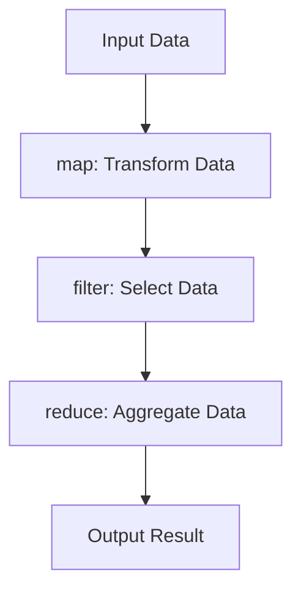

## 8.2. Functional Features in Python

Python is a versatile language that supports multiple programming paradigms, including functional programming (FP). While it is primarily known for its object-oriented capabilities, Python provides a rich set of features that enable developers to write functional code. In this section, we will explore Python's built-in higher-order functions, delve into functional libraries like Toolz and Funcy, and demonstrate how to translate functional programming patterns into Python.

### Built-in Higher-Order Functions

Higher-order functions are a cornerstone of functional programming. They are functions that can take other functions as arguments or return them as results. Python includes several built-in higher-order functions that facilitate functional programming.

#### **map**

The `map` function applies a given function to each item of an iterable (like a list) and returns an iterator. This is useful for transforming data without using explicit loops.

```python
numbers = [1, 2, 3, 4, 5]
squared_numbers = map(lambda x: x ** 2, numbers)

print(list(squared_numbers))  # Output: [1, 4, 9, 16, 25]
```

In this example, `map` takes a lambda function that squares a number and applies it to each element in the `numbers` list.

#### **filter**

The `filter` function constructs an iterator from elements of an iterable for which a function returns true. It is commonly used to filter out unwanted data.

```python
numbers = [1, 2, 3, 4, 5, 6]
even_numbers = filter(lambda x: x % 2 == 0, numbers)

print(list(even_numbers))  # Output: [2, 4, 6]
```

Here, `filter` uses a lambda function to retain only the even numbers from the `numbers` list.

#### **reduce**

The `reduce` function, which is part of the `functools` module, applies a binary function cumulatively to the items of an iterable, from left to right, so as to reduce the iterable to a single value.

```python
from functools import reduce

numbers = [1, 2, 3, 4, 5]
factorial = reduce(lambda x, y: x * y, numbers)

print(factorial)  # Output: 120
```

In this example, `reduce` multiplies the elements of the `numbers` list to compute the factorial.

### Functional Libraries

While Python's built-in functions provide a solid foundation for functional programming, libraries like Toolz and Funcy extend these capabilities, offering more advanced functional tools.

#### **Toolz**

Toolz is a library that provides a set of utility functions for iterators, functions, and dictionaries. It is designed to be lightweight and easy to use.

- **Currying**: Toolz supports currying, which allows you to fix a number of arguments to a function, producing another function.

```python
from toolz import curry

@curry
def add(x, y):
    return x + y

add_five = add(5)
print(add_five(10))  # Output: 15
```

- **Compose**: Toolz provides a `compose` function to combine multiple functions into a single function.

```python
from toolz import compose

def double(x):
    return x * 2

def increment(x):
    return x + 1

double_then_increment = compose(increment, double)
print(double_then_increment(3))  # Output: 7
```

#### **Funcy**

Funcy is another library that offers a collection of functional programming tools for Python. It focuses on providing concise and expressive functional utilities.

- **Partial Application**: Funcy allows for partial application of functions, similar to currying.

```python
from funcy import partial

def multiply(x, y):
    return x * y

double = partial(multiply, 2)
print(double(5))  # Output: 10
```

- **Lazy Evaluation**: Funcy supports lazy evaluation, enabling you to work with potentially infinite sequences.

```python
from funcy import ilazy

@ilazy
def count(start=0):
    while True:
        yield start
        start += 1

print(list(count()[:5]))  # Output: [0, 1, 2, 3, 4]
```

### Pseudocode Comparisons

Translating functional programming patterns into Python involves understanding how to leverage Python's functional features effectively. Let's explore some common functional patterns and their Python implementations.

#### **Function Composition**

Function composition is the process of combining two or more functions to produce a new function. In Python, this can be achieved using the `compose` function from Toolz or by manually chaining functions.

```pseudocode
function compose(f, g):
    return function(x):
        return f(g(x))

function double(x):
    return x * 2

function increment(x):
    return x + 1

composed_function = compose(increment, double)
result = composed_function(3)  # Output: 7
```

In Python, we can use Toolz's `compose` as shown earlier or manually chain functions:

```python
def compose(f, g):
    return lambda x: f(g(x))

def double(x):
    return x * 2

def increment(x):
    return x + 1

composed_function = compose(increment, double)
print(composed_function(3))  # Output: 7
```

#### **Recursion**

Recursion is a fundamental concept in functional programming, where a function calls itself to solve a problem. Python supports recursion, but it's important to be mindful of the recursion limit.

```pseudocode
function factorial(n):
    if n == 0:
        return 1
    else:
        return n * factorial(n - 1)

result = factorial(5)  # Output: 120
```

In Python, the recursive factorial function looks like this:

```python
def factorial(n):
    if n == 0:
        return 1
    else:
        return n * factorial(n - 1)

print(factorial(5))  # Output: 120
```

#### **Lazy Evaluation**

Lazy evaluation delays the computation of expressions until their values are needed. This can be useful for working with large or infinite data structures.

```pseudocode
function lazy_range(start, end):
    current = start
    while current < end:
        yield current
        current += 1

for number in lazy_range(0, 5):
    print(number)
```

In Python, lazy evaluation can be implemented using generators:

```python
def lazy_range(start, end):
    current = start
    while current < end:
        yield current
        current += 1

for number in lazy_range(0, 5):
    print(number)  # Output: 0 1 2 3 4
```

### Try It Yourself

To deepen your understanding, try modifying the code examples provided. For instance, change the lambda functions in `map` and `filter` to perform different operations, or experiment with creating your own higher-order functions. Explore the Toolz and Funcy libraries further by implementing more complex compositions and lazy evaluations.

### Visualizing Functional Concepts

To better understand how these functional features work together, let's visualize the flow of data through a series of transformations using a flowchart.



**Description:** This flowchart illustrates the process of transforming input data using `map`, selecting specific data with `filter`, aggregating the results with `reduce`, and producing the final output.

### References and Links

For further reading on Python's functional programming features, consider exploring the following resources:

- [Python's Official Documentation on Functional Programming](https://docs.python.org/3/howto/functional.html)
- [Toolz Documentation](https://toolz.readthedocs.io/en/latest/)
- [Funcy Documentation](https://funcy.readthedocs.io/en/stable/)

### Knowledge Check

To reinforce your understanding, consider the following questions:

- How does the `map` function differ from a traditional loop in Python?
- What are the benefits of using `filter` over list comprehensions for filtering data?
- How can you implement function composition in Python without using external libraries?
- What are some potential pitfalls of using recursion in Python?
- How does lazy evaluation improve performance in Python programs?

### Embrace the Journey

Remember, this is just the beginning. As you progress, you'll discover more advanced functional programming techniques and how they can be applied to solve complex problems. Keep experimenting, stay curious, and enjoy the journey!

## Quiz Time!



### What is a higher-order function in Python?

- [x] A function that takes other functions as arguments or returns them as results
- [ ] A function that only works with integers
- [ ] A function that is defined inside another function
- [ ] A function that cannot be modified

> **Explanation:** Higher-order functions are those that can take other functions as arguments or return them as results, enabling functional programming patterns.

### Which built-in Python function is used to apply a function to each item of an iterable?

- [x] map
- [ ] filter
- [ ] reduce
- [ ] apply

> **Explanation:** The `map` function applies a given function to each item of an iterable, transforming the data.

### What does the `filter` function do in Python?

- [x] Constructs an iterator from elements of an iterable for which a function returns true
- [ ] Applies a function to each item of an iterable
- [ ] Reduces an iterable to a single value
- [ ] Sorts an iterable in place

> **Explanation:** The `filter` function constructs an iterator from elements of an iterable for which a function returns true, effectively filtering the data.

### Which module in Python provides the `reduce` function?

- [x] functools
- [ ] itertools
- [ ] collections
- [ ] operator

> **Explanation:** The `reduce` function is part of the `functools` module in Python.

### What is the purpose of currying in functional programming?

- [x] To fix a number of arguments to a function, producing another function
- [ ] To sort data in ascending order
- [ ] To execute a function asynchronously
- [ ] To convert a function into a generator

> **Explanation:** Currying allows you to fix a number of arguments to a function, producing another function that can be called with the remaining arguments.

### Which library provides the `compose` function for function composition in Python?

- [x] Toolz
- [ ] Funcy
- [ ] functools
- [ ] itertools

> **Explanation:** Toolz provides the `compose` function, which allows for the composition of multiple functions into a single function.

### How can lazy evaluation be implemented in Python?

- [x] Using generators
- [ ] Using list comprehensions
- [ ] Using the `map` function
- [ ] Using the `filter` function

> **Explanation:** Lazy evaluation can be implemented in Python using generators, which yield values one at a time as needed.

### What is a potential drawback of using recursion in Python?

- [x] Recursion limit can be reached, leading to a stack overflow
- [ ] It is slower than loops in all cases
- [ ] It cannot be used with lists
- [ ] It requires external libraries

> **Explanation:** Python has a recursion limit, and exceeding this limit can lead to a stack overflow, making recursion potentially problematic for deep recursive calls.

### What is the main advantage of using `filter` over list comprehensions?

- [x] `filter` can be more memory efficient as it returns an iterator
- [ ] `filter` is faster in all cases
- [ ] `filter` can sort data automatically
- [ ] `filter` can handle exceptions better

> **Explanation:** `filter` returns an iterator, which can be more memory efficient than list comprehensions that create a new list.

### True or False: Python supports functional programming through both built-in functions and external libraries.

- [x] True
- [ ] False

> **Explanation:** Python supports functional programming through built-in functions like `map`, `filter`, and `reduce`, as well as through external libraries like Toolz and Funcy.


