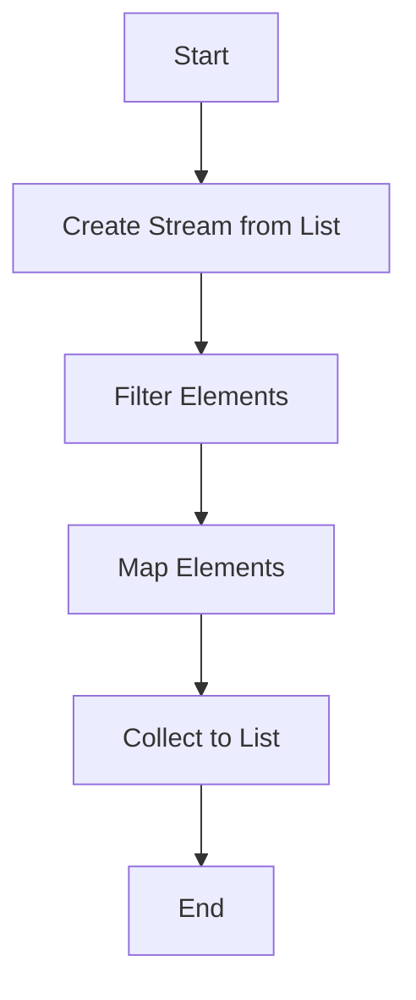

## 8.3. Functional Extensions in Java and C#

In recent years, both Java and C# have embraced functional programming (FP) paradigms, allowing developers to write more expressive, concise, and maintainable code. This section delves into the functional extensions in these languages, focusing on lambda expressions, streams, and other functional constructs. By understanding these features, you can harness the power of FP to solve complex problems more efficiently.

### Introduction to Functional Programming in Java and C#

Functional programming is a paradigm that treats computation as the evaluation of mathematical functions and avoids changing state or mutable data. Java and C#, traditionally imperative languages, have integrated FP features to enhance their capabilities. Let's explore how these languages incorporate FP principles.

### Lambda Expressions

Lambda expressions are a key feature in both Java and C#, enabling you to write anonymous functions. They provide a clear and concise way to represent a method interface using an expression. This feature is particularly useful for implementing functional interfaces or delegates.

#### Java Lambda Expressions

In Java, lambda expressions were introduced in Java 8. They allow you to express instances of single-method interfaces (functional interfaces) more compactly.

**Syntax:**

```java
(parameters) -> expression
```

**Example:**

```java
// Traditional way
Runnable r1 = new Runnable() {
    @Override
    public void run() {
        System.out.println("Hello, World!");
    }
};

// Using lambda expression
Runnable r2 = () -> System.out.println("Hello, World!");
```

In this example, the lambda expression `() -> System.out.println("Hello, World!")` is a more concise way to implement the `Runnable` interface.

#### C# Lambda Expressions

C# has supported lambda expressions since version 3.0. They are used extensively in LINQ queries and are similar in concept to Java's lambdas.

**Syntax:**

```csharp
(parameters) => expression
```

**Example:**

```csharp
// Traditional way
Action greet = delegate {
    Console.WriteLine("Hello, World!");
};

// Using lambda expression
Action greetLambda = () => Console.WriteLine("Hello, World!");
```

Here, the lambda expression `() => Console.WriteLine("Hello, World!")` simplifies the delegate syntax.

### Streams in Java

Streams in Java provide a powerful way to process sequences of elements. They support functional-style operations on streams of elements, such as map, filter, and reduce.

#### Creating Streams

Streams can be created from collections, arrays, or I/O channels.

**Example:**

```java
List<String> names = Arrays.asList("Alice", "Bob", "Charlie");

// Creating a stream
Stream<String> stream = names.stream();
```

#### Stream Operations

Streams support various operations, which are divided into intermediate and terminal operations.

- **Intermediate Operations:** Transform a stream into another stream (e.g., `map`, `filter`).
- **Terminal Operations:** Produce a result or a side-effect (e.g., `forEach`, `collect`).

**Example:**

```java
List<String> names = Arrays.asList("Alice", "Bob", "Charlie");

// Using stream operations
List<String> filteredNames = names.stream()
    .filter(name -> name.startsWith("A"))
    .collect(Collectors.toList());

System.out.println(filteredNames); // Output: [Alice]
```

In this example, `filter` is an intermediate operation, and `collect` is a terminal operation.

### LINQ and Functional Constructs in C#

Language Integrated Query (LINQ) in C# provides a declarative way to query collections. It integrates seamlessly with lambda expressions to offer powerful data manipulation capabilities.

#### LINQ Syntax

LINQ can be used with both query syntax and method syntax.

**Example:**

```csharp
List<string> names = new List<string> { "Alice", "Bob", "Charlie" };

// Query syntax
var filteredNamesQuery = from name in names
                         where name.StartsWith("A")
                         select name;

// Method syntax
var filteredNamesMethod = names.Where(name => name.StartsWith("A")).ToList();

Console.WriteLine(string.Join(", ", filteredNamesMethod)); // Output: Alice
```

Both query and method syntax achieve the same result, filtering names that start with "A".

### Optional and Nullable Types

Handling null values is a common challenge in programming. Java and C# provide constructs to handle optional values safely.

#### Java's Optional

The `Optional` class in Java is a container that may or may not contain a non-null value. It helps avoid `NullPointerException`.

**Example:**

```java
Optional<String> optionalName = Optional.ofNullable(getName());

optionalName.ifPresent(name -> System.out.println("Name: " + name));
```

In this example, `ifPresent` checks if a value is present before executing the lambda expression.

#### C#'s Nullable Types

C# provides nullable types for value types, allowing them to represent null values.

**Example:**

```csharp
int? nullableInt = null;

if (nullableInt.HasValue)
{
    Console.WriteLine("Value: " + nullableInt.Value);
}
else
{
    Console.WriteLine("No value");
}
```

Here, `nullableInt` can hold either an integer value or null.

### Functional Patterns in Java and C#

Java and C# support various functional patterns, enhancing code modularity and reusability.

#### Map-Reduce Pattern

The map-reduce pattern is a common functional programming pattern used for processing collections.

**Java Example:**

```java
List<Integer> numbers = Arrays.asList(1, 2, 3, 4, 5);

// Map and reduce
int sum = numbers.stream()
    .mapToInt(Integer::intValue)
    .sum();

System.out.println("Sum: " + sum); // Output: Sum: 15
```

**C# Example:**

```csharp
List<int> numbers = new List<int> { 1, 2, 3, 4, 5 };

// Map and reduce
int sum = numbers.Sum();

Console.WriteLine("Sum: " + sum); // Output: Sum: 15
```

Both examples demonstrate how to sum a list of numbers using map-reduce.

#### Functional Interfaces and Delegates

Functional interfaces in Java and delegates in C# allow you to pass behavior as parameters.

**Java Example:**

```java
@FunctionalInterface
interface Greeting {
    void sayHello(String name);
}

Greeting greeting = name -> System.out.println("Hello, " + name);
greeting.sayHello("Alice");
```

**C# Example:**

```csharp
delegate void Greeting(string name);

Greeting greeting = name => Console.WriteLine("Hello, " + name);
greeting("Alice");
```

These examples show how to define and use functional interfaces and delegates.

### Try It Yourself

Experiment with the examples provided by modifying the lambda expressions, stream operations, and LINQ queries. Try creating your own functional interfaces and delegates to deepen your understanding.

### Visualizing Functional Constructs

To better understand the flow of functional constructs, let's visualize a simple stream operation in Java using a flowchart.



**Figure 1:** Flowchart of a Stream Operation in Java

This flowchart illustrates the sequence of operations in a Java stream, from creation to collection.

### Key Takeaways

- **Lambda Expressions:** Provide a concise way to implement functional interfaces and delegates.
- **Streams and LINQ:** Offer powerful data processing capabilities with functional-style operations.
- **Optional and Nullable Types:** Help handle null values safely, reducing the risk of runtime exceptions.
- **Functional Patterns:** Enhance code modularity and reusability, making it easier to maintain and extend.

### References and Further Reading

- [Java Lambda Expressions](https://docs.oracle.com/javase/tutorial/java/javaOO/lambdaexpressions.html)
- [C# Lambda Expressions](https://docs.microsoft.com/en-us/dotnet/csharp/programming-guide/statements-expressions-operators/lambda-expressions)
- [Java Streams](https://docs.oracle.com/javase/8/docs/api/java/util/stream/package-summary.html)
- [C# LINQ](https://docs.microsoft.com/en-us/dotnet/csharp/programming-guide/concepts/linq/)

### Embrace the Journey

Remember, this is just the beginning. As you progress, you'll discover more advanced functional programming patterns and techniques. Keep experimenting, stay curious, and enjoy the journey!

## Quiz Time!



### What is the primary purpose of lambda expressions in Java and C#?

- [x] To provide a concise way to implement functional interfaces or delegates
- [ ] To replace all object-oriented programming constructs
- [ ] To handle exceptions more effectively
- [ ] To improve memory management

> **Explanation:** Lambda expressions offer a concise syntax for implementing functional interfaces (Java) or delegates (C#), allowing for more readable and maintainable code.

### Which of the following is an intermediate operation in Java streams?

- [x] filter
- [ ] collect
- [ ] forEach
- [ ] reduce

> **Explanation:** Intermediate operations, like `filter`, transform a stream into another stream and are lazy, meaning they are not executed until a terminal operation is invoked.

### How do you create a nullable type in C#?

- [x] By appending a question mark to the value type (e.g., `int?`)
- [ ] By using the `Nullable` keyword
- [ ] By declaring the type as `null`
- [ ] By using the `Optional` class

> **Explanation:** In C#, nullable types are created by appending a question mark to the value type, allowing it to hold either a value or null.

### What is the output of the following Java stream operation: `List.of(1, 2, 3).stream().map(x -> x * 2).collect(Collectors.toList())`?

- [x] [2, 4, 6]
- [ ] [1, 2, 3]
- [ ] [3, 6, 9]
- [ ] [2, 3, 4]

> **Explanation:** The `map` operation multiplies each element by 2, resulting in the list [2, 4, 6].

### Which C# feature is used to query collections in a declarative way?

- [x] LINQ
- [ ] Streams
- [ ] Optional
- [ ] Delegates

> **Explanation:** LINQ (Language Integrated Query) is a feature in C# that allows querying collections in a declarative manner, similar to SQL.

### What is the purpose of the `Optional` class in Java?

- [x] To safely handle potentially null values
- [ ] To improve performance of collections
- [ ] To manage exceptions
- [ ] To replace all primitive types

> **Explanation:** The `Optional` class in Java is used to represent a value that may or may not be present, helping to avoid `NullPointerException`.

### Which of the following is a terminal operation in Java streams?

- [x] collect
- [ ] map
- [ ] filter
- [ ] peek

> **Explanation:** Terminal operations, like `collect`, produce a result or a side-effect and trigger the execution of the stream pipeline.

### How do lambda expressions enhance code readability?

- [x] By reducing boilerplate code and making the code more concise
- [ ] By enforcing strict type checking
- [ ] By eliminating the need for comments
- [ ] By automatically optimizing performance

> **Explanation:** Lambda expressions reduce boilerplate code, making the code more concise and easier to read and understand.

### What is the equivalent of Java's `Optional` in C#?

- [x] Nullable types
- [ ] LINQ
- [ ] Delegates
- [ ] Streams

> **Explanation:** Nullable types in C# allow value types to represent null, similar to how `Optional` is used in Java for reference types.

### True or False: Streams in Java can be reused after a terminal operation.

- [ ] True
- [x] False

> **Explanation:** Streams in Java cannot be reused after a terminal operation. Once a terminal operation is invoked, the stream is considered consumed.


