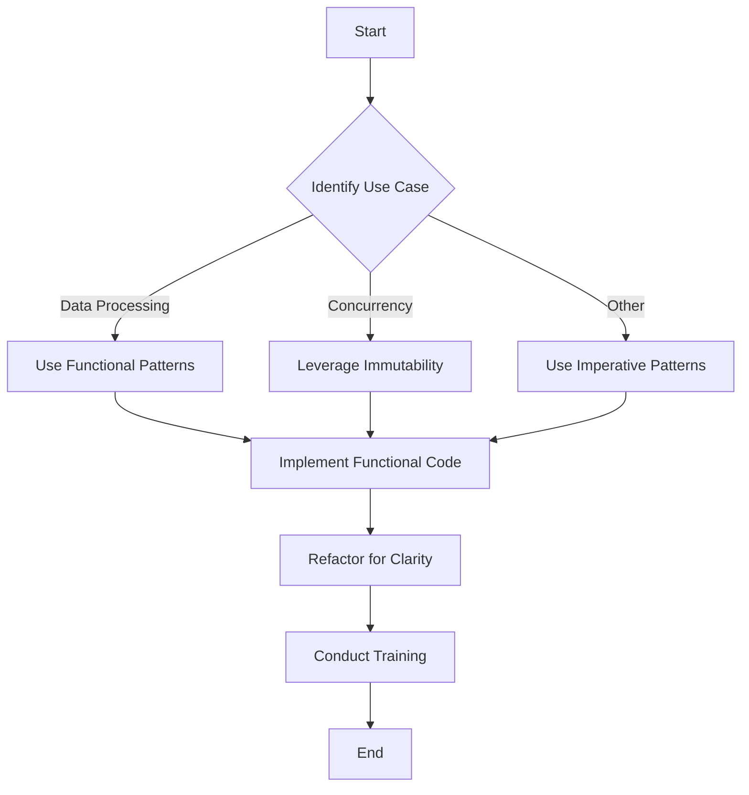

## 8.4. Challenges and Best Practices

Integrating functional programming (FP) patterns into imperative languages presents unique challenges and opportunities. As developers, we often find ourselves navigating the intricacies of blending paradigms, each with its own strengths and limitations. This section delves into the common challenges faced when incorporating functional patterns into imperative languages and outlines best practices to ensure a seamless integration.

### Overcoming Language Limitations

Functional programming offers a powerful toolkit for writing concise, expressive, and maintainable code. However, when working within imperative languages, developers may encounter several limitations that can hinder the adoption of FP patterns. Let's explore these challenges and the workarounds available.

#### 1. Lack of Native Support for FP Constructs

Many imperative languages, such as Java and C#, were not originally designed with functional programming in mind. As a result, they may lack native support for key FP constructs like higher-order functions, immutability, and lazy evaluation.

**Workaround:**

- **Utilize Libraries and Frameworks:** Leverage libraries such as Java's Stream API or C#'s LINQ to introduce functional constructs. These libraries provide higher-order functions like `map`, `filter`, and `reduce`, enabling a more functional style of programming.

```pseudocode
// Example of using Java's Stream API for functional programming
List<Integer> numbers = Arrays.asList(1, 2, 3, 4, 5);
List<Integer> squaredNumbers = numbers.stream()
    .map(n -> n * n)
    .collect(Collectors.toList());
```

- **Adopt Functional Libraries:** Explore third-party libraries like Ramda for JavaScript or Funcy for Python, which offer a rich set of functional utilities.

#### 2. Immutability Challenges

Imperative languages often emphasize mutable state, which can lead to side effects and bugs. Embracing immutability in such environments can be challenging.

**Workaround:**

- **Use Immutable Data Structures:** Opt for immutable collections provided by libraries like Immutable.js for JavaScript or persistent collections in Clojure.

```pseudocode
// Example of using Immutable.js in JavaScript
const { Map } = require('immutable');
const map1 = Map({ a: 1, b: 2, c: 3 });
const map2 = map1.set('b', 50);
console.log(map1.get('b')); // 2
console.log(map2.get('b')); // 50
```

- **Encapsulate State Changes:** Use functions to encapsulate state changes, ensuring that data remains immutable outside of controlled environments.

#### 3. Limited Support for Lazy Evaluation

Lazy evaluation, a hallmark of functional programming, allows for deferred computation, improving performance and efficiency. However, not all imperative languages support this feature natively.

**Workaround:**

- **Implement Lazy Evaluation Manually:** Create custom lazy sequences using generators or iterators, as seen in Python or JavaScript.

```pseudocode
// Example of lazy evaluation using Python generators
def lazy_range(n):
    i = 0
    while i < n:
        yield i
        i += 1

for num in lazy_range(5):
    print(num)
```

- **Leverage Language Features:** Use language-specific features like Java's `Stream` or C#'s `IEnumerable` to achieve lazy evaluation.

### Balancing Functional and Imperative Code

Successfully integrating functional patterns into imperative codebases requires a delicate balance. Here are some strategies to achieve this balance effectively.

#### 1. Identify Suitable Use Cases

Not every problem is best solved with functional programming. Recognize scenarios where FP shines, such as data transformations, concurrency, and stateless computations.

**Best Practice:**

- **Use FP for Data Processing:** Leverage functional patterns for tasks involving data manipulation, such as filtering, mapping, and reducing collections.

```pseudocode
// Example of using functional patterns for data processing in JavaScript
const numbers = [1, 2, 3, 4, 5];
const evenNumbers = numbers.filter(n => n % 2 === 0);
console.log(evenNumbers); // [2, 4]
```

- **Apply FP in Concurrency:** Utilize FP's immutability and statelessness to simplify concurrent programming, reducing the risk of race conditions.

#### 2. Maintain Readability and Maintainability

Mixing paradigms can lead to complex and unreadable code. Strive to maintain clarity and simplicity in your codebase.

**Best Practice:**

- **Adopt Consistent Coding Standards:** Establish coding guidelines that balance functional and imperative styles, ensuring consistency across the codebase.

- **Refactor for Clarity:** Regularly refactor code to improve readability, using descriptive function names and clear abstractions.

#### 3. Educate and Collaborate

Transitioning to a functional style can be challenging for teams accustomed to imperative programming. Foster a culture of learning and collaboration.

**Best Practice:**

- **Conduct Workshops and Training:** Organize training sessions to introduce functional concepts and patterns, helping team members build confidence in their FP skills.

- **Encourage Pair Programming:** Promote pair programming to facilitate knowledge sharing and collaborative problem-solving.

#### 4. Leverage Language Features

Many modern imperative languages have incorporated functional features. Take advantage of these features to write more expressive and concise code.

**Best Practice:**

- **Use Lambdas and Closures:** Utilize lambda expressions and closures to create concise and powerful functions.

```pseudocode
// Example of using lambda expressions in C#
Func<int, int> square = x => x * x;
Console.WriteLine(square(5)); // 25
```

- **Explore Pattern Matching:** In languages like Scala or Kotlin, use pattern matching to simplify complex conditional logic.

### Visualizing the Integration of Functional Patterns

To better understand the integration of functional patterns into imperative languages, let's visualize the process using a flowchart.



**Diagram Description:** This flowchart illustrates the decision-making process for integrating functional patterns into imperative languages. It begins with identifying the use case, followed by selecting the appropriate pattern and implementing the code. The process concludes with refactoring and training to ensure clarity and understanding.

### References and Links

For further reading on integrating functional programming into imperative languages, consider exploring the following resources:

- [MDN Web Docs on Functional Programming](https://developer.mozilla.org/en-US/docs/Web/JavaScript/Guide/Functions/Functional_programming)
- [W3Schools JavaScript Functional Programming](https://www.w3schools.com/js/js_functional.asp)
- [Java Streams Documentation](https://docs.oracle.com/javase/8/docs/api/java/util/stream/package-summary.html)
- [C# LINQ Documentation](https://docs.microsoft.com/en-us/dotnet/csharp/programming-guide/concepts/linq/)

### Knowledge Check

To reinforce your understanding of integrating functional patterns into imperative languages, consider the following questions:

- What are the key challenges of adopting functional programming in imperative languages?
- How can libraries and frameworks aid in overcoming language limitations?
- Why is it important to balance functional and imperative code styles?
- What strategies can be employed to maintain code readability and maintainability?
- How can teams effectively transition to a functional programming style?

### Embrace the Journey

Remember, integrating functional programming patterns into imperative languages is a journey of exploration and growth. As you navigate this path, keep experimenting, stay curious, and enjoy the process of transforming your codebase into a more expressive and maintainable masterpiece. Embrace the power of functional programming and let it enhance your development skills.

## Quiz Time!



### What is a common challenge when integrating functional programming into imperative languages?

- [x] Lack of native support for FP constructs
- [ ] Excessive memory usage
- [ ] Inability to handle large datasets
- [ ] Poor performance

> **Explanation:** Many imperative languages were not designed with functional programming in mind, leading to a lack of native support for FP constructs.

### Which library can be used to introduce functional constructs in Java?

- [x] Java Stream API
- [ ] React
- [ ] Angular
- [ ] Vue.js

> **Explanation:** The Java Stream API provides higher-order functions like `map`, `filter`, and `reduce`, enabling a more functional style of programming.

### How can immutability be achieved in JavaScript?

- [x] Using Immutable.js
- [ ] Using mutable arrays
- [ ] Using global variables
- [ ] Using loops

> **Explanation:** Immutable.js provides immutable data structures, helping achieve immutability in JavaScript.

### What is a benefit of lazy evaluation?

- [x] Improved performance by deferring computation
- [ ] Increased memory usage
- [ ] Slower execution
- [ ] More complex code

> **Explanation:** Lazy evaluation defers computation until necessary, improving performance by avoiding unnecessary calculations.

### Which strategy helps maintain code readability when mixing paradigms?

- [x] Refactor for clarity
- [ ] Use global variables
- [ ] Avoid comments
- [ ] Write long functions

> **Explanation:** Regularly refactoring code improves readability, using descriptive function names and clear abstractions.

### What is a best practice for transitioning teams to functional programming?

- [x] Conduct workshops and training
- [ ] Avoid collaboration
- [ ] Use only imperative code
- [ ] Ignore functional patterns

> **Explanation:** Organizing training sessions helps team members build confidence in their functional programming skills.

### Which feature can be used in C# to create concise functions?

- [x] Lambda expressions
- [ ] Global variables
- [ ] Loops
- [ ] Classes

> **Explanation:** Lambda expressions allow for the creation of concise and powerful functions in C#.

### What is a key advantage of using functional patterns for concurrency?

- [x] Reduced risk of race conditions
- [ ] Increased complexity
- [ ] Slower execution
- [ ] More memory usage

> **Explanation:** FP's immutability and statelessness simplify concurrent programming, reducing the risk of race conditions.

### How can lazy evaluation be implemented in Python?

- [x] Using generators
- [ ] Using loops
- [ ] Using global variables
- [ ] Using classes

> **Explanation:** Generators in Python allow for lazy evaluation by yielding values one at a time.

### True or False: Functional programming patterns can only be used in functional languages.

- [ ] True
- [x] False

> **Explanation:** Functional programming patterns can be integrated into imperative languages using various techniques and libraries.


