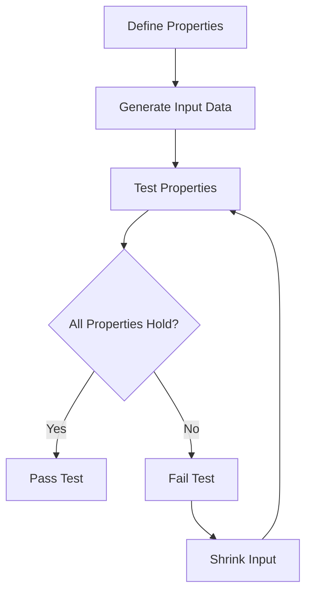

## 9.1. Property-Based Testing

In the realm of software development, ensuring the correctness and reliability of code is paramount. Traditional testing methods, such as unit tests, often focus on specific examples and edge cases. However, they may not cover the entire spectrum of possible inputs, potentially leaving gaps in test coverage. This is where **property-based testing** shines, offering a robust approach to testing by leveraging generative data to explore a wide range of inputs.

### Understanding Property-Based Testing

**Property-based testing** is a testing methodology that focuses on defining the properties or invariants that a function or system should satisfy. Instead of specifying individual test cases, we define general properties that should hold true for all possible inputs. The testing framework then generates a variety of inputs to validate these properties, ensuring that the code behaves correctly across a broad spectrum of scenarios.

#### Key Concepts

- **Properties**: These are general statements or invariants about the behavior of the system. For example, a property for a sorting function might state that the output list should be in ascending order.
- **Generative Data**: The testing framework automatically generates a wide range of input data to test the defined properties. This includes edge cases and random values.
- **Shrinking**: When a test fails, the framework attempts to simplify the input data to find the smallest example that causes the failure, aiding in debugging.

### Benefits of Property-Based Testing

- **Comprehensive Coverage**: By testing a wide range of inputs, property-based testing can uncover edge cases that traditional tests might miss.
- **Automated Test Generation**: The framework handles input generation, reducing the manual effort required to write exhaustive test cases.
- **Robustness**: Ensures that the code behaves correctly under various conditions, improving reliability and robustness.

### Tools and Frameworks

Several tools and frameworks support property-based testing, each offering unique features and capabilities. Here are two of the most popular ones:

#### QuickCheck

Originally developed for Haskell, QuickCheck has inspired similar tools in other languages. It allows developers to define properties and automatically generates test cases to validate them.

- **Language Support**: Haskell, Erlang, Scala, and more.
- **Features**: Automatic test case generation, shrinking, and customizable generators.

#### Hypothesis

Hypothesis is a property-based testing library for Python. It integrates seamlessly with existing testing frameworks like `unittest` and `pytest`.

- **Language Support**: Python.
- **Features**: Powerful data generation, shrinking, and integration with Python's testing ecosystem.

### Writing Property-Based Tests

Let's explore how to write property-based tests using pseudocode. We'll define properties for a simple function and demonstrate how to implement these tests.

#### Example: Testing a Sorting Function

Consider a function `sort` that takes a list of integers and returns a sorted list. We want to ensure that this function behaves correctly for all possible inputs.

**Properties to Test:**

1. **Idempotence**: Sorting a list twice should yield the same result as sorting it once.
2. **Order**: The output list should be in non-decreasing order.
3. **Permutation**: The output list should be a permutation of the input list.

**Pseudocode Implementation:**

```pseudocode
function property_based_test_sort():
    # Define the properties
    property_idempotence = (input_list) => sort(sort(input_list)) == sort(input_list)
    property_order = (input_list) => is_sorted(sort(input_list))
    property_permutation = (input_list) => is_permutation(input_list, sort(input_list))

    # Generate test cases
    for input_list in generate_lists_of_integers():
        assert property_idempotence(input_list)
        assert property_order(input_list)
        assert property_permutation(input_list)

function is_sorted(list):
    for i from 0 to length(list) - 2:
        if list[i] > list[i + 1]:
            return false
    return true

function is_permutation(list1, list2):
    return sort(list1) == sort(list2)
```

### Visualizing Property-Based Testing

To better understand the flow of property-based testing, let's visualize the process using a flowchart.



**Diagram Description**: The flowchart illustrates the process of property-based testing. We start by defining properties, generate input data, and test the properties. If all properties hold, the test passes. If not, the framework attempts to shrink the input to find the minimal failing case.

### Try It Yourself

To deepen your understanding, try modifying the pseudocode example:

- **Add New Properties**: Define additional properties for the sorting function, such as checking that the length of the input and output lists are equal.
- **Test Different Functions**: Apply property-based testing to other functions, such as a function that reverses a list or calculates the factorial of a number.

### Knowledge Check

Let's reinforce our understanding with a few questions:

- **What are the key benefits of property-based testing compared to traditional unit testing?**
- **How does the shrinking process aid in debugging?**
- **What are some common properties you might test for a mathematical function?**

### Conclusion

Property-based testing is a powerful tool in the functional programming toolkit, offering comprehensive test coverage and automated input generation. By focusing on properties rather than specific test cases, we can ensure that our code behaves correctly across a wide range of inputs, improving reliability and robustness.

### Further Reading

For more information on property-based testing, consider exploring the following resources:

- [QuickCheck Documentation](https://hackage.haskell.org/package/QuickCheck)
- [Hypothesis Documentation](https://hypothesis.readthedocs.io/en/latest/)
- [Property-Based Testing with PropEr, Erlang, and Elixir](https://pragprog.com/titles/fhproper/property-based-testing-with-proper-erlang-and-elixir/)

## Quiz Time!



### What is the primary focus of property-based testing?

- [x] Defining properties or invariants that should hold for all inputs
- [ ] Writing specific test cases for known inputs
- [ ] Testing only edge cases
- [ ] Ensuring code coverage

> **Explanation:** Property-based testing focuses on defining properties or invariants that should hold true for all possible inputs, rather than writing specific test cases.

### Which of the following is a benefit of property-based testing?

- [x] Comprehensive test coverage
- [ ] Requires more manual effort
- [ ] Only tests edge cases
- [ ] Limited to specific languages

> **Explanation:** Property-based testing provides comprehensive test coverage by generating a wide range of inputs automatically.

### What is the purpose of the shrinking process in property-based testing?

- [x] To find the smallest failing input
- [ ] To generate more test cases
- [ ] To increase test coverage
- [ ] To simplify the code

> **Explanation:** The shrinking process helps find the smallest input that causes a test to fail, aiding in debugging.

### Which tool is commonly used for property-based testing in Python?

- [x] Hypothesis
- [ ] QuickCheck
- [ ] JUnit
- [ ] Mocha

> **Explanation:** Hypothesis is a popular property-based testing library for Python.

### What property might you test for a sorting function?

- [x] The output list should be in non-decreasing order
- [ ] The output list should be in random order
- [ ] The output list should be longer than the input list
- [ ] The output list should contain only unique elements

> **Explanation:** A common property for a sorting function is that the output list should be in non-decreasing order.

### What does the term "generative data" refer to in property-based testing?

- [x] Automatically generated input data
- [ ] Manually written test cases
- [ ] Data generated by the user
- [ ] Data that is hardcoded

> **Explanation:** Generative data refers to the input data that is automatically generated by the testing framework.

### How does property-based testing improve robustness?

- [x] By ensuring code behaves correctly under various conditions
- [ ] By reducing the number of test cases
- [ ] By focusing only on edge cases
- [ ] By ignoring random inputs

> **Explanation:** Property-based testing improves robustness by ensuring that the code behaves correctly under a wide range of conditions.

### What is a common feature of property-based testing frameworks?

- [x] Automatic input generation
- [ ] Manual input specification
- [ ] Limited test coverage
- [ ] Focus on specific test cases

> **Explanation:** A common feature of property-based testing frameworks is the automatic generation of input data.

### Which of the following is NOT a property you might test for a mathematical function?

- [ ] Commutativity
- [ ] Associativity
- [ ] Identity
- [x] Randomness

> **Explanation:** Randomness is not typically a property tested for mathematical functions, which often focus on properties like commutativity, associativity, and identity.

### True or False: Property-based testing can only be used in functional programming languages.

- [ ] True
- [x] False

> **Explanation:** False. Property-based testing can be used in various programming languages, not just functional ones.



Remember, this is just the beginning. As you progress, you'll build more complex and interactive tests. Keep experimenting, stay curious, and enjoy the journey!
