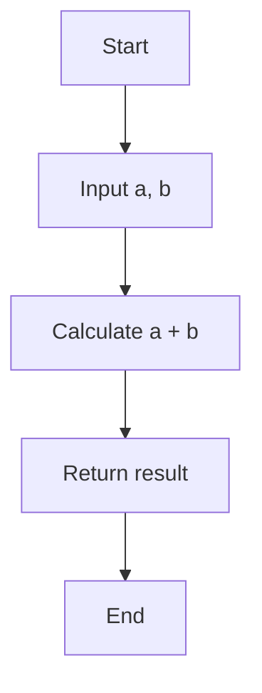

## 9.2. Debugging Pure Functions

In the realm of functional programming, pure functions stand out as a beacon of predictability and reliability. Their deterministic nature, devoid of side effects, makes them not only easier to reason about but also simplifies the debugging process significantly. In this section, we will delve into the nuances of debugging pure functions, exploring techniques and tools that enhance our ability to trace and monitor these functions effectively.

### Simplifying Debugging with Pure Functions

Pure functions are the cornerstone of functional programming. They are defined by two main characteristics:

1. **Deterministic Output**: Given the same input, a pure function will always produce the same output. This predictability is a powerful ally in debugging, as it allows us to isolate and reproduce issues with ease.

2. **No Side Effects**: Pure functions do not alter any state outside their scope. This means they do not modify global variables, perform I/O operations, or interact with external systems. As a result, they are isolated from the complexities of state changes, making them inherently easier to test and debug.

#### Benefits of Debugging Pure Functions

- **Reproducibility**: Since pure functions always produce the same output for the same input, reproducing bugs becomes straightforward. This reproducibility is crucial for effective debugging.
  
- **Isolation**: The absence of side effects ensures that pure functions do not depend on or alter external states. This isolation simplifies the debugging process, as we can focus solely on the function's logic without worrying about external influences.

- **Composability**: Pure functions can be composed together to form more complex operations. This composability allows us to debug smaller, simpler functions individually before integrating them into larger systems.

### Techniques and Tools for Debugging Pure Functions

While pure functions simplify the debugging process, having the right techniques and tools at our disposal can further enhance our ability to trace and monitor these functions effectively.

#### Tracing and Monitoring

Tracing and monitoring are essential techniques for understanding the behavior of pure functions during execution. They provide insights into the function's flow and help identify potential issues.

##### 1. Logging

Logging is a fundamental technique for tracing the execution of pure functions. By strategically placing log statements within the function, we can capture input values, intermediate computations, and output results.

```pseudocode
function calculateSum(a, b):
    log("calculateSum called with a:", a, "b:", b)
    result = a + b
    log("Result of calculateSum:", result)
    return result
```

In this example, logging helps us trace the inputs and outputs of the `calculateSum` function, making it easier to identify discrepancies.

##### 2. Breakpoints and Step-Through Debugging

Modern development environments offer powerful debugging tools that allow us to set breakpoints and step through the execution of our code. This technique is particularly useful for examining the flow of pure functions and understanding how they process data.

- **Setting Breakpoints**: Place breakpoints at critical points in the function to pause execution and inspect variable values.

- **Step-Through Execution**: Use step-through debugging to execute the function line by line, observing how data is transformed at each step.

##### 3. Automated Testing

Automated testing frameworks are invaluable for debugging pure functions. By writing test cases that cover various input scenarios, we can ensure that our functions behave as expected.

- **Unit Tests**: Write unit tests for each pure function, verifying that they produce the correct output for a range of inputs.

- **Property-Based Testing**: Use property-based testing to verify that the function maintains certain properties across a wide range of inputs.

```pseudocode
test "calculateSum returns correct sum":
    assert calculateSum(2, 3) == 5
    assert calculateSum(-1, 1) == 0
    assert calculateSum(0, 0) == 0
```

##### 4. Visualization Tools

Visualization tools can provide a graphical representation of the function's execution, helping us understand complex data transformations.

- **Flowcharts**: Create flowcharts to visualize the function's logic and identify potential bottlenecks or errors.

- **Data Flow Diagrams**: Use data flow diagrams to track how data moves through the function and where it might be altered.



This flowchart represents the `calculateSum` function, illustrating the flow of data from input to output.

### Common Challenges in Debugging Pure Functions

Despite their simplicity, debugging pure functions can present certain challenges. Understanding these challenges and how to address them is crucial for effective debugging.

#### 1. Complex Logic

Pure functions can sometimes contain complex logic, making it difficult to trace the flow of data and identify errors. In such cases, breaking down the function into smaller, more manageable components can simplify the debugging process.

#### 2. Recursive Functions

Recursive functions, while elegant, can be challenging to debug due to their self-referential nature. Using techniques like tail recursion and memoization can help optimize recursive functions and make them easier to debug.

```pseudocode
function factorial(n):
    if n == 0:
        return 1
    else:
        return n * factorial(n - 1)
```

In this recursive `factorial` function, adding logging or using a debugger to step through each recursive call can help identify issues.

#### 3. Higher-Order Functions

Higher-order functions, which take other functions as arguments or return them, can introduce additional layers of complexity. Understanding the behavior of these functions and how they interact with their arguments is key to effective debugging.

```pseudocode
function applyFunction(f, x):
    return f(x)

function square(n):
    return n * n

result = applyFunction(square, 5)
```

In this example, understanding how `applyFunction` interacts with `square` is crucial for debugging.

### Best Practices for Debugging Pure Functions

To maximize the effectiveness of debugging pure functions, consider the following best practices:

- **Write Clear and Concise Code**: Clear and concise code is easier to read and debug. Use descriptive variable names and avoid unnecessary complexity.

- **Document Function Behavior**: Document the expected behavior of each function, including input and output specifications. This documentation serves as a reference during debugging.

- **Use Version Control**: Version control systems like Git allow us to track changes to our code and revert to previous versions if necessary. This is particularly useful when debugging complex functions.

- **Collaborate with Peers**: Collaborating with peers can provide fresh perspectives and insights into potential issues. Code reviews and pair programming are effective ways to identify and resolve bugs.

### Try It Yourself

To reinforce your understanding of debugging pure functions, try modifying the following code examples:

1. **Add Logging**: Introduce additional logging statements to capture intermediate computations in the `factorial` function.

2. **Test Edge Cases**: Write test cases for edge cases in the `calculateSum` function, such as large numbers or negative inputs.

3. **Visualize Data Flow**: Create a flowchart for the `applyFunction` example, illustrating how data moves through the function.

### Conclusion

Debugging pure functions is a rewarding endeavor, thanks to their predictable behavior and lack of side effects. By employing techniques such as logging, breakpoints, and automated testing, we can effectively trace and monitor these functions, ensuring they perform as expected. Remember, this is just the beginning. As you progress, you'll build more complex and interactive systems. Keep experimenting, stay curious, and enjoy the journey!

## Quiz Time!



### What is a key characteristic of pure functions that simplifies debugging?

- [x] They produce the same output for the same input.
- [ ] They modify global variables.
- [ ] They perform I/O operations.
- [ ] They depend on external systems.

> **Explanation:** Pure functions are deterministic, meaning they always produce the same output for the same input, which simplifies debugging.

### Which technique involves executing a function line by line to observe data transformations?

- [x] Step-through debugging
- [ ] Logging
- [ ] Automated testing
- [ ] Visualization tools

> **Explanation:** Step-through debugging allows us to execute a function line by line, observing how data is transformed at each step.

### What is the benefit of using automated testing for pure functions?

- [x] It verifies that functions produce the correct output for various inputs.
- [ ] It modifies the function's logic.
- [ ] It performs I/O operations.
- [ ] It alters external states.

> **Explanation:** Automated testing verifies that pure functions produce the correct output for a range of inputs, ensuring their correctness.

### What challenge can arise when debugging recursive functions?

- [x] Their self-referential nature can make them difficult to trace.
- [ ] They modify global variables.
- [ ] They perform I/O operations.
- [ ] They depend on external systems.

> **Explanation:** Recursive functions can be challenging to debug due to their self-referential nature, making it difficult to trace the flow of data.

### Which practice can help simplify the debugging of complex logic in pure functions?

- [x] Breaking down the function into smaller components
- [ ] Adding more global variables
- [ ] Increasing the function's complexity
- [ ] Removing all comments

> **Explanation:** Breaking down complex logic into smaller, more manageable components can simplify the debugging process.

### How can visualization tools aid in debugging pure functions?

- [x] By providing a graphical representation of the function's execution
- [ ] By modifying the function's logic
- [ ] By performing I/O operations
- [ ] By altering external states

> **Explanation:** Visualization tools provide a graphical representation of the function's execution, helping us understand complex data transformations.

### What is a benefit of using version control systems like Git in debugging?

- [x] They allow us to track changes and revert to previous versions.
- [ ] They modify the function's logic.
- [ ] They perform I/O operations.
- [ ] They alter external states.

> **Explanation:** Version control systems like Git allow us to track changes to our code and revert to previous versions if necessary.

### Which technique is useful for examining the flow of pure functions?

- [x] Breakpoints and step-through debugging
- [ ] Logging
- [ ] Automated testing
- [ ] Visualization tools

> **Explanation:** Breakpoints and step-through debugging are useful for examining the flow of pure functions and understanding how they process data.

### What is a common challenge when debugging higher-order functions?

- [x] Understanding how they interact with their arguments
- [ ] Modifying global variables
- [ ] Performing I/O operations
- [ ] Depending on external systems

> **Explanation:** Higher-order functions can introduce additional layers of complexity, making it important to understand how they interact with their arguments.

### True or False: Pure functions can alter global variables.

- [ ] True
- [x] False

> **Explanation:** Pure functions do not alter global variables or any state outside their scope.


