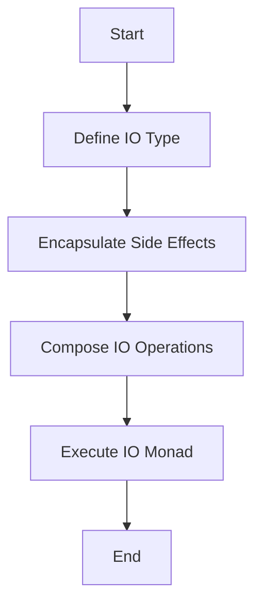
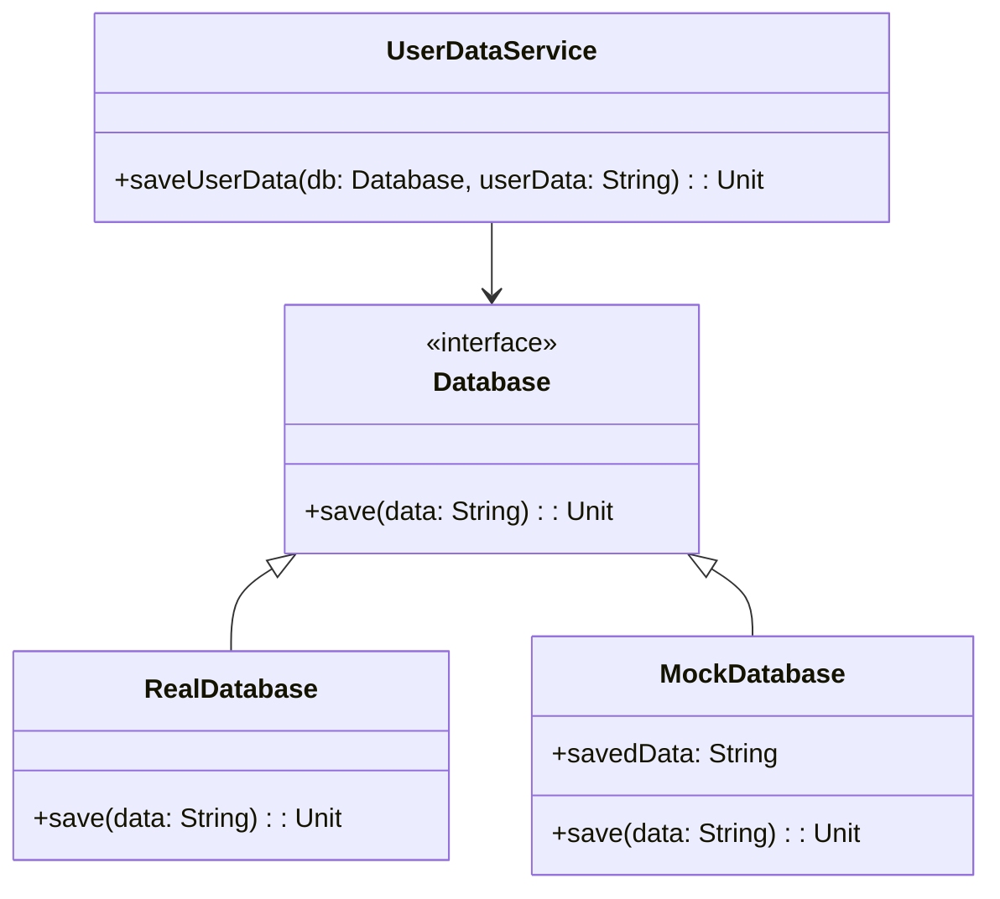

## 9.3. Managing Side Effects

In functional programming, managing side effects is crucial for maintaining the purity and predictability of functions. Side effects can include anything from modifying a global variable, performing I/O operations, or interacting with external systems. This section delves into strategies for isolating side effects using constructs like monads, specifically the IO monad, and provides methodologies for effectively testing functions that involve side effects.

### Understanding Side Effects

Before diving into management strategies, let's clarify what side effects are. In functional programming, a side effect is any operation that affects the state outside its local environment or interacts with the outside world. Common examples include:

- Modifying a global variable.
- Writing to a file or database.
- Sending data over a network.
- Printing to a console.

These operations can make functions impure, meaning their output is not solely determined by their input, which complicates reasoning about code and testing.

### Isolation of Side Effects

To manage side effects effectively, we aim to isolate them from the core logic of our programs. This separation allows us to maintain the benefits of functional programming, such as referential transparency and ease of testing.

#### Using Monads like IO

Monads are powerful constructs in functional programming that help manage side effects by encapsulating them within a controlled environment. The IO monad, in particular, is designed to handle input/output operations while preserving functional purity.

##### The IO Monad

The IO monad encapsulates side effects, allowing us to sequence operations while keeping them isolated from pure functions. Here's a conceptual breakdown:

- **Encapsulation**: The IO monad wraps side effects, preventing them from leaking into pure code.
- **Sequencing**: It allows chaining of operations, ensuring they execute in a specific order.
- **Deferred Execution**: IO operations are not executed until explicitly invoked, maintaining purity.

###### Pseudocode Example: IO Monad

Let's explore a simple pseudocode example to illustrate the IO monad's usage:

```pseudocode
// Define an IO type
type IO[A] = () => A

// Function to read from console
function readLine(): IO[String] {
    return () => {
        // Side effect: reading from console
        return Console.read()
    }
}

// Function to write to console
function writeLine(message: String): IO[Unit] {
    return () => {
        // Side effect: writing to console
        Console.write(message)
    }
}

// Composing IO operations
function greet(): IO[Unit] {
    return () => {
        val name = readLine()()
        writeLine("Hello, " + name)()
    }
}

// Execute the IO operation
greet()()
```

In this example, `readLine` and `writeLine` are encapsulated within the IO monad, ensuring that side effects are isolated and controlled.

##### Benefits of Using the IO Monad

- **Predictability**: By encapsulating side effects, we can reason about our code more predictably.
- **Testability**: Isolated side effects make it easier to test the core logic without external dependencies.
- **Composability**: IO operations can be composed and sequenced, maintaining a clean and modular codebase.

#### Visualizing the IO Monad

To better understand how the IO monad encapsulates side effects, let's visualize the process using a flowchart:



**Figure 1**: Flowchart illustrating the encapsulation and execution of side effects using the IO monad.

### Testing Functions with Side Effects

Testing functions with side effects can be challenging due to their interaction with external systems. However, by isolating side effects, we can employ strategies to test these functions effectively.

#### Strategies for Effective Testing

1. **Dependency Injection**: Pass dependencies, such as databases or file systems, as parameters to functions. This allows for easy mocking and testing.

2. **Mocking and Stubbing**: Use mock objects to simulate external systems, ensuring tests are isolated and repeatable.

3. **Property-Based Testing**: Test properties of functions rather than specific outputs, ensuring they hold true across a range of inputs.

4. **Use of Monads**: Encapsulate side effects in monads, allowing for testing of pure logic separately from side effects.

##### Pseudocode Example: Testing with Dependency Injection

Let's see how dependency injection can be used to test a function with side effects:

```pseudocode
// Define a database interface
interface Database {
    function save(data: String): Unit
}

// Function to save user data
function saveUserData(db: Database, userData: String): Unit {
    db.save(userData)
}

// Mock database for testing
class MockDatabase implements Database {
    var savedData: String = ""

    function save(data: String): Unit {
        savedData = data
    }
}

// Test function
function testSaveUserData() {
    val mockDb = new MockDatabase()
    saveUserData(mockDb, "Test User")

    assert(mockDb.savedData == "Test User")
}
```

In this example, we inject a `Database` dependency into the `saveUserData` function, allowing us to use a `MockDatabase` for testing.

#### Visualizing Dependency Injection

To illustrate how dependency injection aids in testing, consider the following diagram:



**Figure 2**: Class diagram showing the use of dependency injection for testing with a mock database.

### Embrace the Journey

Managing side effects is a fundamental aspect of functional programming that enhances code quality and maintainability. By isolating side effects using constructs like the IO monad and employing effective testing strategies, we can build robust and reliable software systems.

Remember, this is just the beginning. As you progress, you'll discover more advanced techniques and patterns for managing side effects. Keep experimenting, stay curious, and enjoy the journey!

### Knowledge Check

To reinforce your understanding, consider the following questions and challenges:

- How does the IO monad help in managing side effects?
- What are the benefits of isolating side effects in functional programming?
- Try modifying the pseudocode examples to handle different types of side effects, such as file I/O or network requests.

### References and Further Reading

For more in-depth exploration of managing side effects and related topics, consider the following resources:

- [MDN Web Docs on Functional Programming](https://developer.mozilla.org/en-US/docs/Glossary/Functional_programming)
- [Haskell's IO Monad](https://wiki.haskell.org/IO_inside)
- [Property-Based Testing with QuickCheck](https://hackage.haskell.org/package/QuickCheck)

## Quiz Time!



### What is a side effect in functional programming?

- [x] An operation that affects the state outside its local environment.
- [ ] A function that returns a value.
- [ ] A variable that is only used locally.
- [ ] A loop that iterates over a collection.

> **Explanation:** A side effect is any operation that affects the state outside its local environment or interacts with the outside world, such as modifying a global variable or performing I/O operations.

### How does the IO monad help manage side effects?

- [x] By encapsulating side effects and allowing them to be sequenced.
- [ ] By eliminating all side effects from the program.
- [ ] By converting side effects into pure functions.
- [ ] By preventing any I/O operations from occurring.

> **Explanation:** The IO monad encapsulates side effects, allowing them to be sequenced and controlled, thus maintaining functional purity.

### What is the benefit of using dependency injection for testing?

- [x] It allows for easy mocking and testing of external dependencies.
- [ ] It eliminates the need for any external dependencies.
- [ ] It automatically generates test cases.
- [ ] It ensures that all functions are pure.

> **Explanation:** Dependency injection allows for easy mocking and testing of external dependencies by passing them as parameters to functions.

### Which of the following is a strategy for testing functions with side effects?

- [x] Mocking and stubbing external systems.
- [ ] Ignoring side effects during testing.
- [ ] Using only pure functions.
- [ ] Avoiding all I/O operations.

> **Explanation:** Mocking and stubbing external systems is a strategy for testing functions with side effects, ensuring tests are isolated and repeatable.

### What is the role of the IO monad in functional programming?

- [x] To encapsulate and manage side effects.
- [ ] To eliminate all side effects.
- [ ] To convert side effects into pure functions.
- [ ] To prevent any I/O operations from occurring.

> **Explanation:** The IO monad encapsulates and manages side effects, allowing them to be controlled and sequenced in a functional program.

### What is a common challenge when testing functions with side effects?

- [x] Their interaction with external systems.
- [ ] Their lack of return values.
- [ ] Their inability to be composed.
- [ ] Their excessive use of recursion.

> **Explanation:** A common challenge when testing functions with side effects is their interaction with external systems, which can complicate testing.

### How can property-based testing be useful for functions with side effects?

- [x] By testing properties of functions rather than specific outputs.
- [ ] By eliminating the need for any side effects.
- [ ] By automatically generating side effects.
- [ ] By converting side effects into pure functions.

> **Explanation:** Property-based testing is useful for functions with side effects by testing properties of functions rather than specific outputs, ensuring they hold true across a range of inputs.

### What is the main advantage of isolating side effects in functional programming?

- [x] It enhances code quality and maintainability.
- [ ] It eliminates the need for any testing.
- [ ] It automatically generates documentation.
- [ ] It ensures all functions are recursive.

> **Explanation:** The main advantage of isolating side effects in functional programming is that it enhances code quality and maintainability by keeping side effects separate from pure logic.

### What is the purpose of using mock objects in testing?

- [x] To simulate external systems and ensure tests are isolated.
- [ ] To eliminate the need for any external dependencies.
- [ ] To automatically generate test cases.
- [ ] To ensure all functions are pure.

> **Explanation:** Mock objects are used in testing to simulate external systems and ensure tests are isolated and repeatable.

### True or False: The IO monad eliminates all side effects from a program.

- [ ] True
- [x] False

> **Explanation:** False. The IO monad does not eliminate side effects; instead, it encapsulates and manages them, allowing for controlled execution.


