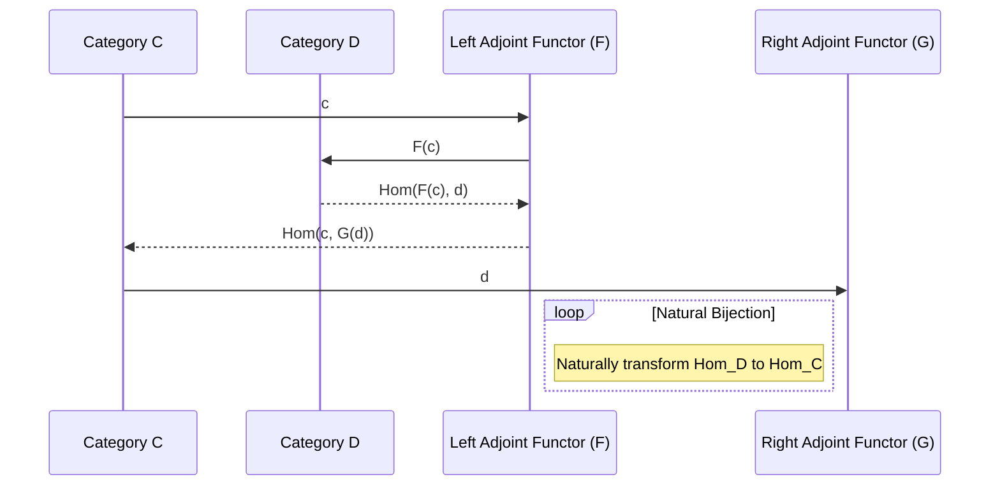

## Adjoint Functors: Bringing Concepts from Category Theory for Dual Properties in Programming

### Introduction

Adjoint Functors are an advanced concept borrowed from category theory, instrumental in many functional programming paradigms. Originally abstract mathematical tools, adjoint functors facilitate reasoning about structured objects and morphisms between them, providing a bridge between different types of structures. This pattern aids in solving complex problems by exploiting the dualities present in programming constructs.

### Principles and Definitions

Adjoint Functors consist of a pair: the left adjoint and the right adjoint. The key idea behind them can be expressed in categorical terms:

1. **Functors:** Transformations between categories maintaining the structure of morphisms.
2. **Natural Transformations:** Ways to transform one functor into another while preserving the composition laws.
3. **Adjoint Pair:** Consists of two functors \\\( F \colon C \to D \\\) and \\\( G \colon D \to C \\\) such that for every object \\\( c \\\) in \\\( C \\\) and \\\( d \\\) in \\\( D \\\):
   
   \text{Hom}_D(F(c), d) \cong \text{Hom}_C(c, G(d))
   
   This bijection is natural in both \\\( c \\\) and \\\( d \\\).

### Mathematical Formulation

To understand adjoint functors better, one can formalize the relationship as follows:

\begin{align*}
\phi &\colon \text{Hom}_D(F(c), d) \to \text{Hom}_C(c, G(d)) \quad \text{(natural transformation)} \\
\phi^{-1} &\colon \text{Hom}_C(c, G(d)) \to \text{Hom}_D(F(c), d)
\end{align*}

Here, \\\( F \\\) is the left adjoint and \\\( G \\\) is the right adjoint.

### Practical Application in Functional Programming

#### Example: Lists and Monads

In functional programming, adjoint functors are often discussed in the context of monads and lists. Consider the following:

- **List Construction (Left Adjoint):** Creating a list from elements.
- **List Deconstruction (Right Adjoint):** Converting a list back to its constituent elements.

#### Pseudocode Example

```haskell
-- Define the adjunction
list :: a -> [a]
list a = [a]

-- Define the deconstruction
decons :: [a] -> (a, [a])
decons (x:xs) = (x, xs)
```

### UML Sequence Diagram

To illustrate the interaction between adjoint functors, let's delineate the structure using UML diagram, focusing on the transformation process between functors:



### Related Design Patterns

1. **Monads:** Often intertwined with adjoint functors for managing side effects and sequence operations.
2. **Functor:** Basic building blocks for creating adjunctions.
3. **Natural Transformations:** Enables the smooth transformation between functors.

### Additional Resources

- [Category Theory for Programmers by Bartosz Milewski](https://github.com/hmemcpy/milewski-ctfp-pdf)
- [Haskell and Category Theory](https://www.haskell.org/)

### Summary

Adjoint Functors are powerful constructs that enhance the reasoning and structuring of programs by leveraging abstract mathematics principles. They capture dualities existing in types and type constructors, enabling more robust and expressive designs. In functional programming, they help manage operations like list construction and deconstruction, tying deeply with the concepts of monads and natural transformations. Understanding adjoint functors paves the way to mastering other advanced design patterns and enriching one's functional programming toolkit.

