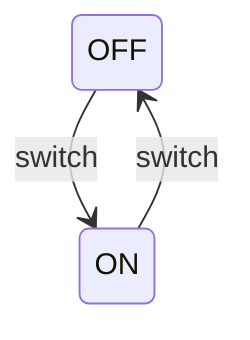
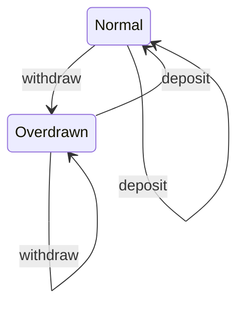

## Introduction

Coalgebra is a powerful concept from category theory that serves as an alternative to algebraic approaches, focusing on the transitions between states rather than the states themselves. This paradigm is particularly useful for modeling stateful systems, such as software programs with continuous state changes, biological processes, and dynamic systems.

In functional programming, coalgebras provide a structured way to handle state and behaviors over time, making it easier to reason about and implement complex state transitions.

## Fundamentals of Coalgebra

### Basic Definition

In algebra, structures like groups or rings are defined by specifying operations that combine elements to produce other elements. In coalgebra, we define structures by specifying how elements can deconstruct or transition into other elements.

### Formal Definition

A coalgebra for a functor \\(F\\) consists of:

- A set (or type) \\(C\\) representing the states.
- A function \\( \gamma: C \to F(C) \\) describing the transitions.

### Key Concepts

- **Coalgebraic Dynamics:** The focus on how states evolve over time via transitions.
- **Functorial Approach:** Using functors to encapsulate transition rules, facilitating generalization and abstraction.

## Coalgebra in State Machines

Coalgebraic concepts can be naturally applied to finite state machines, where the states and transitions can be explicitly modeled.

### Example: Simple State Machine

Consider a simple binary state machine with states `ON` and `OFF`.



This system can be represented coalgebraically:

- State set: {ON, OFF}
- Transition function: `transition: State -> State` where `State = {ON, OFF}`

## Coalgebraic Design Pattern

### Practical Example

Consider a banking system where an account can be either in a `Normal` state or an `Overdrawn` state. Each state transition (like deposit or withdrawal) can change the state accordingly.



Functionally, it can be modeled as:
 \gamma: \text{AccountState} \rightarrow \text{Transaction}(\text{AccountState}) 

Where `Transaction` defines the types of transitions (deposits, withdrawals).

## Related Design Patterns

Several design patterns share conceptual similarities with coalgebra, often focusing on state and behavior management:

- **State Pattern:** Encapsulates state-based behavior, allowing an object to alter its behavior when its internal state changes.
- **Strategy Pattern:** Defines a family of algorithms (behaviors) and makes them interchangeable. The specific algorithm used can change depending on the context (similar to transitions).
- **Interpreter Pattern:** Treats language elements as states and provides ways to interpret these states accordingly.

## Additional Resources

### Books

1. **Categories for the Working Mathematician** by Saunders Mac Lane
2. **Category Theory for Programmers** by Bartosz Milewski

### Online Articles

- [Introduction to Coalgebra](https://ncatlab.org/nlab/show/coalgebra)
- [Category Theory and Functional Programming](https://bartoszmilewski.com/)

### Academic Papers

- **Coalgebras and Modelling of State-Based Dynamic Systems** by H. Peter Gumm
- **Coalgebraic Methods for the Design of Data Types** by Bart Jacobs

## Final Summary

Coalgebra offers a robust and versatile framework for modeling stateful systems, emphasizing the transitions between states using functorial methods. By abstracting the focus to transitions, it provides a clear and functional way to capture system dynamics. This paradigm seamlessly integrates into functional programming, making it powerful for handling complex and evolving states.

```katex
\gamma: C \rightarrow F(C)
```

Whether building state machines, dynamic systems, or interactive software, coalgebraic methods enhance the ability to manage and reason about the state and its evolution over time.

## Conclusion

Coalgebra is an essential concept in functional programming and system modeling, providing a structured way to handle dynamic state transitions. By shifting the focus from states to transitions, coalgebra brings clarity and power to the development of complex systems across various domains.

oprizable to developers looking to leverage functional paradigms for creating modular, maintainable, and robust software solutions.
