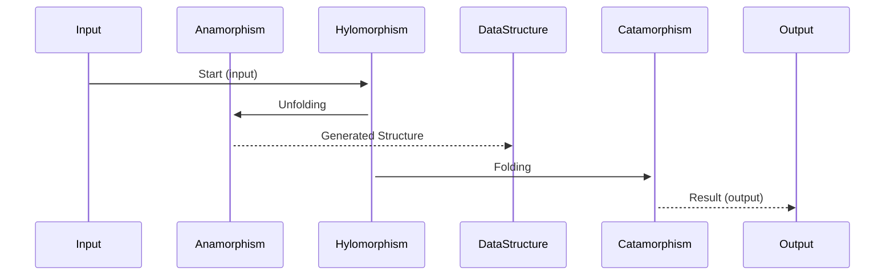

## Introduction

In the realm of functional programming, recursion schemes provide a structured approach to handle recursive data types such as lists, trees, and more. Among these schemes, **hylomorphisms** stand out for their ability to unify generation and consumption of data structures. A hylomorphism is essentially a composite of an anamorphism (unfolding) and a catamorphism (folding), which allows us to build and then immediately consume a data structure in a single, seamless process.

## Anamorphisms and Catamorphisms

### Anamorphisms

An anamorphism is a function that, given some input, unfolds or generates a data structure. It can be thought of as the constructive counterpart of a recursive function, where the recursion proceeds by decomposing the input into smaller parts until a base case is reached.

**Example in Haskell:**

Let's define an anamorphism that generates a list of integers from a given integer down to 1.

```haskell
unfoldInt :: Int -> [Int]
unfoldInt 0 = []
unfoldInt n = n : unfoldInt (n - 1)
```

This function generates the list `[n, n-1, ..., 1]`.

### Catamorphisms

A catamorphism is the dual to an anamorphism—an operation that consumes or folds a data structure down to a single value. This is a generalization of folds commonly seen in functional programming.

**Example in Haskell:**

Let's define a catamorphism that sums a list of integers.

```haskell
foldSum :: [Int] -> Int
foldSum []     = 0
foldSum (x:xs) = x + foldSum xs
```

This function takes a list of integers and returns their sum.

## Hylomorphisms: Combining Anamorphisms and Catamorphisms

A hylomorphism provides a powerful abstraction by combining both anamorphisms and catamorphisms into a single process. It allows us to unfold a structure and immediately fold it without ever needing to explicitly construct the intermediate data structure.

**Formal Definition:**

Given a function `f :: A -> Either B (A, C)` and a function `g :: (C, B) -> B`, the hylomorphism `hylo` can be defined as:

\text{hylo}(\text{f}, \text{g}) = g \circ \text{ana}(f)

Where `ana` is the anamorphism defined as:

\text{ana(f)}(a) = \text{unfold}(f(a))

And `cata` is the catamorphism defined as:

\text{cata}(g) = \text{fold}(g)

### Implementation Example in Haskell

Let's suppose we want to calculate the factorial of a number using a hylomorphism. We can unfold the number into a list of decrements and then fold it by multiplying the elements.

```haskell
factorial :: Int -> Int
factorial n = hylo (\x -> if x == 0 then Left 1 else Right (x, x-1)) (\\(x, y) -> x * y) n

hylo :: (a -> Either b (a, c)) -> (c -> b) -> a -> b
hylo f g x = either id g (fmap (hylo f g) (f x))
```

Here, 
- The anamorphism part creates the list `[n, n-1, ..., 1]` as the input is unfolded.
- The catamorphism part then multiplies all elements in this list to compute the factorial.

## Related Design Patterns

### 1. **F-Algebras and F-Coalgebras**

F-Algebras provide a framework for defining how to fold data structures, while F-Coalgebras facilitate the unfolding. Hylomorphisms can be seen as a specific use case where an F-Coalgebra and an F-Algebra are composed.

### 2. **Recursive Data Types**

Recursive data types are the foundation upon which recursion schemes, including hylomorphisms, are built. Understanding these is crucial for effectively using hylomorphisms.

### 3. **Meiosis and Mitogenesis**

These are higher-order abstractions inspired by biological processes that provide more compositional power. They generalize anamorphisms and catamorphisms, respectively.

## Additional Resources

- [Recursion Schemes: A Field Guide](https://github.com/scalaz/scalaz/wiki/Recursion-Schemes)
- [Functional Pearl: Hylomorphisms and Deforestation](https://www.cambridge.org/core/journals/journal-of-functional-programming/article/functional-pearl-hylomorphisms-and-deforestation/BAD2CDE097C340325FCAC9DB61866240)
- [Category Theory for Programmers: Recursion Schemes](https://bartoszmilewski.com/2017/09/24/recursion-schemes-part-two/)

## Summary

Hylomorphisms offer a powerful and elegant way to process data by combining the construction (unfolding) and consumption (folding) of data structures. By leveraging the compositional nature of functional programming, hylomorphisms enable efficient and concise data processing routines. Mastery of this recursion scheme provides functional programmers with advanced tools for sophisticated problem-solving scenarios. Understanding related design patterns like F-Algebras, F-Coalgebras, and recursive data types can further deepen one's comprehension and utility of hylomorphisms.



By mastering hylomorphisms, you'll be equipped to bridge the gap between declarative data description and imperative transformations, leading to cleaner, more maintainable, and performant code.
