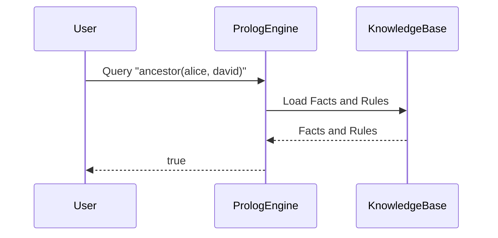

## Logic Programming: Declaring Facts and Rules, Letting the System Derive Conclusions

### Introduction
Logic programming is a paradigm within declarative programming where developers declare facts and rules about problems within a system, allowing the system to derive conclusions or find solutions by inference. This approach is distinctly different from imperative programming practices, emphasizing **"what to solve"** over **"how to solve it"**.

### Fundamental Principles
- **Facts**: Statements about the problem domain, considered always true. They form the foundational knowledge from which inferences will be drawn.
- **Rules**: Conditional logic statements that define relationships between facts and generate new facts.
- **Queries**: Questions asked of the system to derive information from the stated facts and rules. The mechanism used for such deductions generally involves backward or forward chaining.

### Key Components

1. **Facts**
   - Simple, atomic propositions representing knowledge.
   - Example: `cat(Tom).`

2. **Rules**
   - Conditional statements used to infer new information based on existing facts.
   - Example: 
     ```prolog
     mammal(X) :- cat(X).
     ```

3. **Queries**
   - Asked to the system to obtain information.
   - Example: 
     ```prolog
     ?- mammal(Tom).
     ```
     This would return `true` based on the earlier facts and rules.

### Advantages
- **Concise and high-level abstractions**: Code represents high-level problem specifications rather than algorithms.
- **Ease of understanding**: The problem domain is clear from the facts and rules, often mirroring natural language.
- **Built-in backtracking**: Inferences handle searching and solution backtracking, offloading complexity from the developer.

### Practical Applications

1. **Expert Systems**: Automating decision-making processes by codifying expert knowledge into facts and rules.
2. **Natural Language Processing (NLP)**: Parsing and understanding human language by structurally representing the linguistic rules.
3. **Constraint Solving**: Addressing problems by defining constraints and allowing the system to derive solutions.
4. **Database Querying**: Query optimization and complex querying operations.

### Related Design Patterns

#### 1. **Declarative Programming**
Declarative Programming focuses on writing expressions that describe the logic without explicitly detailing the control flow. Logic programming is inherently a declarative approach.

#### 2. **Dependency Injection**
Dependency injection relies heavily on declaring necessary components and their relationships. It complements logic programming by providing a flexible and declarative way to manage dependencies and object creation.

### Example: Prolog Snippet

Here is a small Prolog example illustrating declaring facts and rules, and querying:

```prolog
% Facts
parent(alice, bob).
parent(bob, carol).
parent(carol, david).

% Rule
ancestor(X, Y) :- parent(X, Y).
ancestor(X, Y) :- parent(X, Z), ancestor(Z, Y).

% Query
?- ancestor(alice, david).
% This query will return 'true' considering the provided facts and rules.
```

### UML Sequence Diagram



### Additional Resources

- **Books**:
  - "Programming in Prolog" by William Clocksin and Christopher S. Mellish
  - "Foundations of Logical Consequence" by Colin R. Caret and Ole Thomassen Hjortland
  
- **Online Resources**:
  - [Prolog Tutorials](https://www.swi-prolog.org/pldoc/man?section=tutorial)
  - [Logic Programming on Wikipedia](https://en.wikipedia.org/wiki/Logic_programming)

### Conclusion

Logic programming offers a compelling approach by separating problem definitions (facts and rules) from problem-solving mechanisms (inference). It lends itself to high-level abstraction and practical applications in complex domains like NLP, expert systems, and constraint solving. Understanding these principles and related design patterns can significantly enhance one's programming paradigms.

By leveraging this detailed exploration of logic programming, developers can craft elegant and efficient solutions for a wide array of complex problems, capitalizing on the declarative power it offers.
