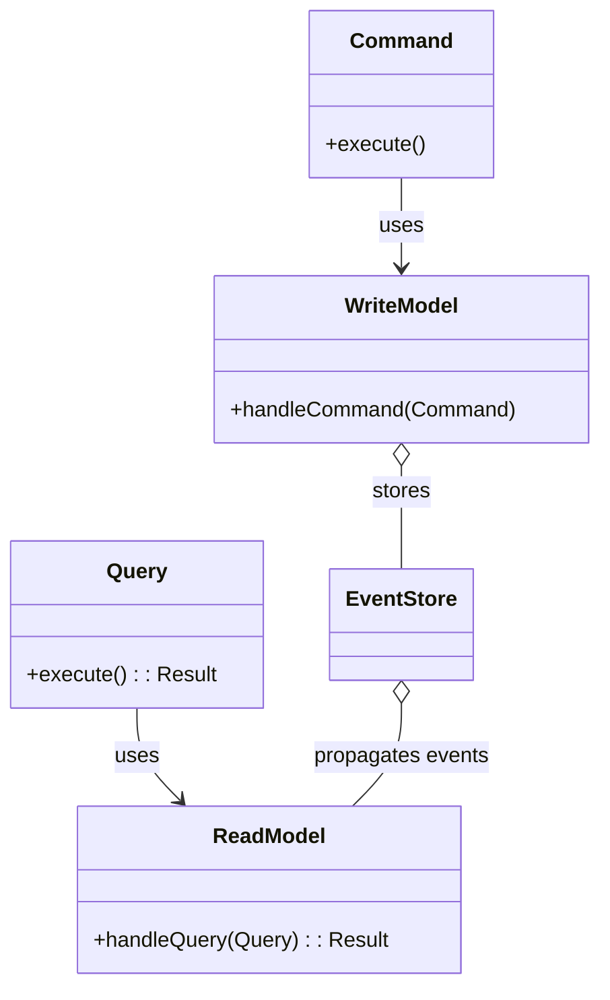

## Introduction

Command-Query Responsibility Segregation (CQRS) is a design pattern in software architecture that separates commands (write operations) from queries (read operations). This separation is vital in complex systems, improving scalability, maintainability, and performance. By distinguishing between these operations, CQRS facilitates more robust system designs that can handle read and write workloads independently and efficiently.

## Fundamental Concepts

### Commands vs. Queries

In the context of CQRS:

- **Command**: A command is an operation that changes the state of the system. It acts by invoking a write operation in the database (e.g., create, update, delete).
- **Query**: A query retrieves information without altering the system's state, focusing solely on read operations.

### Read and Write Models

CQRS separates the data model for reading from the data model for writing. This differentiation allows developers to optimize read and write models independently.

1. **Write Model**: Reflects the system's operational domain and ensures consistency during state changes. This model typically contains complex business logic and validation.
2. **Read Model**: Optimizes query performance and constructs views tailored to the consumers' needs, often using denormalized data structures for efficient data retrieval.

### Data Consistency

CQRS systems often follow eventual consistency rather than immediate consistency, particularly in distributed systems. The change in the write model propagates to the read model asynchronously, which may lead to a slight delay before the read model reflects the recent state.

### Event-Driven Approach

CQRS often pairs with Event Sourcing, where state changes are stored as a sequence of events:
- **Events**: Immutable facts representing state transitions. Instead of storing a current state snapshot, systems persist these events and reconstruct state by replaying them.

## Diagrammatic Representation

### Class Diagram for CQRS

Below is UML class diagram that represents a basic CQRS architecture:



### Sequence Diagram for CQRS Read and Write Operations

```mermaid
sequenceDiagram
    participant User
    participant CommandHandler
    participant WriteModel
    participant EventStore
    participant ReadModel
    participant QueryHandler

    User->>+CommandHandler: Send Command
    CommandHandler->>+WriteModel: Handle Command
    WriteModel->>EventStore: Save State Change
    EventStore->>ReadModel: Propagate Event
    ReadModel-->>-EventStore: Acknowledge

    User->>+QueryHandler: Send Query
    QueryHandler->>ReadModel: Handle Query
    ReadModel-->>QueryHandler: Return Result
    QueryHandler-->>-User: Return Response
```

## Related Design Patterns and Concepts

1. **Event Sourcing**: A complementary pattern that adheres to recording state changes as a sequence of events rather than storing the current state in the database.
2. **Domain-Driven Design (DDD)**: An approach focusing on evolving a software system's core functionalities by design of its domain models and business logic.
3. **Microservices Architecture**: CQRS fits well within a microservices architecture where different services can manage their own databases optimized for expected workloads.

## Practical Implementation Tips

1. **Database Strategies**: Employ different databases for the read model and write model for higher efficiency.
2. **Scalability**: Use message queues or event logs (like Kafka or RabbitMQ) to manage event propagation between the write and read models.
3. **Consistency Management**: Implement mechanisms to handle eventual consistency gracefully, providing users with feedback about the stabilization process.

### Additional Resources

- [Martin Fowler’s CQRS](https://martinfowler.com/bliki/CQRS.html): A seminal article on CQRS by Martin Fowler.
- [Event Sourcing and CQRS Explained](https://eventstore.com/cqrs-and-event-sourcing/): A comprehensive explanation of CQRS and Event Sourcing.
- [Domain-Driven Design Reference](https://domainlanguage.com/ddd/reference/): Detailed documentation on Domain-Driven Design, often paired with CQRS.

## Summary

CQRS is a powerful design pattern in functional programming and software architecture, segregating commands from queries to enhance scalability, maintainability, and performance. By adopting separate read and write models, leveraging event sourcing, and utilizing strategies to manage eventual consistency, developers can create robust and scalable systems suited for complex application requirements.

CQRS's pairing with other patterns like Event Sourcing and Domain-Driven Design provides a strong foundation for building sophisticated applications tailored to modern, distributed environments.

Understanding and implementing CQRS can significantly contribute to creating scalable, maintainable, and performant systems that handle intensive read and write operations efficiently.
