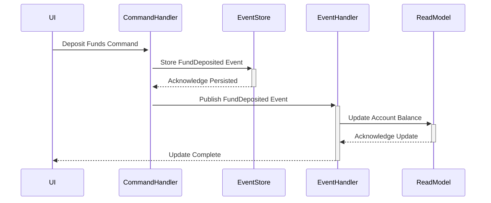

**Event Sourcing** is a powerful design pattern in functional programming that involves storing all changes to application state as a sequence of events. Instead of mutating the current state directly and losing previous states, Event Sourcing allows the system to rebuild the current state by replaying a sequence of events. This approach aligns with the principles of immutability and functional programming, fostering traceability, auditability, and robust recovery mechanisms.

## Concepts and Principles

At its core, Event Sourcing provides an immutable log of all events that describe state transitions within the system. This event log is central to reconstructing the state at any given point in time. Here are the key principles involved in Event Sourcing:

### Event Immutability

In Event Sourcing, events are immutable and represent discrete state transitions. Once an event is stored, it cannot be changed, reinforcing the principle of immutability in functional programming.

### Event Stream

Each entity (or aggregate) typically has an associated event stream, which is a chronologically ordered list of events that have occurred to that entity.

### State Reconstruction

The current state of an entity is not stored directly. Instead, it is reconstructed by applying all the relevant events in the event stream.

### Event Dispatching

Events are often dispatched to event handlers or projectors that can maintain derived views or models of the data, suitable for querying and display.

### Example

Consider a simple banking application. Here is an example sequence of events for an account:

1. `AccountCreated(accountId, owner)`
2. `FundDeposited(accountId, amount)`
3. `FundWithdrawn(accountId, amount)`

From these events, the current state of the account can be derived by replaying them.

## Advantages of Event Sourcing

- **Auditability**: Provides a comprehensive audit trail of all changes.
- **Historical Queries**: Allows querying the state of the system at any point in time.
- **Reproducibility**: Facilitates debugging and error recovery by replaying events to reproduce states.
- **Scalability**: Can be combined with Command Query Responsibility Segregation (CQRS) for scalable read models.

## Common Patterns and Relationships

Event Sourcing often interacts with other design patterns and methodologies:

### Command Query Responsibility Segregation (CQRS)

Event Sourcing naturally complements CQRS, where commands change state by producing events, and queries are performed on read models built from these events.

### Domain-Driven Design (DDD)

In DDD, aggregates enforce strong consistency boundaries. Event Sourcing aligns well with aggregates, as each aggregate can manage its event stream independently.

### CQRS and Event Sourcing Example

Let’s consider the following UML sequence diagram to illustrate how Event Sourcing works with CQRS in a banking application:



### Event Sourcing in Functional Languages

#### Scala Example with Akka Persistence

Here’s a snippet of how you might implement Event Sourcing with Scala and Akka Persistence:

```scala
import akka.persistence._

case class Deposit(amount: Double)
case class Withdraw(amount: Double)
case class TransactionOccurred(kind: String, amount: Double)

class AccountPersistentActor extends PersistentActor {
  override def persistenceId: String = "account-id"

  var balance: Double = 0

  def updateState(event: TransactionOccurred): Unit = event match {
    case TransactionOccurred("Deposit", amount) => balance += amount
    case TransactionOccurred("Withdraw", amount) => balance -= amount
  }

  override def receiveRecover: Receive = {
    case evt: TransactionOccurred => updateState(evt)
  }

  override def receiveCommand: Receive = {
    case Deposit(amount) =>
      persist(TransactionOccurred("Deposit", amount))(updateState)
    case Withdraw(amount) =>
      persist(TransactionOccurred("Withdraw", amount))(updateState)
    case _ => // handle other commands
  }
}
```

### Summary

Event Sourcing stores all changes to application state as a sequence of immutable events. This aligns with functional programming by promoting immutability, auditability, and facilitating the reconstruction of historical states. By complementing patterns like CQRS and methodologies like DDD, Event Sourcing creates scalable, maintainable systems with robust recovery and debugging capabilities. 

For further reading and advanced concepts, refer to:

- Martin Fowler's article on [Event Sourcing](https://martinfowler.com/eaaDev/EventSourcing.html)
- Greg Young's [CQRS and Event Sourcing](https://cqrs.files.wordpress.com/2010/11/cqrs_documents.pdf)

Incorporating Event Sourcing into your functional programming toolkit provides powerful mechanisms to manage state changes in a clear, auditable, and immutable way.
