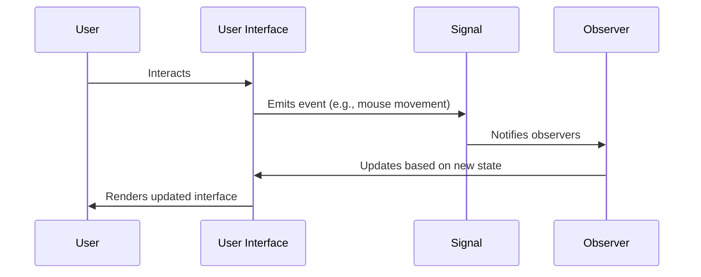

Functional Reactive Programming (FRP) is a programming paradigm that deals with reactive programming (asynchronous data streams and the propagation of change) in a functional style. It provides a powerful way to handle state and time-varying values declaratively.

## Principles of Functional Reactive Programming

FRP merges ideas from functional programming and reactive programming. It aims to make the manipulation of time-varying values simpler and more intuitive while maintaining the benefits of immutability and pure functions. Here are some key principles:

1. **First-Class Reactive Values**: Time-varying values are treated as first-class citizens.
2. **Declarative Style**: The logic of the program is expressed through declarative constructs rather than imperative code.
3. **Immutability**: States are immutable, ensuring that time-varying values and events remain predictable and deterministic.
4. **Composability**: Small, pure functions compose together to create more complex behavior.

### Key Concepts in FRP

- **Streams**: Represent sequences of values over time.
- **Signals/Behaviors**: Functions from time to values (i.e., values that change over time).
- **Events**: Discrete occurrences that may carry data.

## Example

In FRP, you can use observables to manage the state over time. Consider a basic example where we are tracking the position of a mouse over time.

### Basic Pseudocode for Mouse Tracking

```haskell
mousePosition :: Signal (Int, Int)
mousePosition = trackPosition (fromEvent mouseMoveEvent)
```

Here, `mousePosition` is a signal that updates the current mouse position every time a `mouseMoveEvent` occurs.

## Related Design Patterns

There are several related design patterns and concepts associated with FRP:

### Observer Pattern
The observer pattern is fundamental to reactive programming. In FRP, observables (or streams) act as the source of data, and observers (or subscribers) react to the changes in these data streams.

### Model-View-Update (MVU)
In some implementations of FRP, especially in application UIs, the MVU architecture is employed. The model represents the state, the view represents the UI, and the update function describes how the model changes over time.

### Monads and Functors
Monads and functors from functional programming are often employed to manage effects and compose operations on time-varying values efficiently.

## UML Sequence Diagram for FRP Flow



## Additional Resources

1. **Books**:
   - "Functional Reactive Programming" by Stephen Blackheath and Anthony Jones
   - "Reactive Programming with RxJava" by Tomasz Nurkiewicz and Ben Christensen

2. **Libraries**:
   - [RxJS](https://rxjs.dev/): Reactive Extensions for JavaScript
   - [ReactiveX](http://reactivex.io/): A library for composing asynchronous and event-based programs by using observable sequences.

3. **Online Courses**:
   - "Introduction to Functional Reactive Programming" on Coursera
   - "Reactive Programming in Modern JavaScript" on Udemy

## Summary

Functional Reactive Programming (FRP) is an elegant solution for managing state and time-varying values in a functional way. It embraces immutability, first-class time-varying values, and a declarative style that enhances composability and predictability. By integrating concepts from functional programming and reactive programming, FRP enables developers to write clear, concise, and maintainable code for complex time-dependent interactions.

Incorporating FRP into your development arsenal can significantly improve how you handle real-time data, events, and state management, empowering you to build more responsive and resilient applications.
