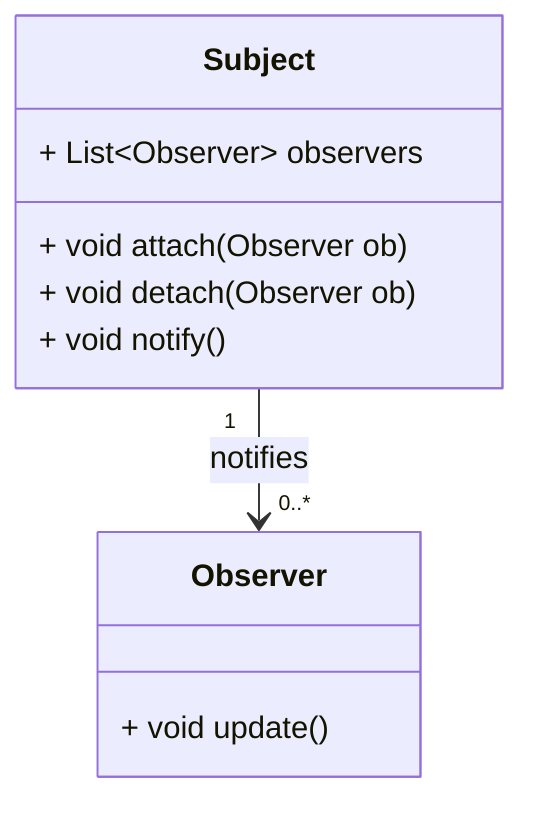

## Introduction

The Observer pattern is a fundamental design pattern used in functional programming to allow a collection of observers to subscribe to and react to events or changes in state of a subject. This pattern is highly useful in scenarios where an object must automatically notify a number of dependent objects of any changes to its state, thereby promoting a loosely coupled design between the subject and its observers.

## Detailed Description

The Observer pattern involves:

- **Subject (Observable)**: The entity that keeps track of all its dependents, called observers, and notifies them of state changes or events.
- **Observers**: Entities that want to be informed about changes in the subject.

This relationship can be visualized using a UML class diagram:



When the subject state changes, it updates all its observers by calling their `update` method. 

Here's an example of how this might look in a functional programming language like Haskell:

```haskell
module ObserverPattern where

type Observer a = a -> IO ()

data Subject a = Subject {
  observers :: [Observer a],
  state     :: a
}

attach :: Observer a -> Subject a -> Subject a
attach ob subject = subject { observers = ob : observers subject }

detach :: Observer a -> Subject a -> Subject a
detach ob subject = subject { observers = filter (/= ob) (observers subject) }

notify :: Subject a -> IO ()
notify subject = mapM_ (\ob -> ob (state subject)) (observers subject)

-- Example usage
printObserver :: Show a => Observer a
printObserver state = putStrLn ("State changed to: " ++ show(state))

mainSubject :: Subject Int
mainSubject = Subject { observers = [], state = 0 }

-- To use:
-- > let updatedSubject = attach printObserver mainSubject
-- > notify updatedSubject
```

In this example:
- The `Subject` data type holds a list of observers and the current state.
- `attach` and `detach` functions manage the list of observers.
- `notify` is used to inform all observers about a state change.

### Events and Reactive Programming

The Observer pattern is extensively used in reactive programming, where the system reacts to events and state changes in a declarative manner. Libraries like RxJS in JavaScript, or Reactive Streams in Scala and Java, heavily utilize this pattern to manage streams of asynchronous events.

## Related Design Patterns

Here are some related design patterns that complement the Observer pattern:

- **Publish-Subscribe**: A more generalized version where subjects (publishers) and observers (subscribers) communicate through a message broker, decoupling direct dependencies.
- **Mediator**: Encapsulates interactions between different objects, reducing direct dependencies and allowing objects to interact only via a mediator.
- **State**: Objects change their behavior when their internal state changes, which can often use observers to react to state transitions.
- **MVC (Model-View-Controller)**: Architectural pattern where the model (data) notifies views (UI components) of changes, relying on an observer mechanism.

## Additional Resources

For further reading and exploration, the following resources can be useful:
- ["Design Patterns: Elements of Reusable Object-Oriented Software" by Gamma et al.](https://www.goodreads.com/book/show/85009.Design_Patterns)
- ["Functional and Reactive Domain Modeling" by Debasish Ghosh](https://www.goodreads.com/book/show/20553682-functional-and-reactive-domain-modeling)
- [RxJS Official Documentation](https://rxjs.dev/guide/overview)
- ["Pro Functional PHP Programming" by Rob Aley](https://www.goodreads.com/book/show/33870809-pro-functional-php-programming)

## Summary

The Observer design pattern is crucial for building systems that need to automatically notify a collection of observer objects about changes to the state of an observable subject. By abstracting this functionality, it allows developers to create modular and loosely-coupled code that is more maintainable and scalable. The pattern finds extensive use in the realms of reactive programming and event-driven architectures in functional programming paradigms. 

Understanding and implementing the Observer pattern also lays the groundwork for understanding more complex patterns such as Publish-Subscribe, Mediator, and broader architectural patterns like MVC.

Feel free to experiment with and extend the provided example to fit more complex scenarios and leverage the power of functional programming to manage state and events efficiently.
