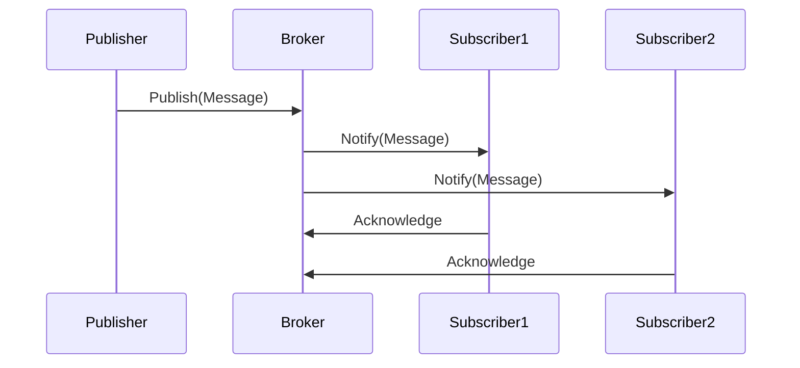

## Publish-Subscribe: Emitting messages/events to multiple subscribers

### Introduction
The **Publish-Subscribe (Pub-Sub)** design pattern is a messaging pattern where messages or events are sent by publishers (or producers) and received by subscribers (or consumers). This pattern allows these components to communicate in a decoupled manner, meaning the publisher does not need to know the details of the subscribers, and vice versa. This pattern is widely used in various domains such as event-driven architectures, real-time systems, and distributed systems.

### Core Concepts

- **Publisher**: The component that emits messages or events.
- **Subscriber**: The component that receives messages or events.
- **Message**: The data being transmitted from the publisher to subscribers.
- **Broker**: An intermediary component that manages subscriptions and routes messages from publishers to subscribers.

### Publish-Subscribe in Functional Programming
In functional programming, the publish-subscribe pattern can be elegantly implemented by leveraging first-class functions, immutability, and higher-order functions. Functional languages often provide constructs for working with streams of data, facilitating the implementation of Pub-Sub.

### Implementation

#### Basic Example in Haskell

Here is a Haskell implementation of a simple Pub-Sub system:

```haskell
import Control.Concurrent.STM
import Control.Monad

type Topic = String
type Message = String

-- The PubSub data type will manage subscribers using an STM-based list of TChans.
data PubSub = PubSub
  { subscribers :: TVar [(Topic, TChan Message)] }

-- Initialize a new PubSub system
newPubSub :: IO PubSub
newPubSub = PubSub <$> newTVarIO []

-- Subscribe to a topic
subscribe :: PubSub -> Topic -> IO (TChan Message)
subscribe pubsub topic = atomically $ do
  chan <- newTChan
  modifyTVar' (subscribers pubsub) ((topic, chan) :)
  return chan

-- Publish a message to a topic
publish :: PubSub -> Topic -> Message -> IO ()
publish pubsub topic msg = atomically $ do
  subs <- readTVar (subscribers pubsub)
  forM_ subs $ \\(subTopic, chan) ->
    when (subTopic == topic) $
      writeTChan chan msg

-- Example usage
main :: IO ()
main = do
  pubsub <- newPubSub
  chan <- subscribe(pubsub, "topic1")
  forkIO $ forever $ do
    msg <- atomically $ readTChan chan
    putStrLn $ "Received: " ++ msg
  publish pubsub "topic1" "Hello, World!"
```

### Sequence Diagram



### Related Design Patterns

- **Observer Pattern**: Similar to Pub-Sub, but the publisher and subscribers are more tightly coupled, usually found as direct object relationships.
- **Event Sourcing**: Capturing all changes to an application state as a sequence of events, where events are the source of truth.
- **Mediator Pattern**: An object that encapsulates how a set of objects interact, similar to a message broker but can have more control logic.

### Additional Resources

- **Designing Event-Driven Systems**: Concepts and patterns behind various event-driven solutions, including Pub-Sub.
- **Reactive Streams in Functional Programming**: Leveraging functional reactive programming (FRP) patterns to build reactive applications.
- **"Real World Haskell"** by Bryan O'Sullivan, Don Stewart, and John Goerzen: Offers practical examples that include concurrency and STM.

### Summary
The Publish-Subscribe design pattern is integral in creating decoupled and scalable systems. Functional programming offers elegant ways to implement this pattern using immutability, higher-order functions, and concurrency primitives like Software Transactional Memory (STM). Understanding and applying this pattern is crucial in building robust, maintainable systems that can easily evolve and scale.


