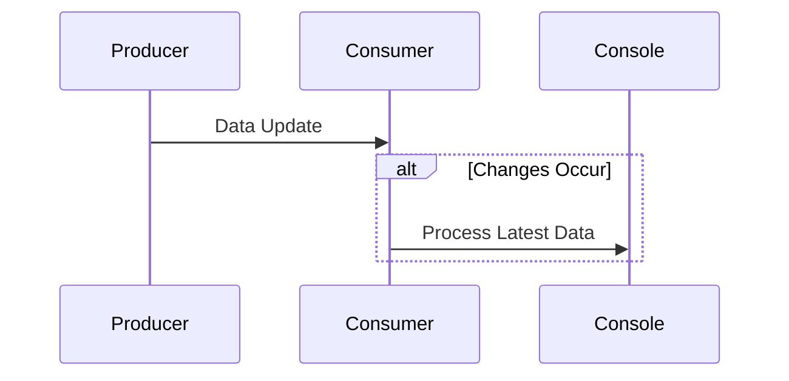
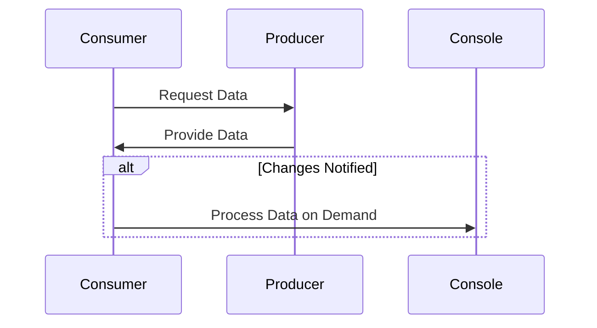

The **Push and Pull** design patterns are fundamental strategies for managing data flow within software systems, especially in the context of functional programming. These patterns revolve around how data is propagated or retrieved in response to changes, ensuring that the system remains up-to-date and consistent without unnecessary overhead.

## Overview

### Push Strategy
In the *Push* approach, data producers (or sources) actively send updates to consumers automatically whenever a change occurs. This ensures that consumers always have the most up-to-date data, reducing the need for them to poll or fetch information predictively.

### Pull Strategy
Conversely, in the *Pull* strategy, data consumers request the latest data from producers at their own convenience. Consumers pull data when needed, reducing unnecessary data transfers at the cost of potentially working with outdated information if they don't poll frequently enough.

## Detailed Explanation

### Push Strategy

The Push strategy can be visualized as an event-driven model where changes are propagated through events or notifications:

In this model, as soon as there is an update in the Producer, it immediately pushes the update to the Consumer.

#### Advantages of Push Strategy
- **Real-Time Updates**: Consumers receive data updates in real-time.
- **Efficiency**: Eliminates the need for consumers to repeatedly poll producers.
- **Freshness**: Ensures consumers work with the latest data.

#### Disadvantages of Push Strategy
- **Overhead**: May lead to excessive data transfer if updates are too frequent.
- **Complexity**: Implementation involves setting up an event notification system.
- **Data Volume**: In systems with large volumes of updates, can cause a bottleneck.

### Pull Strategy

The Pull strategy can be represented as a demand-driven model where data is fetched by consumers as necessary:

Here, the Consumer queries the Producer for updates only when it needs the data.

#### Advantages of Pull Strategy
- **Control**: Consumers can control when they fetch data.
- **Bandwidth Management**: Reduces unnecessary data updates.
- **Simplicity**: Easier to implement compared to push systems.

#### Disadvantages of Pull Strategy
- **Staleness**: The data may not be the most current if not frequently polled.
- **Latency**: Consumers may experience delays as data isn't updated in real-time.
- **Polling Overhead**: Continuous polling can become inefficient.

## Use Cases

- **Push**: Real-time data analytics, financial trading systems, notification services.
- **Pull**: Batch data processing, periodic data syncing, on-demand information retrieval.

## Related Design Patterns

### Observer Pattern
In many systems, the Push strategy is implemented using the Observer pattern, where observers register to be notified of state changes in the subject (Producer). This pattern is particularly useful in scenarios requiring real-time data synchronization.

### Reactive Programming
Reactive programming paradigms embrace the Push model extensively, providing tools and frameworks to handle streams of data and propagate changes seamlessly. Libraries such as RxJS (Reactive Extensions for JavaScript) enable developers to compose asynchronous and event-based programs by using observables.

## Additional Resources

1. **Books**
   - *"Functional Programming in Scala"* by Paul Chiusano and Runar Bjarnason
   - *"Reactive Programming with RxJS"* by Sergi Mansilla

2. **Online Articles**
   - ["Understanding Push and Pull Strategies in Data Flow"](https://example.com/push-pull-data-flow)
   - ["Reactive Programming: The Push-Based Approach"](https://example.com/reactive-programming)

3. **Courses**
   - Coursera: *Functional Programming Principles in Scala*
   - edX: *Introduction to Reactive Programming*

## Summary

The Push and Pull strategies provide key mechanisms for data synchronization in functional programming. While Push ensures real-time updates and fresh data at the cost of potential overhead, Pull allows for consumer-driven control over data retrieval albeit with possible latency and staleness. Understanding and choosing between these strategies is essential for designing efficient, scalable, and responsive systems. By leveraging associated patterns such as Observer and concepts from Reactive Programming, developers can implement robust solutions tailored to their specific use cases.
