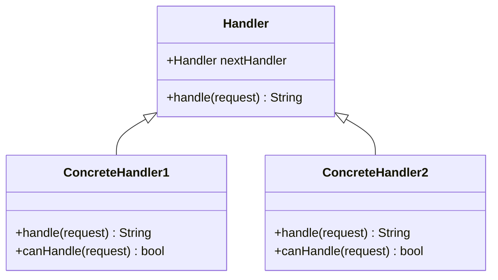

## Introduction

The Chain of Responsibility design pattern is a behavioral design pattern that allows an object to send a request to a chain of handlers. Each handler in the chain either processes the request or forwards it to the next handler in the chain. This pattern decouples the sender of the request from the receivers, promoting loose coupling and greater flexibility in request handling.

In functional programming, the Chain of Responsibility pattern can be implemented in a highly concise and expressive manner using higher-order functions and immutable data structures.

## Advantages

- **Flexibility**: Handlers can be added, removed, or reordered dynamically.
- **Separation of Concerns**: Request processing logic is distributed across various handlers, each of which deals with specific aspects of the request.
- **Loose Coupling**: The sender of the request has no knowledge of the specific handler, promoting better modularity.

## Implementation

### Pseudocode Example

Here's a simple pseudocode example to illustrate the Chain of Responsibility pattern:

```plaintext
Handler {
  method handle(request)
}

ConcreteHandler1 extends Handler {
  method handle(request) {
    if (canHandle(request)) {
      // Process request
    } else if (nextHandler != null) {
      nextHandler.handle(request)
    }
  }
}

ConcreteHandler2 extends Handler {
  method handle(request) {
    if (canHandle(request)) {
      // Process request
    } else if (nextHandler != null) {
      nextHandler.handle(request)
    }
  }
}

// Client code
ConcreteHandler1 handler1 = new ConcreteHandler1()
ConcreteHandler2 handler2 = new ConcreteHandler2()
handler1.nextHandler = handler2

handler1.handle(request)
```

### Functional Programming Example in Haskell

Using Haskell, a functional language, we can implement a Chain of Responsibility pattern in a pure functional way. Here is an example:

```haskell
type Request = String

-- Define a type for a handler, which takes a request and an optional next handler
type Handler = Request -> Maybe (Handler) -> String

-- A sample handler that returns uppercased request if length is less than 5
handler1 :: Handler
handler1 request nextHandler = 
  if length request < 5
  then map toUpper request
  else maybe "Request not handled" (\h -> h request Nothing) nextHandler

-- Another handler which returns reversed string
handler2 :: Handler
handler2 request nextHandler = 
  if length request >= 5
  then reverse request
  else maybe "Request not handled" (\h -> h request Nothing) nextHandler

-- Function to create a chain of handlers
chainOfHandlers :: [Handler] -> Request -> String
chainOfHandlers [] _ = "Chain is empty"
chainOfHandlers (h:hs) request = h request (fmap sequence hs)

-- Usage example
-- Only the appropriate handler in the chain will process the request
let result = chainOfHandlers [handler1, handler2] "hello"
print result  -- Outputs "olleh"
```

### Diagram Using Mermaid

Below is UML diagram representing the structure of the Chain of Responsibility pattern.



## Related Design Patterns

- **Decorator Pattern**: Adds responsibilities to objects dynamically without affecting other objects, which can be combined with Chain of Responsibility to handle requests in a more flexible manner.
- **Command Pattern**: Encapsulates a request as an object, allowing for parameterization of clients with different requests, queuing of requests, and logging of operations.
- **Observer Pattern**: Maintains a list of dependents and notifies them of any state changes, which complements the Chain of Responsibility by managing complex interactions between objects.

## Additional Resources

- *Design Patterns: Elements of Reusable Object-Oriented Software* by Erich Gamma, Richard Helm, Ralph Johnson, John Vlissides (The "Gang of Four" book)
- [Haskell Chain of Responsibility Pattern](https://wiki.haskell.org/Chain_of_responsibility) – Example of Chain of Responsibility in Haskell
- [Martin Fowler's Patterns](https://martinfowler.com/eaaCatalog/) – Catalog of Enterprise Application Architecture Patterns

## Summary

The Chain of Responsibility pattern is a powerful and versatile design pattern that promotes loose coupling and flexibility by passing requests along a chain of handlers. It is particularly well-suited to functional programming languages, which can utilize higher-order functions and immutability to encapsulate this pattern effectively. Understanding and applying this pattern helps in creating more maintainable and scalable codebases.
