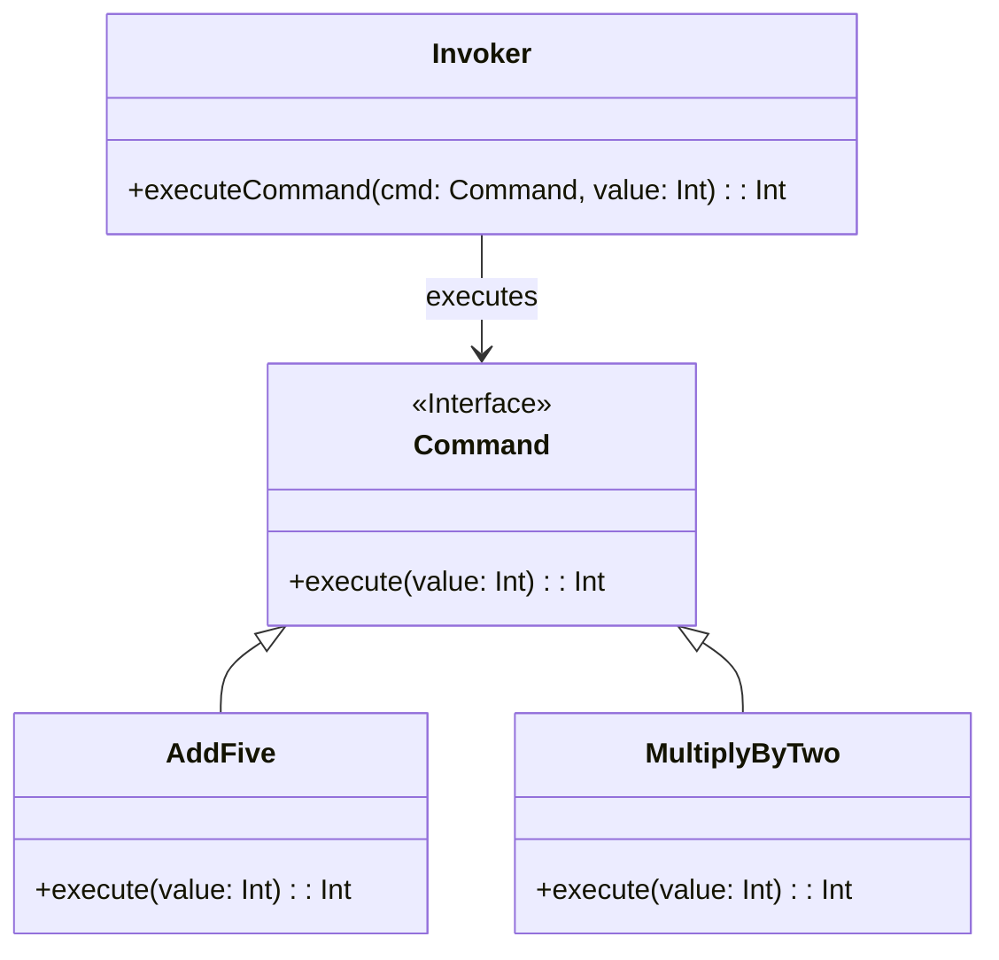

## Introduction
The **Command Pattern** encapsulates a request as an object, thereby decoupling the sender and the receiver of the request. This enables parameterization, queuing, logging, and undo functionality for operations. The Command pattern is particularly valuable in functional programming, where immutability and first-class functions assure robust and predictable behavior.

### Structure
The basic structure of the Command pattern involves the following components:
- **Command Interface**: Defines an interface with a method for executing the command.
- **ConcreteCommand**: Implements the Command interface, encapsulating the request.
- **Invoker**: Holds and executes the commands.
- **Receiver**: Performs the action specified by the command.

### KaTeX Implementation

Let's use a simple mathematical function example:

```haskell
-- Command Interface
type Command = Int -> Int

-- Concrete Command1
addFive :: Command
addFive x = x + 5

-- Concrete Command2
multiplyByTwo :: Command
multiplyByTwo x = x * 2

-- Invoker
executeCommand :: Command -> Int -> Int
executeCommand cmd val = cmd val

-- Receiver (In this context, an Int value)
valueReceiver :: Int
valueReceiver = 10

-- Execution
main :: IO ()
main = do
  let result1 = executeCommand addFive valueReceiver
  let result2 = executeCommand multiplyByTwo valueReceiver
  putStrLn $ "Result of adding five: " ++ show result1
  putStrLn $ "Result of multiplying by two: " ++ show result2
```

In this example, `Command` is a type alias for a function accepting an `Int` and returning an `Int`. We then define two concrete commands, `addFive` and `multiplyByTwo`, which conform to this type. The `executeCommand` function serves as the invoker, executing any command passed to it with a provided value.

## UML Diagram with Mermaid



## Detailed Example

Here's a more in-depth example illustrating a command to turn on/off a light.

### Haskell Implementation

```haskell
-- Command Interface
type Command = IO ()

-- Concrete Command1
turnOn :: Command
turnOn = putStrLn "Light is ON"

-- Concrete Command2
turnOff :: Command
turnOff = putStrLn "Light is OFF"

-- Invoker
executeCommand :: Command -> IO ()
executeCommand cmd = cmd

main :: IO ()
main = do
  executeCommand turnOn
  executeCommand turnOff
```

### Real-world Applications
Below are some practical applications of the Command Pattern:

1. **Undo/Redo functionality**: In text editors where operations (commands) can be undone/redone.
2. **GUI Buttons**: Each button can encapsulate a command, making it easier to handle user interactions.
3. **Task Scheduling**: Commands can be queued and executed later.

## Related Design Patterns

### Chain of Responsibility
The Command pattern is often compared to the **Chain of Responsibility** pattern, where instead of having a single invoker, a chain of handlers is set to process the command sequentially until one handle the command.

### Strategy
The **Strategy** pattern is also quite similar, but it is designed for selecting a family of algorithms at runtime rather than encapsulating commands.

### Memento
The **Memento** pattern can be used in conjunction with the Command pattern to maintain the state such that commands can be undone.

## Additional Resources
- **Books**:
    - "Design Patterns: Elements of Reusable Object-Oriented Software" by Erich Gamma, Richard Helm, Ralph Johnson, John Vlissides
    - "Functional Programming in Scala" by Paul Chiusano and Rúnar Bjarnason
- **Online Tutorials**:
    - Command Pattern in Haskell: https://www.fpcomplete.com/blog/2017/06/haskell-architecture/
    - Functional Patterns through Real-World Examples: https://dev.to/mauro_codes/functional-design-patterns-in-real-world-examples-39ei

## Summary
The Command Pattern in functional programming encapsulates requests as objects allowing for parameterization, logging, queuing, and operation undo/redo functionality. This pattern promotes decoupling between the producer of the command and its consumer, leading to more modular and maintainable code. It shares similarities with patterns such as Chain of Responsibility, Strategy, and Memento.

By understanding and implementing the Command pattern, you can create more flexible and reusable software designs that conform to functional programming principles.

---

By following this structured guideline, use cases, implementations, and related patterns, the Command pattern can be expertly leveraged in functional programming for robust system architectures.
