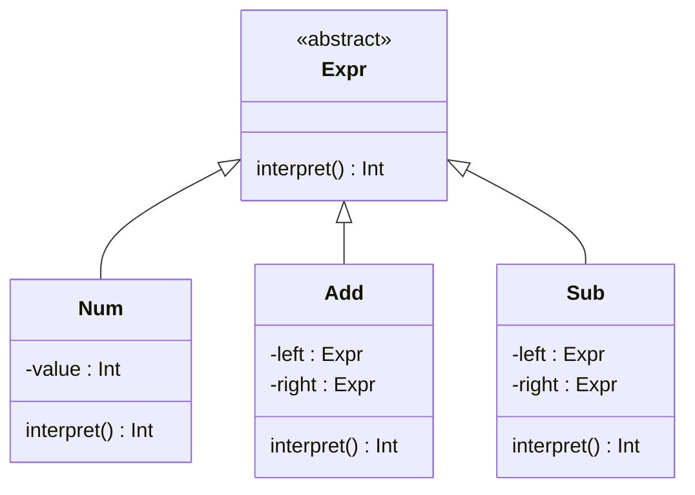
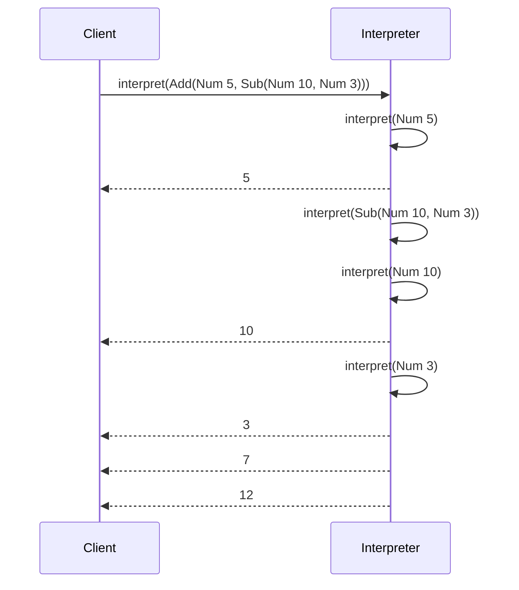

## Introduction

The **Interpreter design pattern** is a behavioral design pattern that allows you to define a grammatical representation for a language and use this representation to interpret sentences in that language. This pattern is particularly useful in applications where languages can often change and scripts or expressions need to be evaluated or executed.

In the context of functional programming, the Interpreter pattern helps in creating compositions of operations on a high level of abstraction. It leverages immutable data structures and functions as first-class citizens to parse and execute commands efficiently.

## Concept

The Interpreter pattern can be thought of in the following way:
- **Abstract Syntax Tree (AST):** Represents the grammar through a tree structure.
- **Interpreter:** Traverses the tree structure and performs operations defined by the nodes of the tree.

## Components

1. **AbstractExpression**
   - Declares an abstract interpret method.
2. **TerminalExpression**
   - Implements an interpret method associated with terminal symbols in the grammar.
3. **NonTerminalExpression**
   - Represents non-terminal symbols in the grammar and typically contains other expressions.
4. **Context**
   - Contains information that's global to the interpreter.

## Example in Functional Programming

Consider a simple language for arithmetic operations.

```haskell
-- Defining an abstract syntax tree (AST)
data Expr = Num Int
          | Add Expr Expr
          | Sub Expr Expr

-- Interpreter function
interpret :: Expr -> Int
interpret (Num n) = n
interpret (Add x y) = interpret x + interpret y
interpret (Sub x y) = interpret x - interpret y

-- Example Usage
exampleExpr = Add (Num 5) (Sub (Num 10) (Num 3))
result = interpret exampleExpr
```

In this example, we define a small grammar with three types of expressions: numbers, additions, and subtractions. The `interpret` function then recursively evaluates these expressions. 

### Class Diagram

Below is a graphical representation using Mermaid:



### Sequence Diagram of Interpretation Process



## Related Design Patterns

1. **Composite Pattern**
   - The Composite pattern allows you to compose objects into tree structures to represent part-whole hierarchies. The Interpreter pattern can leverage this to implement hierarchies of expressions.

2. **Visitor Pattern**
   - The Visitor pattern allows you to add further operations to objects without having to modify them. This can be used when extending the interpret function operation.

3. **Strategy Pattern**
   - The Strategy pattern defines a family of algorithms, encapsulates each one, and makes them interchangeable. Different strategies can define multiple interpretations.

## Additional Resources

1. **Books:**
   - "Design Patterns: Elements of Reusable Object-Oriented Software" by Erich Gamma, Richard Helm, Ralph Johnson, and John Vlissides.
   - "Functional Programming in Scala" by Paul Chiusano and Rúnar Bjarnason.

2. **Articles & Tutorials:**
   - [Functional Programming Patterns](https://www.scalatic.com/functional-programming-patterns) - A detailed look at various functional programming patterns.
   - [Understanding the Interpreter Pattern in Functional Programming](https://www.haskell.org/interpreter-pattern) - Insights into the Interpreter design pattern with Haskell examples.

## Summary

The Interpreter design pattern is essential for scenarios requiring the interpretation of scripts or language constructs dynamically. It provides a robust framework for defining and processing language grammars. By leveraging functional programming principles, we can create maintainable and scalable applications that interpret commands efficiently. 

Benefits include simpler evaluation models and better modularity. However, this pattern is recommended where language and grammar change frequently, as designing an interpreter for very complex grammars can become cumbersome.

By understanding and utilizing the Interpreter pattern, software engineers can effectively handle complex parsing tasks and build interpretable DSLs (Domain-Specific Languages) that enhance the robustness and flexibility of their systems.
