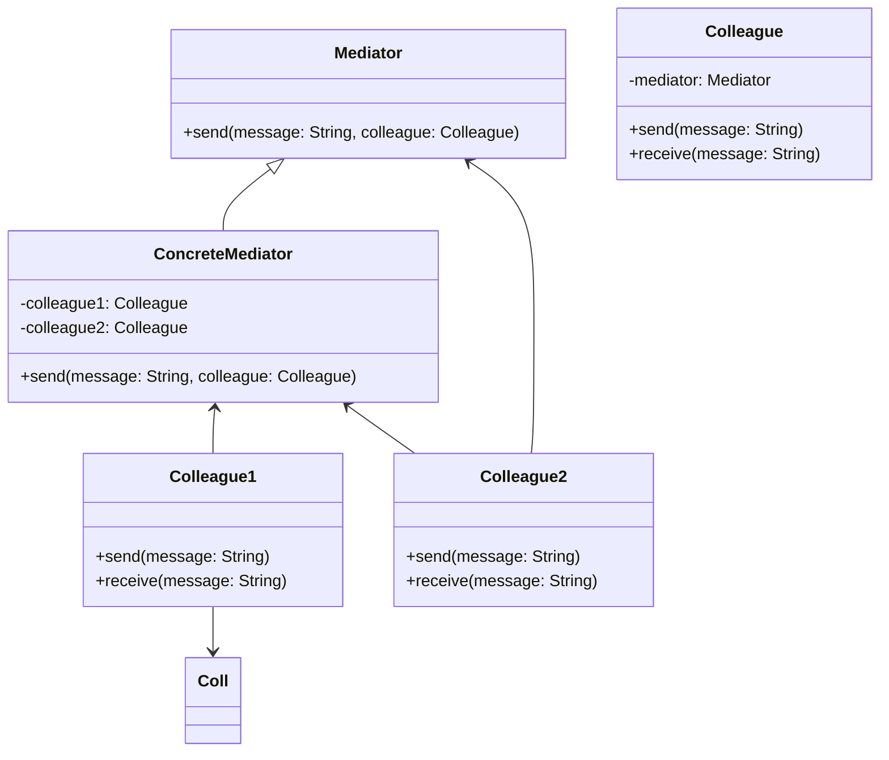

## Introduction

The Mediator design pattern is one of the behavioral design patterns that aims to facilitate coordinated communication between a set of objects, thus promoting loose coupling by preventing direct dependencies among them. This is particularly useful in functional programming, where immutability and stateless functions are key principles.

In a typical implementation, a mediator object handles all communications between the various components, thereby reducing the complexity of interactions and improving the code's maintainability.

## Key Principles of the Mediator Pattern

1. **Encapsulation of Interactions**: Instead of having objects refer to each other directly, they communicate through the mediator.
2. **Reduction of Dependencies**: Objects do not need to hold references to each other; they only need to know about the mediator.
3. **Loose Coupling**: By decoupling objects, the system becomes more flexible and easier to modify or extend.

## Components

1. **Mediator Interface**: Declares the interface for communication with Colleague objects.
2. **Concrete Mediator**: Implements the mediator interface and coordinates communication between Colleague objects.
3. **Colleague Classes**: Collaborating objects that communicate through the mediator. They only interact with the mediator and are unaware of each other.

## UML Diagram

## Implementation Example in Functional Programming (F#)

### Mediator Interface
```fsharp
type Mediator =
    abstract member Send: string -> Colleague -> unit
```

### Concrete Mediator
```fsharp
type ConcreteMediator() =
    let mutable colleague1 = None : Colleague option
    let mutable colleague2 = None : Colleague option

    member this.Colleague1
        with get() = colleague1
        and set(value) = colleague1 <- Some(value)

    member this.Colleague2
        with get() = colleague2
        and set(value) = colleague2 <- Some(value)

    interface Mediator with
        member this.Send(message, colleague) =
            match colleague1, colleague2 with
            | Some c1, Some c2 ->
                if colleague = c1 then c2.Receive(message)
                elif colleague = c2 then c1.Receive(message)
            | _ -> failwith "Colleagues not properly initialized"
```

### Colleague Class
```fsharp
type Colleague(mediator: Mediator) =
    member this.Send(message: string) =
        mediator.Send(message, this)

    member this.Receive(message: string) =
        printfn "Message received: %s" message
```

### Example Usage
```fsharp
let mediator = ConcreteMediator()

let colleague1 = Colleague(mediator)
let colleague2 = Colleague(mediator)

mediator.Colleague1 <- colleague1
mediator.Colleague2 <- colleague2

colleague1.Send("Hello from Colleague1")
colleague2.Send("Hello from Colleague2")
```

## Related Design Patterns

- **Observer Pattern**: Similar to the mediator pattern, it defines a one-to-many dependency but differs in that subjects (observables) notify observers directly.
- **Command Pattern**: Encapsulates a command request as an object, helping to decouple the sender and receiver. Often used with the mediator pattern to route command requests.
- **Facade Pattern**: Also aims to reduce complexity but does so by providing a simplified interface to a subsystem, rather than organizing communication.

## Additional Resources

- [Design Patterns: Elements of Reusable Object-Oriented Software by Erich Gamma, Richard Helm, Ralph Johnson, John Vlissides](https://www.amazon.com/Design-Patterns-Elements-Reusable-Object-Oriented/dp/0201633612)
- [Functional Programming Design Patterns in Scala](https://www.manning.com/books/functional-programming-patterns-in-scala-and-clojure)
- [Mediator Pattern – SourceMaking](https://sourcemaking.com/design_patterns/mediator)
- [Patterns in F# – A Functional Approach to Writing Idiomatic Code](https://fsharp.org/guides/patterns/) 

## Summary

The Mediator design pattern is an essential tool in managing complex object interactions by centralizing communication and promoting loose coupling. In functional programming, this is particularly relevant as it helps maintain immutability and stateless interactions. The pattern can significantly simplify complex systems by reducing dependencies and making them easier to maintain and evolve.

By implementing a mediator, you can ensure that components remain isolated and reusable, adhering to the principles of functional programming.
