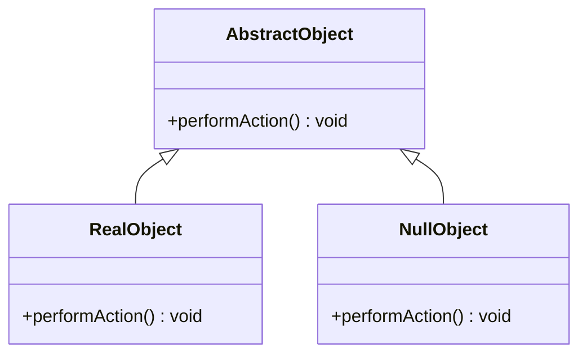

In functional programming, the concept of null references can introduce complexity and potential errors in code, particularly when the absence of an object needs to be handled explicitly. The **Null Object pattern** creates a non-functional or default object that can be used in place of a null reference to provide standard behavior, reducing the need for null checks and error handling code.

## Motivation

Imagine a scenario where various modules of your application need to interact with a component that might be missing or not initialized. If you adopt a typical null reference approach, your code would be filled with extensive checks like:

```scala
if (component != null) {
  component.performAction()
} else {
  // handle null case
}
```

The repetition of null checks not only makes code more verbose and error-prone, but it also mixes the null-handling logic with the core business logic. The Null Object pattern offers an elegant solution by encapsulating this null behavior within a dedicated object.

## Applicability

The Null Object pattern is applicable when:

- You have recurring null checks scattered across the application.
- You want to simplify the logic by uniformly treating absent objects with a default behavior.
- You aim to adhere to the principles of clean code and functional programming, reducing side effects and improving readability.

## Structure

Using Mermeid syntax, the structure of the Null Object pattern can be represented as:



- **AbstractObject**: An interface or abstract class declaring the methods that both RealObject and NullObject will implement.
- **RealObject**: The actual object with meaningful behavior.
- **NullObject**: A non-functional object that provides harmless default behavior, often doing nothing (`no-op`).

## Implementation Example

### Scala

Using Scala's options and traits, the implementation can be very streamlined.

```scala
trait Service {
  def performAction(): Unit
}

object RealService extends Service {
  def performAction(): Unit = {
    println("Performing some real service!")
  }
}

object NullService extends Service {
  def performAction(): Unit = {
    // Do nothing
  }
}

def executeService(service: Service): Unit = {
  service.performAction()
}

// Usage
val service: Service = if (someCondition) RealService else NullService
executeService(service)
```

### Haskell

Haskell’s type system and algebraic data types make Null Object pattern straightforward.

```haskell
data Service = RealService | NullService

performAction :: Service -> IO ()
performAction RealService = putStrLn "Performing some real service!"
performAction NullService  = return ()

-- Usage
main :: IO ()
main = do
  let service = if someCondition then RealService else NullService
  performAction(service)
```

## Related Design Patterns

### 1. **Option / Maybe Monad**
Handles the absence of values more explicitly, often seen in languages like Scala (`Option`) or Haskell (`Maybe`).

### 2. **Strategy Pattern**
Defines a family of algorithms, encapsulates each one, and makes them interchangeable. The Null Object can be seen as a strategy where the behavior is to do nothing.

### 3. **Decorator Pattern**
Adds behavior to objects. Null Object can be considered a special case of Decorator where the added behavior is "do nothing".

## Additional Resources

- **Book**: *Design Patterns: Elements of Reusable Object-Oriented Software* by Erich Gamma, Richard Helm, Ralph Johnson, and John Vlissides
- **Article**: Fowler, Martin, “Replace Conditional Logic with Strategy” (https://martinfowler.com/eaaCatalog/replaceConditionalLogicWithStrategy.html)
- **Video**: Null Object Pattern by Christopher Okhravi (https://www.youtube.com/watch?v=LGErKLZWxXI)

## Summary

The Null Object pattern is a robust design principle that simplifies code structure by providing default, harmless behavior for absent cases. It minimizes the need for null checks, streamlines code readability, and complements the functional programming paradigm by reducing side effects and keeping functions pure. Incorporating the Null Object pattern can lead to more maintainable and less error-prone code. Understanding its interplay with related patterns like Option and Strategy can further enhance your design arsenal.
