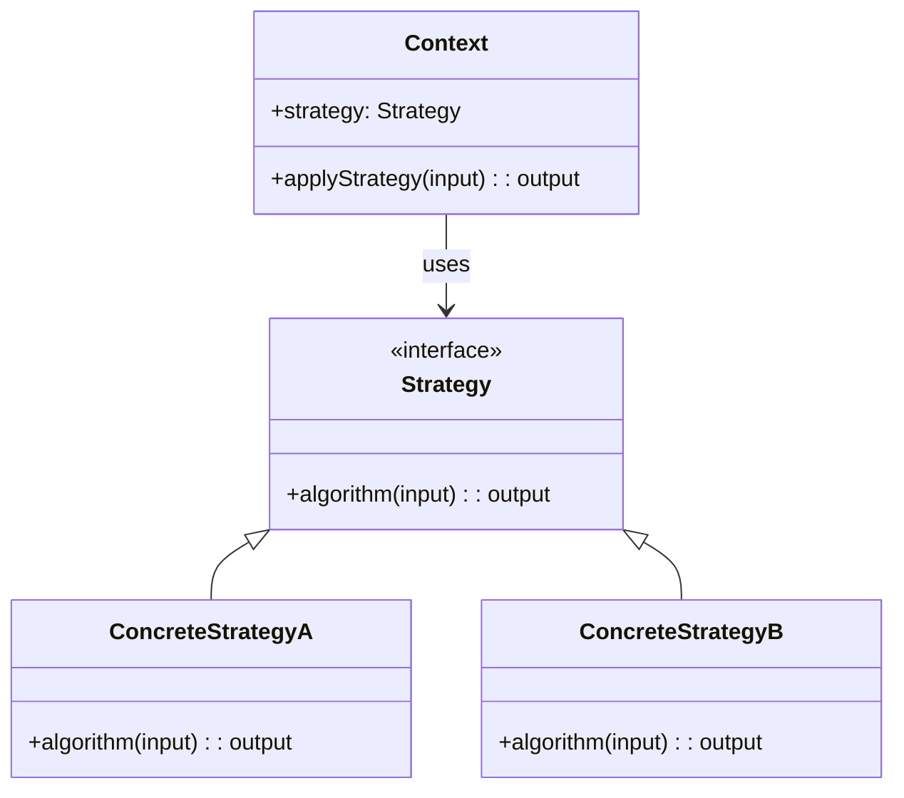

## Introduction to the Strategy Pattern

The Strategy pattern is a behavioral design pattern that enables selecting an algorithm's behavior at runtime. This pattern defines a family of algorithms, encapsulates each one, and makes them interchangeable, allowing the algorithm to vary independently from clients that use it. This promotes flexibility and reusability in your software design.

## Implementing the Strategy Pattern in Functional Programming

In functional programming, the Strategy pattern can be elegantly implemented using higher-order functions (functions that take other functions as arguments or return them). This section will discuss how to apply this pattern functionally with comprehensive examples and KaTeX for any necessary mathematical representations.

### Example in Haskell

Let's explore an implementation in Haskell, a purely functional programming language.

```haskell
-- Define type alias for a Strategy
type Strategy a = [a] -> a

-- Concrete strategies
sumStrategy :: Num a => Strategy a
sumStrategy = sum

productStrategy :: Num a => Strategy a
productStrategy = product

-- Context to apply a strategy
applyStrategy :: Strategy a -> [a] -> a
applyStrategy strategy xs = strategy xs

-- Example usage
main :: IO ()
main = do
    let numbers = [1, 2, 3, 4]
    putStrLn $ "Sum: " ++ show (applyStrategy sumStrategy numbers)
    putStrLn $ "Product: " ++ show (applyStrategy productStrategy numbers)
```

In this example, we define a `Strategy` type alias and two specific strategies: `sumStrategy` and `productStrategy`. The `applyStrategy` function takes a strategy and a list of numbers, applying the given strategy to the list.

### Example in Scala

Let's look at the same pattern in Scala.

```scala
// Define a Strategy type alias
type Strategy[A] = List[A] => A

// Concrete strategies
val sumStrategy: Strategy[Int] = _.sum
val productStrategy: Strategy[Int] = _.product

// Context to apply a strategy
def applyStrategy[A](strategy: Strategy[A], list: List[A]): A = strategy(list)

// Example usage
object StrategyPatternExample extends App {
  val numbers = List(1, 2, 3, 4)
  println(s"Sum: ${applyStrategy(sumStrategy, numbers)}")
  println(s"Product: ${applyStrategy(productStrategy, numbers)}")
}
```

Similar to the Haskell example, we use a type alias `Strategy` and define two strategies, `sumStrategy` and `productStrategy`. The `applyStrategy` function is used to apply a strategy to a list of numbers.

## Related Design Patterns

1. **State Pattern**: The State pattern is closely related to the Strategy pattern but focuses on managing state transitions within an object. Strategy explicitly selects algorithms, whereas State manages the states and transitions.

2. **Command Pattern**: The Command pattern encapsulates a request as an object, thereby allowing for parameterizing clients with different requests, queueing requests, and logging the requests. This encapsulation concept is similar to Strategy.

3. **Decorator Pattern**: The Decorator pattern allows behavior to be added to an individual object, dynamically, without affecting the behavior of other objects from the same class. The Strategy pattern delegates the behavior entirely, while Decorator adds behaviors.

## Additional Resources

- *Design Patterns: Elements of Reusable Object-Oriented Software* by Erich Gamma, Richard Helm, Ralph Johnson, and John Vlissides (the Gang of Four)
- Functional Programming in Scala by Paul Chiusano and Runar Bjarnason
- Haskell: The Craft of Functional Programming by Simon Thompson

## Summary

The Strategy pattern in functional programming emphasizes the separation of concerns by encapsulating a family of algorithms into individual strategies. This results in flexible and reusable code. By leveraging higher-order functions, this pattern fits naturally into functional programming paradigms. The Strategy pattern shares similarities with other behavioral design patterns, enriching its applicability and integration within comprehensive design solutions.


