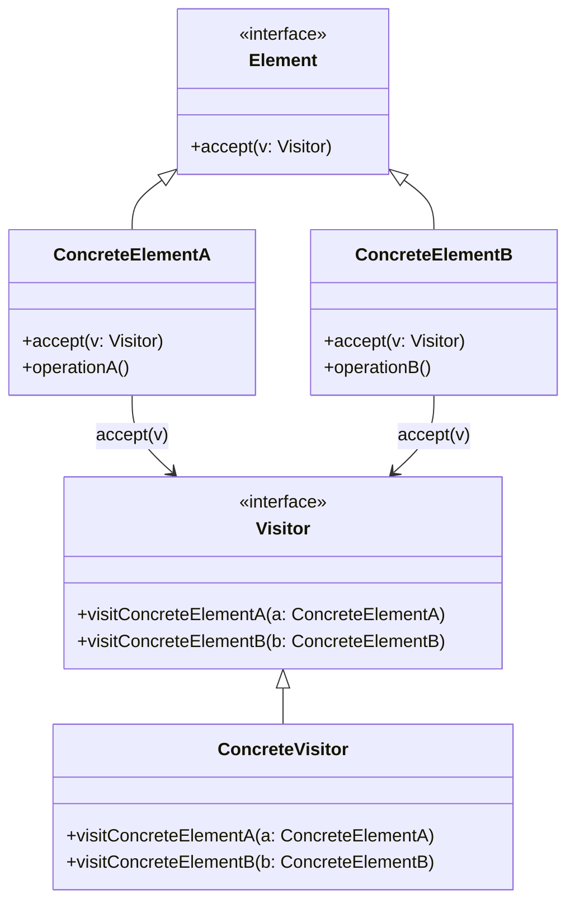
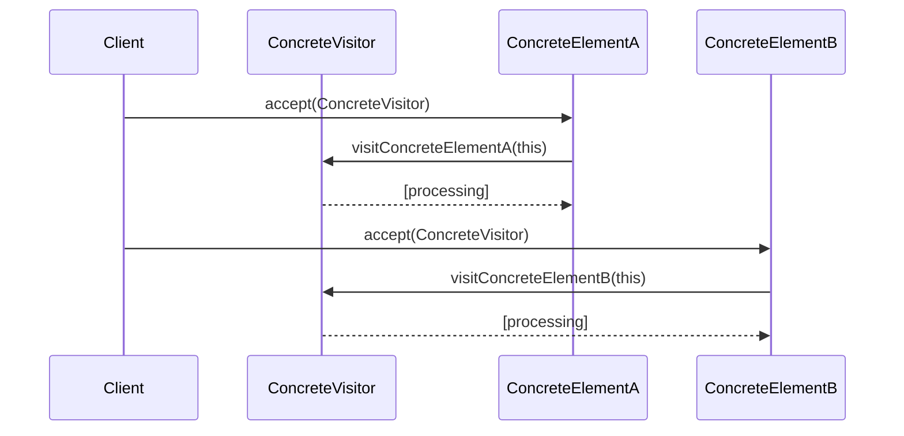

## Introduction

In functional programming and software engineering, the **Visitor Pattern** is a behavioral design pattern that allows you to add further operations to objects without altering their structures. This pattern involves creating a visitor class that changes the executing algorithm of an element class. Visitor Pattern is particularly useful for systems where object structures are invariant, but operations performed on them can vary.

## Components of Visitor Pattern

1. **Visitor Interface**: Declares a `visit` method for each type of concrete element in an object structure.
2. **Concrete Visitor**: Implements each `visit` method, defining actions to be performed on elements.
3. **Element Interface**: Declares an `accept` method that takes a visitor object as an argument.
4. **Concrete Element**: Implements the `accept` method defined in the element interface to accept a visitor object.

Here's a quick illustration in Haskell:

```haskell
{-# LANGUAGE GADTs #-}

-- Define a visitor
data Visitor a where
  Visitor :: (a -> b) -> Visitor a

-- Define an element
data Element = Element Int String

-- Implement accept method
accept :: Element -> Visitor Element -> Element
accept el (Visitor f) = f el

-- Example so-called concrete visitor
elementVisitor :: Visitor Element
elementVisitor = Visitor $ \\(Element i str) -> Element (i + 1) (str ++ "!")

-- Example usage
main :: IO ()
main = do
  let el = Element 1 "Hello"
  let newEl = accept el elementVisitor
  print newEl
-- Output: Element 2 "Hello!"
```

## Detailed Class and Sequence Diagram in Mermaid UML

### Class Diagram

The class diagram for the Visitor Pattern reflects the interaction between various components:



### Sequence Diagram

The sequence diagram showcases the runtime interactions between elements and visitors:



## Advantages and Disadvantages

### Advantages

- **Open/Closed Principle**: Add new operations without changing existing code.
- **Separation of Concerns**: Separates algorithms from the object structure.
- **Extensibility**: Easy to introduce new visitors with new algorithms.

### Disadvantages

- **Complexity**: Can increase complexity by having to create visitor classes for each operation.
- **Consider Multiple Visitors**: Each visitor requires updates to accept methods in all elements.
- **Coupling**: Tight coupling between the structure and algorithm.

## Related Patterns

### Command Pattern

* **Description**: Encapsulates a request as an object, thereby allowing for parameterization of clients with queues, requests, and operations.
* **Use Case**: When requiring a separate object for processing, Command can work alongside Visitor to encapsulate logic.

### Interpreter Pattern

* **Description**: Given a language, define a representation for its grammar along with an interpreter. This behavior embeds the language's grammar and interpreters within the objects.
* **Use Case**: In scenarios, Visitor can complement the Interpreter pattern by offering new ways of interpreting different grammar components.

## Additional Resources

- *Design Patterns: Elements of Reusable Object-Oriented Software* by Erich Gamma, Richard Helm, Ralph Johnson, John Vlissides
- *Functional Programming in Scala* by Paul Chiusano and Runar Bjarnason

## Summary

The Visitor Pattern is a sophisticated design pattern enabling operations on object structures to be defined without altering the objects themselves. This increases the system's extensibility while promoting a clean separation of concerns. Although it can add complexity, it proves extremely valuable in scenarios where an object structure remains stable, but the operations need to be extended.

By integrating Visitor, Command, and Interpreter patterns, developers can create highly flexible and extensible systems leveraging the full power of functional principles and object-oriented design patterns.


