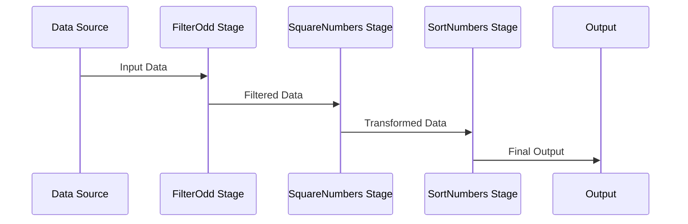

## Introduction

The Pipeline pattern is a design principle prevalent in functional programming. It enables the processing of data through a sequence of stages where each stage performs a specific transformation on the input data. This approach promotes readability, maintainability, and composition, simplifying complex data transformations by breaking them down into smaller steps.

## Characteristics

1. **Sequential Processing**:
    Each stage in a pipeline receives data, processes it, and passes the result to the next stage.

2. **Immutability**:
    Data transformation in each stage is performed without modifying the original input, fostering immutability principles in functional programming.

3. **Composition**:
    Pipelines can be constructed by composing smaller pipelines, resulting in modular and reusable code components.

4. **Declarativity**:
    The pipeline pattern often leads to a declarative approach, where the focus is on defining what should be done, rather than how it should be done.

## Example in Haskell

Here's a simple example of a pipeline in Haskell, where a list of integers is processed through several stages of transformation:

```haskell
import Data.List (sort)

-- Stage 1: Filter out odd numbers
filterOdd :: [Int] -> [Int]
filterOdd = filter even

-- Stage 2: Square each number
squareNumbers :: [Int] -> [Int]
squareNumbers = map (^2)

-- Stage 3: Sort the list in ascending order
sortNumbers :: [Int] -> [Int]
sortNumbers = sort

-- Composing the stages into a pipeline
pipeline :: [Int] -> [Int]
pipeline = sortNumbers . squareNumbers . filterOdd

main :: IO ()
main = print $ pipeline [5, 3, 8, 1, 4, 7]
```

In the above example, the `pipeline` function composes three stages: filtering odd numbers, squaring the even numbers, and sorting the resultant list.

## Diagrammatic Representation

Below is the UML sequence diagram depicting the Pipeline pattern:



## Related Design Patterns

### 1. **Chain of Responsibility**:
Though similar in their sequential nature, the Chain of Responsibility pattern differs in that each handler in the chain decides on processing the request or passing it along, whereas the Pipeline pattern processes and passes the transformed output rigidly.

### 2. **Builder Pattern**:
The Builder pattern, often used in object-oriented design, constructs complex objects step-by-step. While the Pipeline pattern is more focused on data transformation stages, both organize and decouple steps logically.

### 3. **Decorator Pattern**:
The Decorator pattern can dynamically add responsibilities to objects. Conceptually, each decorator can be viewed as a stage in a pipeline, perhaps making it composable and flexible.

## Additional Resources

- [A Brief Introduction to Functional Programming](https://www.example.com/functional-programming-intro)
- [Understanding Composition in Functional Programming](https://www.example.com/composition-in-fp)
- [Pipeline Immutable Data Transformations in JavaScript](https://www.example.com/js-pipeline-pattern)

## Conclusion

The Pipeline pattern is a robust and elegant design pattern in functional programming that facilitates the modular and compositional transformation of data through a sequence of stages. By promoting immutability and a declarative structure, it enhances the readability and maintainability of code. Understanding how to implement and utilize this pattern, as illustrated through Haskell examples and comparisons to related design patterns, is invaluable for any functional programmer.

---

This concludes our discussion on the Pipeline pattern. We hope this comprehensive article helps you grasp the concept and application effectively. For further reading, explore the additional resources provided.
