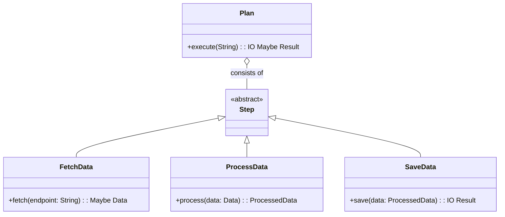
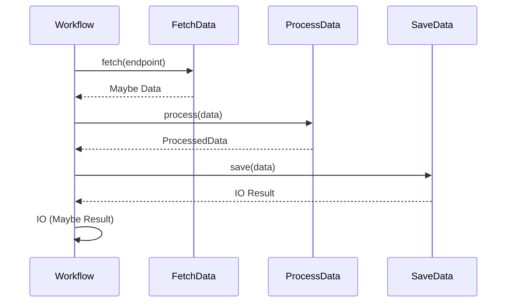

## Introduction

The **Plan** design pattern in functional programming facilitates the creation of complex workflows by composing simpler, reusable component steps. This pattern leverages the benefits of immutability, pure functions, and higher-order functions, enabling clear, predictable, and maintainable systems.

## The Problem

In many applications, workflows consist of multiple sequential or parallel steps. Traditionally, these workflows can become difficult to manage and extend due to complicated control structures, side-effects, and mutable state. It becomes imperative to simplify these computational steps and orchestrate them in a more manageable and modular way.

## The Principle

The Plan design pattern addresses this issue by breaking workflows into simple, discrete steps that can be composed to form more complex operations. Each step ideally handles a single responsibility, follows immutability, and avoids side effects. The steps are then composed via higher-order functions, which result in a clear and declarative workflow.

## Implementation

### Step Definitions

Start by defining the smallest operational units of the workflow. These should be pure functions:

```haskell
-- Example in Haskell

-- Step 1: Fetch data
fetchData :: String -> Maybe Data
fetchData endpoint = ...

-- Step 2: Process data
processData :: Data -> ProcessedData
processData data = ...

-- Step 3: Save data
saveData :: ProcessedData -> IO Result
saveData processedData = ...
```

### Composing Steps

Use higher-order functions to compose these simple steps into a complex workflow:

```haskell
-- Example in Haskell

createWorkflow :: String -> IO (Maybe Result)
createWorkflow endpoint = do
    let maybeData = fetchData endpoint
    case maybeData of 
      Nothing -> return Nothing
      Just data -> do
        let processedData = processData data
        result <- saveData processedData
        return (Just result)
```

### Usage of Functional Constructs

Utilize monads or functors to manage effects and composition more effectively. For instance, chaining the operations together using the `Maybe` and `IO` monads:

```haskell
createWorkflow :: String -> IO (Maybe Result)
createWorkflow endpoint = 
  case fetchData endpoint of
    Nothing -> return Nothing
    Just data -> do 
      let processedData = processData data
      result <- saveData processedData
      return (Just result)
```

Alternatively, leveraging `do` notation for cleaner composition:

### Visual Representation

#### Class Diagram using Mermaid



#### Sequence Diagram



## Related Patterns

### [Pipeline](./pipeline)
The Pipeline pattern focuses on processing data through a sequence of stages, where each stage is responsible for a modular transformation.

### [Builder](./builder)
While typically used in object-oriented contexts, the Builder pattern in functional programming can also be applied to construct complex objects step-by-step, ensuring mutability and clarity of process.

### [Monadic Style](./monadic-style)
Leverages monads to represent sequences of computations, managing side-effects more robustly within the functional paradigm.

## Additional Resources

1. "Functional Programming Patterns in Scala and Clojure" by Michael Bevilacqua-Linn
2. "Functional Programming in Haskell" by Graham Hutton
3. Haskell Wiki: [Haskell/Design Patterns](https://wiki.haskell.org/Category:Idioms)

## Summary

The **Plan** design pattern exemplifies the functional programming philosophy of simplifying complex systems through composition and immutability. By dividing a workflow into individual steps and composing them using higher-order functions and monadic constructs, this pattern ensures that the system remains modular, readable, and maintainable. Understanding and applying this design pattern can significantly improve the scalability and robustness of applications.
