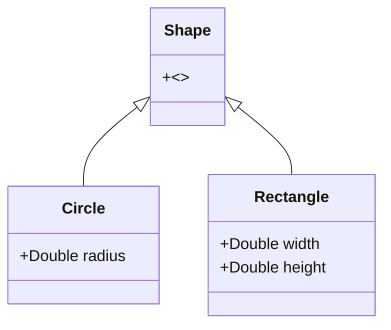

In functional programming, **Case Classes** play a critical role by providing a concise and immutable way to define data structures. They are specifically tailored for algebraic data types (ADTs) and facilitate pattern matching, which is a core feature in many functional programming languages.

## What are Case Classes?

Case classes are a type of class specifically designed to hold data. They are immutable by default and come with built-in functionality for pattern matching. Commonly found in languages like Scala and Haskell, they encapsulate both data and behavior in a clean and concise way.

### Key Characteristics

1. **Immutability**: Once created, the instances of case classes cannot be altered. This immutability aligns well with the principles of functional programming.
2. **Pattern Matching**: Case classes support decomposition via pattern matching, enabling functional programmers to write expressive and readable code.
3. **Conciseness**: Case classes reduce boilerplate code by automatically deriving methods such as `equals()`, `hashCode()`, `toString()`, and `copy()`.
4. **Algebraic Data Types**: Case classes are frequently used to represent ADTs, especially in the forms of sum types (enums) and product types (tuples).

### Syntax in Scala

Here's a simple example of a case class in Scala:

```scala
case class Person(name: String, age: Int)
```

This single line creates a class containing two fields, and Scala generates the following:
- A factory method (`apply`) for creating instances of `Person`.
- Methods for `equals`, `hashCode`, `toString` and a `copy` method to create modified copies of instances.
  
## Example: Algebraic Data Types

Consider a sealed trait and several case classes that encode an algebraic data type representing different shapes.

```scala
sealed trait Shape
case class Circle(radius: Double) extends Shape
case class Rectangle(width: Double, height: Double) extends Shape
```

### Pattern Matching

Pattern matching allows us to perform operations on these shapes elegantly. Here’s how we can define a function to compute the area of different shapes:

```scala
def area(shape: Shape): Double = shape match {
  case Circle(radius) => Math.PI * radius * radius
  case Rectangle(width, height) => width * height
}
```

## UML Class Diagram

Here's a UML diagram illustrating the relationship between the `Shape` trait and its case class extensions:



## Related Design Patterns

- **Algebraic Data Types (ADTs)**: Case classes are integral to defining ADTs, used for creating types that can carry different kinds of values.
- **Sealed Traits**: Often used alongside case classes to restrict which classes can extend a given trait, ensuring all possible subtypes are known at compile time.
- **Data Transfer Object (DTO)**: Represents simple classes used for data transportation, similar to case classes but usually impure and mutable.

## Additional Resources

- [Scala Documentation on Case Classes](https://docs.scala-lang.org/tour/case-classes.html)
- [Functional Programming in Scala by Paul Chiusano and Runar Bjarnason](https://www.manning.com/books/functional-programming-in-scala)
- [The Power of Case Classes and Pattern Matching in Scala](https://rockthejvm.com/blog/scala-case-classes)

## Summary

**Case Classes** are a compelling feature in functional programming languages like Scala and Haskell. They promote immutability, reduce boilerplate code, and simplify the creation of algebraic data types. Combined with the power of pattern matching, they enable functional programmers to write elegant, expressive, and maintainable code.
