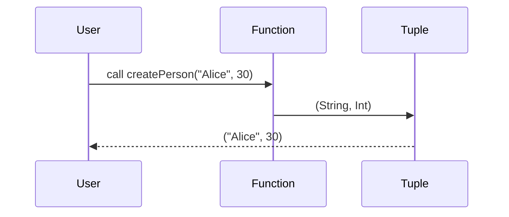

## Introduction

In functional programming, **Product Types**, commonly known as **Tuples**, are a fundamental way to create compound data types. They group together various pieces of data into a single entity, making it easier to pass around related data as a cohesive unit. Product Types form the cornerstone of practical type systems by enabling the combination of multiple values, potentially of different types, within one construct.

## Defining Product Types (Tuples)

### Formal Definition

A tuple is essentially a finite ordered list of elements. Each element can be of a different type. Given types \\( A \\) and \\( B \\), a tuple can be displayed as:


T = (A, B)


Where \\( T \\) represents the tuple combining elements of types \\( A \\) and \\( B \\).

### Example in Functional Programming

Consider the following function in Haskell, a functional programming language:

```haskell
type Person = (String, Int)

createPerson :: String -> Int -> Person
createPerson name age = (name, age)
```

Here, `Person` is a tuple consisting of a `String` and an `Int`.

## Benefits of Using Product Types

1. **Simplicity**: Encapsulates multiple values in a single structure effortlessly.
2. **Type Safety**: Ensures that values within tuples adhere to defined types at compile-time.
3. **Convenience**: Facilitates passing multiple values through functions without explicit structures.

## Design Patterns Involving Product Types

Product Types are not stand-alone patterns but are recurrent in many other design patterns:

### 1. Composite Pattern

Product Types can be seen as a simplified form of the Composite pattern. Rather than creating complex class hierarchies, tuples allow combining values directly.

### 2. Data Transfer Object (DTO)

In functional paradigms, instead of creating an immutable class with getters, a tuple can represent a compact and straightforward DTO.

### 3. Pair Programming

In languages and contexts where functions naturally pair values together, like producing both a result and a status code, tuples are invaluable.

## Related Design Patterns and Concepts

### 1. **Sum Types (Tagged Unions, Variants)**
Sum types allow defining types that can represent multiple different types but only one at a time. In some languages, they are known as union types.

### 2. **Dependent Types**
These types depend on value parameters, typical in languages supporting more advanced type systems like Idris or Agda.

### 3. **Algebraic Data Types (ADTs)**
Include both Product Types and Sum Types under a unified framework, providing more robustness and expressiveness in type systems.

### Example (Mermaid Diagram for Tuple Operations)

Here is a visual scenario of tuple operations in a functional program using Mermaid for clarity.



## Exploring Advanced Topics

### Immutability

Functional programming often emphasizes immutability. Tuples, when used as product types, naturally align with this paradigm. Once created, the tuple cannot be altered, ensuring data consistency and thread safety.

### Pattern Matching

Especially in languages like Scala or Haskell, pattern matching allows destructuring tuples smoothly:

```haskell
displayPerson :: Person -> String
displayPerson (name, age) = name ++ " is " ++ show age
```

This enables elegant and readable handling of product types within functions.

### Higher-Kinded Types

In more advanced scenarios, higher-kinded types might come into play, where tuples themselves might be higher-order functions or types.

## Conclusion

Product Types (Tuples) are a cornerstone of functional programming. Their simplicity in combining various values into a single entity allows for practical and efficient code structures. Whether forming basic data structures or integrating complex type systems, understanding and utilizing product types is paramount for functional programming paradigms.

### Additional Resources

1. **Books**:
   - "Functional Programming in Scala" by Paul Chiusano and Rúnar Bjarnason
   - "Programming in Haskell" by Graham Hutton

2. **Online Courses**:
   - "Functional Programming Principles in Scala" on Coursera by Martin Odersky
   - edX's Haskell online course series

### Summary

Mastering Product Types (Tuples) equips any functional programmer with the knowledge to build robust applications. Their ease of use, combined with powerful type safety and seamless interoperability with other functional constructs, makes them indispensable in the development of sophisticated, type-safe applications.

---

This comprehensive overview bridges fundamental concepts with practical usage, serving as a cornerstone reference for anyone delving into functional programming principles and design patterns.
