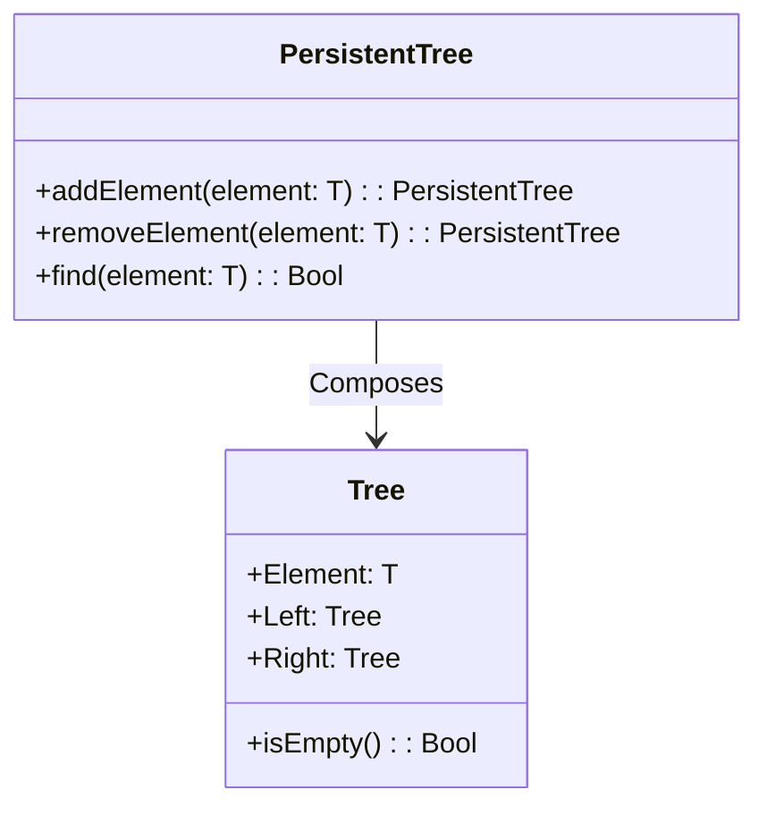
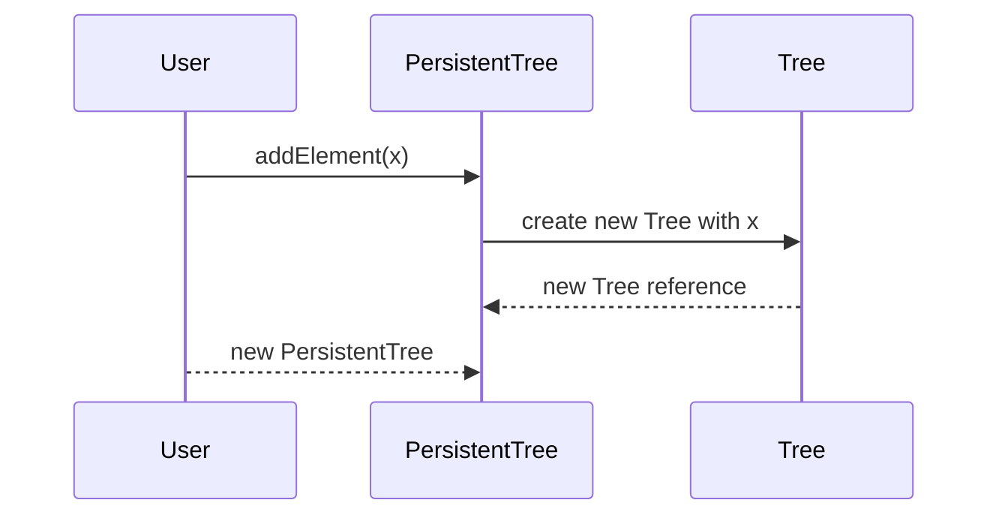

Persistent data structures are a core concept in functional programming that ensure immutability by preserving previous versions of themselves whenever they are modified. This article delves into the principles behind these data structures, their design patterns, related patterns, and resources for further exploration.

## What are Persistent Data Structures?

Persistent data structures maintain immutability and ensure that any operation resulting in a new structure does not destroy or overwrite the existing structure. Instead, new data structures will reference parts of the old one, ensuring the previous version remains intact and accessible.

### Types of Persistence:

1. **Partial Persistence**: Only the most recent version can be modified. Previous versions are read-only.
2. **Full Persistence**: Both past and current versions are readable and can be modified.
3. **Confluent Persistence**: Allows the merging of versions, enabling more complex version control.

## Key Concepts

### Structural Sharing

Structural sharing is a technique used to optimize the memory usage and efficiency of persistent data structures. When a new version of a data structure is created, unchanged portions are shared between the old and new versions. This minimizes the need for deep copies and enhances performance.

### Immutability

Immutability is a fundamental principle in functional programming. By ensuring that data structures cannot be changed once created, you eliminate the complexities associated with mutable state, such as race conditions in concurrent programming.

### Time Travel

Persistent data structures enable versioned data, making it possible to "time travel" to any previous version of the data structure. This feature is particularly useful for debugging, auditing, and implementing undo functionality.

## Examples of Persistent Data Structures

1. **Persistent Lists (Cons Lists)**

   Cons lists (constructed lists) are classic examples of persistent data structures often used in functional languages like Lisp and Haskell. Each new list created by adding elements retains the original list.

   ```haskell
   data List a = Nil | Cons a (List a)
   ```

2. **Persistent Trees**

   Trees, such as Red-Black Trees and AVL Trees, can be made persistent by ensuring that only affected paths in the tree are modified and shared across versions.

   ```haskell
   data Tree a = Empty | Node a (Tree a) (Tree a)
   ```

3. **Persistent Hash Maps and Vectors**

   Clojure’s persistent data structures, such as hash maps and vectors, employ structural sharing to maintain efficiency.

## Related Design Patterns

### The Command Pattern

The Command pattern, while primarily an OOP pattern, can relate to functional programming in managing state changes. Persistent data structures are akin to keeping every command's result, rendering a full history.

### The State Monad

In Haskell, the State Monad can be used to encapsulate state changes in a sequence of functions, enabling functional programs to manage state implicitly while maintaining immutability.

### Event Sourcing

Event Sourcing stores state as a sequence of events. Persistent data structures align closely with this pattern by ensuring all state transitions are retained and accessible.

## UML Class Diagram

Here is a simplified UML Class diagram for a persistent binary tree, implemented using structural sharing.



## Sequence Diagram

Below is a sequence diagram depicting the creation of a new persistent tree when an element is added.



## Additional Resources

1. [Clojure Documentation](https://clojure.org/reference/data_structures)
2. [Okasaki, Chris. "Purely Functional Data Structures.", 1999](https://www.cs.cmu.edu/~rwh/theses/okasaki.pdf)
3. [Haskell Wiki](https://wiki.haskell.org/Persistent_data_structures)

## Summary

Persistent data structures are vital for functional programming, offering countless benefits over mutable counterparts. Their immutability and ability to retain historical states make them invaluable for reliable, concurrent, and maintainable software systems. Understanding and implementing these structures will lead to more robust and predictable codebases.

Explore the additional resources to deepen your understanding and leverage these powerful constructs in your functional programming endeavors.
