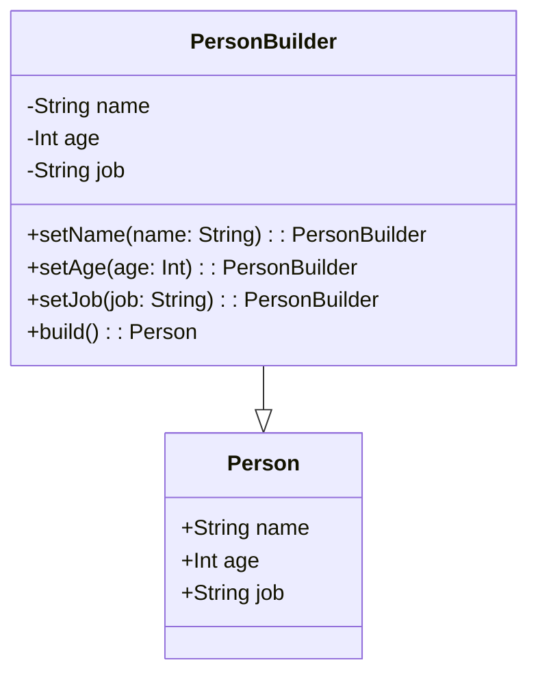

## Introduction

Fluent Interfaces is a design pattern aimed at creating APIs that can be read fluidly and naturally within a specific domain context. The term was popularized by Martin Fowler, and it emphasizes the readability and ease of use of the APIs by chaining method calls in a way that almost reads like natural language.

In functional programming, Fluent Interfaces align well with the paradigm's emphasis on immutability and function chaining, creating expressive APIs that promote a declarative coding style. Fluent interfaces not only improve the readability of code but also facilitate the development of domain-specific languages (DSLs).

## Core Concepts

### Method Chaining

Method chaining is the essence of fluent interfaces. By returning the object itself or another relevant object, subsequent methods can be called in a chain. This approach allows for a succinct and expressive specification of operations.

### Intention-Revealing Interfaces

A good fluent interface should communicate the developer's intent clearly. This readability ensures that the code is self-explanatory, promoting easier maintenance and understanding.

### Domain-Specific Language (DSL)

Fluent interfaces often help develop DSLs. DSLs are specialized mini-languages developed for a specific problem domain, providing a higher level of abstraction and more straightforward code.

## Example

Below we provide an example of a simple Fluent Interface in Scala, a functional programming language.

```scala
case class Person(name: String, age: Int, job: String)

class PersonBuilder {
  private var name: String = ""
  private var age: Int = 0
  private var job: String = ""

  def setName(name: String): this.type = {
    this.name = name
    this
  }

  def setAge(age: Int): this.type = {
    this.age = age
    this
  }

  def setJob(job: String): this.type = {
    this.job = job
    this
  }

  def build(): Person = Person(name, age, job)
}

val person = new PersonBuilder()
  .setName("John Doe")
  .setAge(30)
  .setJob("Software Engineer")
  .build()

println(person)
```

In this example, the `PersonBuilder` class employs fluent methods to build a `Person` object in a readable, natural way.

## Related Design Patterns

### Builder Pattern
The Builder pattern is closely related to fluent interfaces. It's a creational pattern that creates complex objects step by step, promoting a smooth API that's conducive to method chaining.

### Interpreter Pattern
This pattern is another that often complements fluent interfaces. The Interpreter pattern involves creating a mini-language for a specific domain and describing the grammar and vocabulary of this language.

### Chaining Pattern
Chaining pattern focuses on chaining method calls which is the essence of fluent interfaces. It is often used in conjunction to simplify object creation and method invocation sequences.

## Additional Resources

- Martin Fowler's article on [Fluent Interface](https://martinfowler.com/bliki/FluentInterface.html)
- [Functional Programming in Scala](https://www.manning.com/books/functional-programming-in-scala) by Paul Chiusano and Rúnar Bjarnason 
- [Domain-Specific Languages](https://www.martinfowler.com/books/dsl.html) by Martin Fowler

## UML Diagram

To further illustrate, here’s diagram showing the fluent interface structure:



## Summary

Fluent Interfaces provide a powerful way of designing APIs that are intuitive and expressive, particularly in domain-specific contexts. By leveraging method chaining and creating intention-revealing interfaces, fluent APIs can greatly enhance readability and maintainability. This pattern aligns well with the functional programming emphasis on immutability and chaining, providing a declarative and natural approach to coding.

By understanding and utilizing Fluent Interfaces, developers can create more readable, intention-revealing code that both speaks the language of the domain and adheres to the principles of functional programming.
